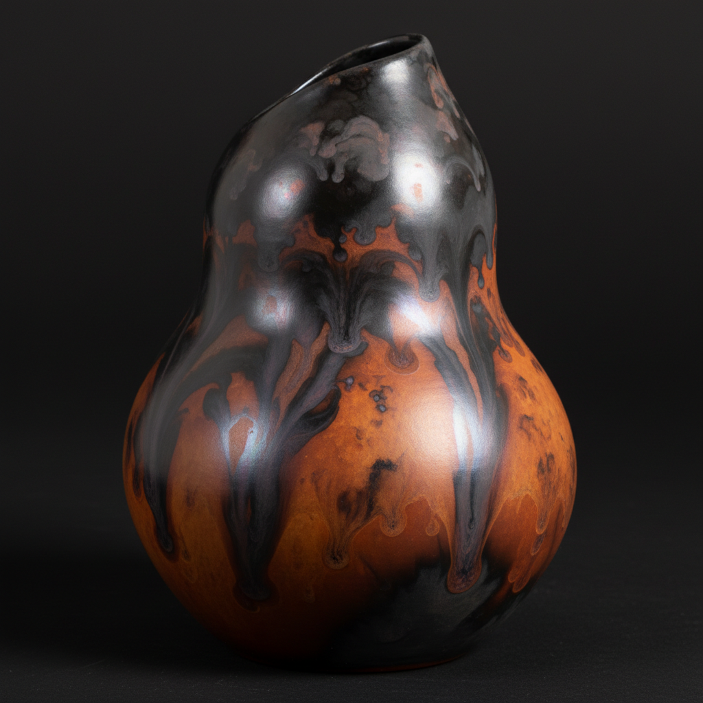

# Smoke Firing Art 熏烧艺术

> "Smoke firing is painting with atmosphere — unglazed pots nestled among sawdust, leaves, seaweed, and copper wire in a metal container, then set alight to smolder for hours, the smoke and minerals carried by the fire depositing themselves on the porous clay surface in washes of gray, black, orange, and iridescent purple, each piece emerging from the ashes like a landscape painted by the wind." — Unknown

## 概述

熏烧艺术（Smoke Firing Art）是一种将未施釉的陶器放入可燃材料（锯末、树叶、海藻、铜线等）中进行低温熏烧的装饰技法。在缓慢闷烧的过程中，烟碳和各种矿物质沉积在多孔的陶器表面，形成丰富的灰色、黑色、橙色和虹彩紫色的色彩变化。熏烧是最古老的陶瓷烧制方式之一，在当代陶艺中作为一种追求自然效果的替代烧制技法而复兴。

熏烧艺术的核心要素包括：1）未施釉——使用未上釉的多孔陶器；2）可燃材料——锯末、树叶、报纸等有机物；3）金属盐——铜线、铁丝等提供金属色彩；4）闷烧——缓慢的低温闷烧过程；5）碳沉积——烟碳在表面的沉积；6）矿物着色——金属氧化物的色彩效果；7）抛光——烧制前的表面抛光处理。

## 核心特征

| 特征 | 描述 |
|------|------|
| 烟碳着色 | 烟和碳在表面的沉积 |
| 自然色彩 | 灰、黑、橙、紫的自然色调 |
| 未施釉 | 多孔的裸陶表面 |
| 低温烧制 | 相对较低的烧制温度 |
| 有机材料 | 使用天然可燃物 |
| 不可预测 | 随机的色彩分布 |

## 视觉特征

- **烟灰色调**：深浅不一的灰色和黑色
- **橙色斑块**：铁或有机物产生的暖色
- **虹彩紫色**：铜产生的虹彩效果
- **渐变过渡**：色彩之间的柔和过渡
- **抛光光泽**：烧制前抛光的丝绸质感
- **自然纹理**：如风景般的自然图案

## 代表作品

| 作品 | 艺术家/文化 | 年代 | 意义 |
|------|-------------|------|------|
| *非洲传统熏烧陶器* | 非洲各族 | 传统 | 传统熏烧 |
| *Gabriele Koch作品* | Gabriele Koch | 当代 | 当代熏烧大师 |
| *Pit-fired vessels* | 各地陶艺家 | 当代 | 坑烧作品 |
| *Saggar-fired ceramics* | 当代陶艺家 | 当代 | 匣钵熏烧 |
| *Barrel-fired pottery* | 当代陶艺家 | 当代 | 桶烧作品 |

## 历史时间线

| 时期 | 事件 |
|------|------|
| 史前 | 最早的陶器烧制方式 |
| 古代 | 世界各地的传统熏烧 |
| 非洲传统 | 非洲持续的熏烧传统 |
| 20世纪 | 工作室陶艺中熏烧的复兴 |
| 当代 | 熏烧作为艺术表达手段 |

## 中国语境

熏烧在中国有极其古老的历史——中国新石器时代的黑陶（如龙山文化黑陶）就是通过在还原气氛中熏烧而成的。龙山文化的蛋壳黑陶——薄如蛋壳、黑如漆——是史前熏烧技术的巅峰。中国传统的"窑变"概念中也包含了烟碳对釉面的影响。在中国当代陶艺中，熏烧作为一种回归原始、追求自然效果的技法受到关注。中国陶艺家将熏烧与中国传统的水墨美学结合——熏烧产生的灰色调和渐变效果与水墨画的意境相通。

## AI生成概念图

## 与其他风格的关系

- **Pit Firing** → 坑烧
- **Raku** → 乐烧
- **Naked Raku** → 裸乐烧
- **Horsehair Pottery** → 马毛陶
- **Saggar Firing** → 匣钵烧
- **Black Pottery** → 黑陶

---

*浮光艺志 | Chronicle of Artistry*
