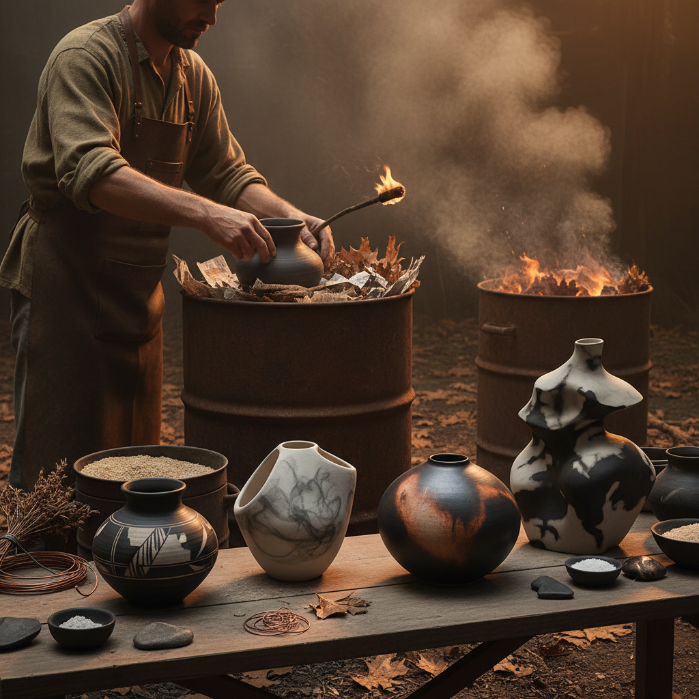

# Smoke Firing 烟熏烧制

> "Smoke firing is painting with fire itself — flames and carbon dancing across unglazed clay, leaving behind ghostly marks, blushes of color, and veils of smoke that record the memory of the kiln's breath on every surface." — Unknown

## 概述

烟熏烧制（Smoke Firing）是一种利用烟雾和碳沉积在未施釉陶器表面产生装饰效果的原始烧制技法。将抛光或涂有化妆土的陶器放入可燃材料（如木屑、树叶、报纸、锯末、海藻等）中进行低温烧制（通常600-900°C），烟雾中的碳颗粒渗入陶器表面的微孔中，产生从浅灰到深黑的各种色调和独特的烟熏纹理。

烟熏烧制是人类最古老的陶器烧制方式之一——在窑炉发明之前，所有的陶器都是在露天篝火或坑中烧制的，自然会产生烟熏效果。世界各地的原住民文化（如美洲原住民的黑陶、非洲的烟熏陶器）都有精美的烟熏烧制传统。当代陶艺家将烟熏烧制发展为一种精细的艺术表现手段——通过控制可燃材料的种类、位置和烧制条件来创造特定的视觉效果。

## 核心特征

| 特征 | 描述 |
|------|------|
| 烟雾 | 利用烟雾着色 |
| 碳 | 碳沉积产生色调 |
| 低温 | 低温烧制 |
| 原始 | 最原始的烧制方式 |
| 偶然 | 部分偶然效果 |
| 无釉 | 通常不施釉 |

## 视觉特征

- **烟熏**：烟熏的灰黑色调
- **渐变**：自然的色调渐变
- **纹理**：烟雾留下的纹理
- **有机**：有机的图案
- **原始**：原始的美感
- **独特**：每件都独一无二

## 代表作品

| 作品 | 艺术家 | 年代 | 意义 |
|------|--------|------|------|
| *Pueblo black pottery* | Maria Martinez | 20世纪 | 美洲原住民烟熏黑陶 |
| *African smoke-fired vessels* | 非洲工匠 | 传统 | 非洲烟熏陶器 |
| *Contemporary smoke-fired art* | Various | 当代 | 当代烟熏陶艺 |
| *Barrel-fired ceramics* | Various | 当代 | 桶烧陶瓷 |
| *Saggar-fired works* | Various | 当代 | 匣钵烧制 |

## 历史时间线

| 时期 | 事件 |
|------|------|
| 史前 | 最早的篝火烧陶 |
| 古代 | 全球各文化的烟熏传统 |
| 传统 | 美洲原住民的黑陶传统 |
| 20世纪 | Maria Martinez的黑陶复兴 |
| 当代 | 烟熏烧制在当代陶艺中的艺术化 |
| 当代 | 桶烧和匣钵烧的发展 |

## 中国语境

烟熏烧制在中国有悠久的历史——中国新石器时代的黑陶（如龙山文化黑陶）就是通过还原气氛和烟熏产生黑色效果的。中国的一些传统陶瓷烧制方法中包含烟熏的元素。中国的当代陶艺教育中，烟熏烧制作为一种原始烧制技法被教授。中国的陶艺工作室和体验活动中，烟熏烧制因其"戏剧性的过程和不可预测的结果"而受到欢迎。

## AI生成概念图

## 与其他风格的关系

- **Pit Firing** → 坑烧
- **Raku** → 乐烧
- **Saggar Firing** → 匣钵烧
- **Burnishing** → 抛光
- **Primitive Pottery** → 原始陶器
- **Black Pottery** → 黑陶

---

*浮光艺志 | Chronicle of Artistry*
