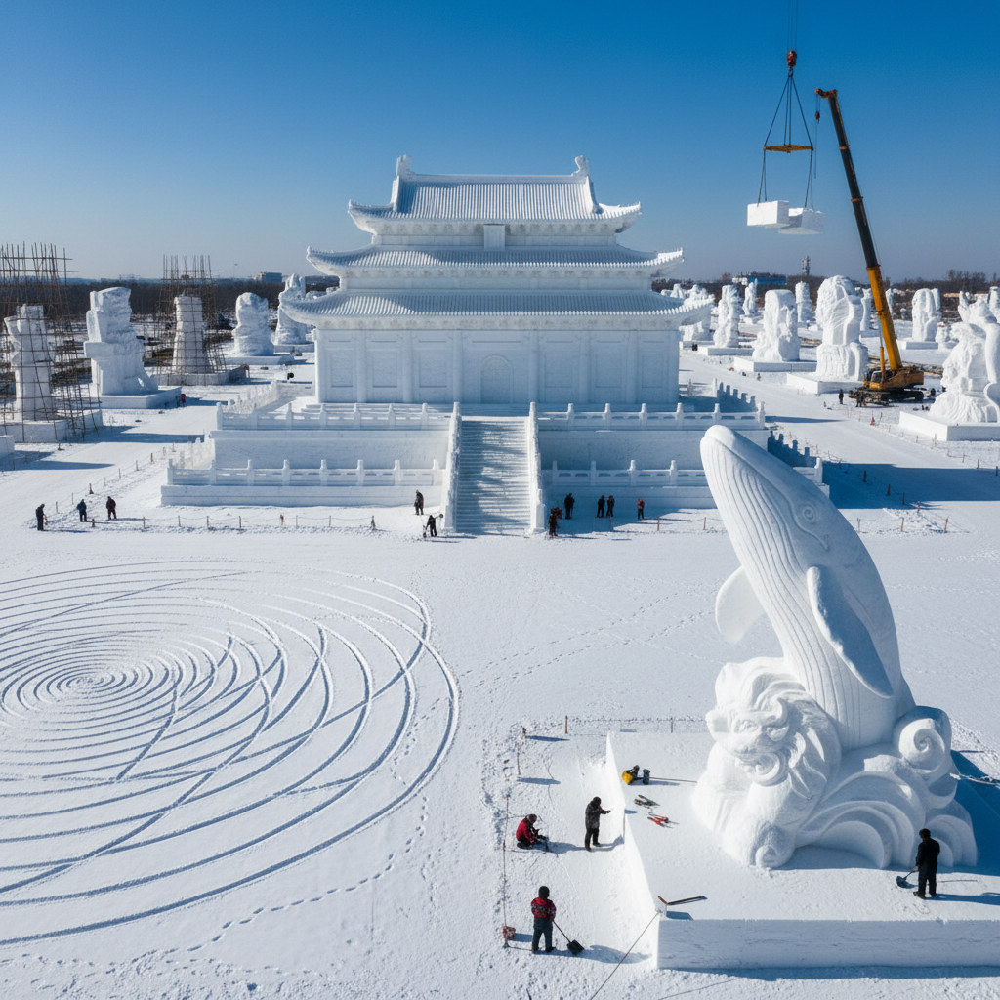

# Snow Art 雪雕艺术

> "Snow is the most democratic of sculptural materials — it falls from the sky for free, it can be shaped by anyone with hands or tools, and it erases itself when spring comes, leaving the landscape clean for next year's creation. Snow art exists in the space between architecture and sculpture, between permanence and impermanence, between the monumental and the ephemeral." — Unknown

## 概述

雪雕艺术（Snow Art）是以雪为主要材料进行艺术创作的实践——利用雪的可塑性、白色纯净感和大规模可用性创造从小型雪人到巨型雪雕建筑的各种作品。雪雕艺术是冬季文化的重要组成部分。

雪雕艺术的实践包括：1）雪雕——用压实的雪块雕刻大型造型；2）雪建筑——用雪建造的建筑结构（如雪屋igloo）；3）雪地画——在雪地上行走创造的大型图案（Simon Beck）；4）雪人艺术——将传统雪人提升为艺术形式；5）雪迷宫——用雪墙建造的迷宫；6）雪地书法——在雪地上书写的大型文字；7）雪景装置——利用自然降雪创作的环境艺术。

## 核心特征

| 特征 | 描述 |
|------|------|
| 白色 | 纯白的色彩 |
| 大型 | 可以非常巨大 |
| 短暂 | 春天融化消失 |
| 免费 | 材料免费可得 |
| 可塑 | 压实后可雕刻 |
| 季节 | 受季节限制 |

## 视觉特征

- **白色**：纯白的雪色
- **巨大**：大型雪雕的壮观
- **阴影**：雪面上的蓝色阴影
- **纹理**：雕刻的纹理细节
- **光影**：阳光在雪面的光影
- **纯净**：纯净无瑕的感觉

## 代表作品

| 作品 | 艺术家 | 年代 | 意义 |
|------|--------|------|------|
| *Harbin Snow Sculptures* | Various | 1963至今 | 哈尔滨雪雕 |
| *Snow drawings* | Simon Beck | 2004至今 | 雪地几何画 |
| *Sapporo Snow Festival* | Various | 1950至今 | 札幌雪祭雪雕 |
| *Snow architecture* | Various | 当代 | 雪建筑 |
| *Snowman art* | Various | 当代 | 创意雪人 |

## 历史时间线

| 时期 | 事件 |
|------|------|
| 古代 | 北方民族的雪屋建造 |
| 1950 | 札幌雪祭开始 |
| 1963 | 哈尔滨冰雪节开始 |
| 2004 | Simon Beck开始雪地画 |
| 当代 | 雪雕作为国际艺术形式 |

## 中国语境

雪雕艺术在中国有极其重要的地位。中国哈尔滨太阳岛国际雪雕艺术博览会是世界上最大的雪雕展览——每年展出数百件巨型雪雕作品，有些高达数十米。中国的雪雕艺术家在国际雪雕比赛中屡获大奖，以其精湛的技艺和宏大的构思著称。中国东北的雪雕传统与当地的冬季文化紧密相连——从民间的堆雪人到专业的雪雕比赛，雪雕是东北冬季生活的重要组成部分。中国的雪乡（黑龙江双峰林场）以其自然形成的雪蘑菇景观闻名，展示了自然雪景的艺术美。中国当代的雪雕艺术融合了中国传统建筑、神话人物和当代主题，创造出具有中国特色的雪雕作品。

## AI生成概念图

## 与其他风格的关系

- **Ice Sculpture Art** → 冰雕艺术
- **Land Art** → 大地艺术
- **Ephemeral Art** → 短暂艺术
- **Architecture** → 建筑
- **Sculpture** → 雕塑
- **Environmental Art** → 环境艺术

---

*浮光艺志 | Chronicle of Artistry*
