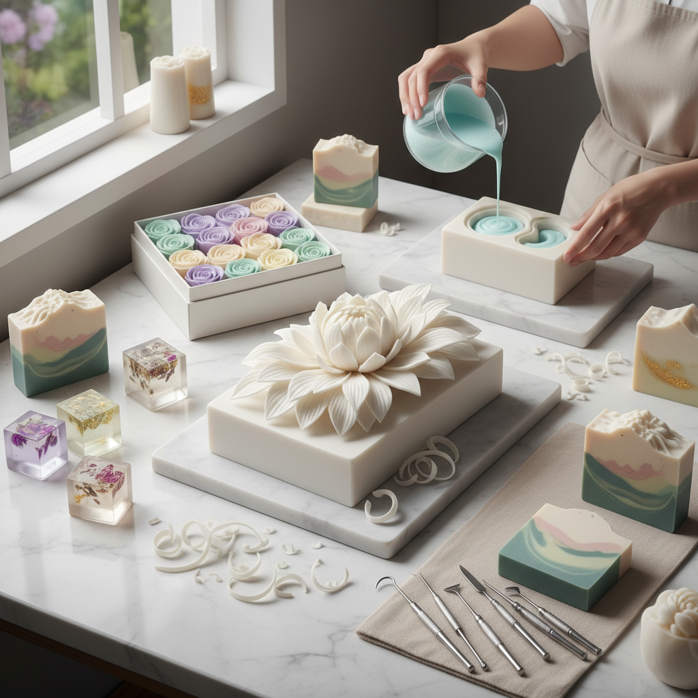

# Soap Art 皂艺术

> "Soap carving teaches the most important lesson in sculpture: that removing material is as creative as adding it. Every cut reveals what was always inside the block, waiting to be found. And because soap is soft and forgiving, it invites experimentation — mistakes can be smoothed away, and a new sculpture can always begin from what remains of the old one." — Unknown

## 概述

皂艺术（Soap Art）是以肥皂为主要材料进行艺术创作的实践——利用肥皂的可雕性、色彩可调性和芳香特性创造视觉和嗅觉兼具的艺术品。皂艺术从简单的肥皂雕刻到复杂的手工皂设计，涵盖了广泛的创作形式。

皂艺术的实践包括：1）皂雕——在肥皂块上进行雕刻（泰国传统）；2）手工艺术皂——用冷制法或热制法制作的装饰性手工皂；3）皂花——用肥皂雕刻的仿真花卉；4）分层皂——利用不同颜色的皂液分层浇注创造图案；5）皂画——在肥皂表面绘制图案；6）皂中皂——将小型皂嵌入透明皂中创造立体效果；7）渲染皂——用色彩渲染技法创造大理石纹等效果。

## 核心特征

| 特征 | 描述 |
|------|------|
| 可雕 | 柔软易雕刻 |
| 芳香 | 可添加香氛 |
| 色彩 | 可调配任何颜色 |
| 实用 | 兼具实用功能 |
| 亲民 | 材料易得 |
| 短暂 | 使用后消失 |

## 视觉特征

- **柔和**：柔和的色彩和形态
- **光滑**：光滑的雕刻表面
- **半透明**：透明皂的光感
- **层次**：分层皂的色彩层次
- **精细**：精细的雕刻细节
- **渐变**：色彩的自然渐变

## 代表作品

| 作品 | 艺术家 | 年代 | 意义 |
|------|--------|------|------|
| *Thai soap carvings* | 泰国传统 | 古代至今 | 泰国皂雕花 |
| *Artisan soaps* | Various | 当代 | 手工艺术皂 |
| *Soap sculptures* | Various | 当代 | 皂雕塑 |
| *Layered art soaps* | Various | 2010年代 | 分层艺术皂 |
| *Soap flowers* | Various | 当代 | 皂花艺术 |

## 历史时间线

| 时期 | 事件 |
|------|------|
| 古代 | 肥皂的发明 |
| 19世纪 | 工业化肥皂生产 |
| 20世纪初 | 皂雕作为学校手工课 |
| 泰国传统 | 精细皂雕花的发展 |
| 当代 | 手工艺术皂的兴起 |

## 中国语境

皂艺术在中国近年来发展迅速。中国的手工皂文化从2010年代开始蓬勃发展，大量手工皂工作室和品牌涌现。中国的手工皂艺术家擅长将中国传统美学元素融入皂设计——用中国传统色彩（如故宫色系）、中国传统图案（如云纹、龙凤）和中国传统香料（如桂花、茉莉）创作具有中国特色的艺术皂。中国的"渲染皂"技法发展出独特的风格——将水墨画的晕染效果应用于皂液的色彩渲染。中国传统的"澡豆"——古代的清洁用品——可以视为中国皂艺术的历史渊源。中国当代的皂艺术社群活跃，定期举办手工皂展览和比赛。

## AI生成概念图

## 与其他风格的关系

- **Carving Art** → 雕刻艺术
- **Wax Art** → 蜡艺术
- **Culinary Art** → 烹饪艺术
- **Ephemeral Art** → 短暂艺术
- **Craft Art** → 工艺美术
- **Aromatherapy Art** → 芳香艺术

---

*浮光艺志 | Chronicle of Artistry*
