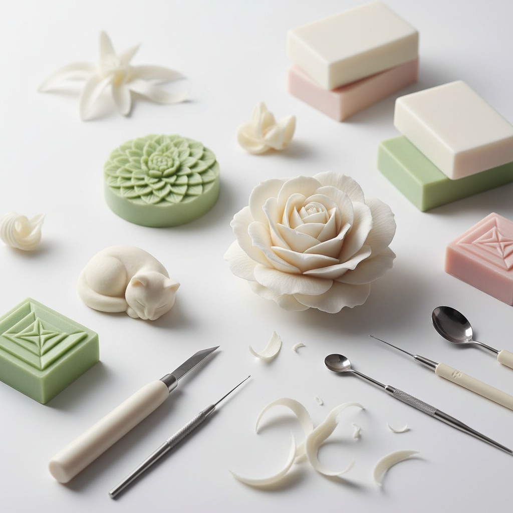

# Soap Carving Art 肥皂雕刻艺术

> "Soap is the gentlest of carving materials — soft enough to cut with a butter knife, forgiving enough to allow mistakes, yet capable of holding surprisingly fine detail. A bar of soap becomes a rose, a face, a temple, a bird — all from a material so humble it sits beside every sink. Soap carving proves that art needs no precious materials, only a sharp eye and a steady hand." — Unknown

## 概述

肥皂雕刻艺术（Soap Carving Art）是以肥皂为雕刻材料进行微型雕塑创作的艺术形式——利用肥皂柔软易切割的特性，用简单的刀具和工具雕刻出精细的花卉、动物、人物和抽象造型。肥皂雕刻是最容易入门的雕刻艺术之一，也能达到极高的艺术水准。

肥皂雕刻的实践包括：1）花卉雕刻——在肥皂上雕刻玫瑰、莲花等花朵；2）动物雕刻——雕刻动物造型；3）人物雕刻——雕刻人物面部或全身；4）建筑雕刻——雕刻微型建筑；5）泰式肥皂雕刻——泰国传统的精细肥皂雕花；6）几何雕刻——雕刻几何图案和抽象造型；7）彩色肥皂雕刻——用彩色肥皂或上色的雕刻作品。

## 核心特征

| 特征 | 描述 |
|------|------|
| 柔软 | 极易雕刻的材料 |
| 精细 | 可达到精细的细节 |
| 香氛 | 带有香味 |
| 易得 | 材料极易获得 |
| 入门 | 容易入门学习 |
| 短暂 | 会随时间变化 |

## 视觉特征

- **白色**：经典的白色肥皂
- **光滑**：光滑的切面
- **精细**：精细的雕刻细节
- **柔和**：柔和的边缘和曲线
- **半透明**：某些肥皂的半透明感
- **微型**：通常是微型作品

## 代表作品

| 作品 | 艺术家 | 年代 | 意义 |
|------|--------|------|------|
| *Thai soap carving* | 泰国传统 | 古代至今 | 泰式精细肥皂雕花 |
| *Soap roses* | Various | 当代 | 肥皂玫瑰雕刻 |
| *Detailed soap sculptures* | Various | 当代 | 精细肥皂雕塑 |
| *School soap carving* | Various | 20世纪至今 | 教育用肥皂雕刻 |
| *Contemporary soap art* | Various | 当代 | 当代肥皂艺术 |

## 历史时间线

| 时期 | 事件 |
|------|------|
| 古代 | 泰国的水果和肥皂雕刻传统 |
| 19世纪 | 肥皂雕刻作为教育工具 |
| 20世纪 | 肥皂雕刻的普及化 |
| 2010年代 | 社交媒体上的肥皂雕刻热潮 |
| 当代 | 肥皂雕刻的ASMR和治愈文化 |

## 中国语境

肥皂雕刻艺术在中国近年来通过社交媒体获得了广泛关注。中国的短视频平台上，肥皂雕刻视频非常受欢迎——其"治愈系"的视觉和听觉效果（ASMR）吸引了大量观众。中国的一些手工艺爱好者将肥皂雕刻发展为精细的艺术创作——雕刻中国传统元素如莲花、牡丹、龙凤等图案。中国的肥皂雕刻也被用于教育——作为儿童美术教育中培养空间感和手工能力的入门项目。中国的手工皂产业发展迅速——一些手工皂品牌将雕刻元素融入产品设计，创造出既实用又美观的艺术肥皂。中国的一些艺术家也将肥皂作为当代艺术的创作媒介——探索消耗、清洁和短暂性的主题。

## AI生成概念图

## 与其他风格的关系

- **Wood Carving** → 木雕艺术
- **Miniature Art** → 微缩艺术
- **Ephemeral Art** → 短暂艺术
- **ASMR Art** → ASMR艺术
- **Thai Craft** → 泰国工艺
- **Sculpture** → 雕塑

---

*浮光艺志 | Chronicle of Artistry*
