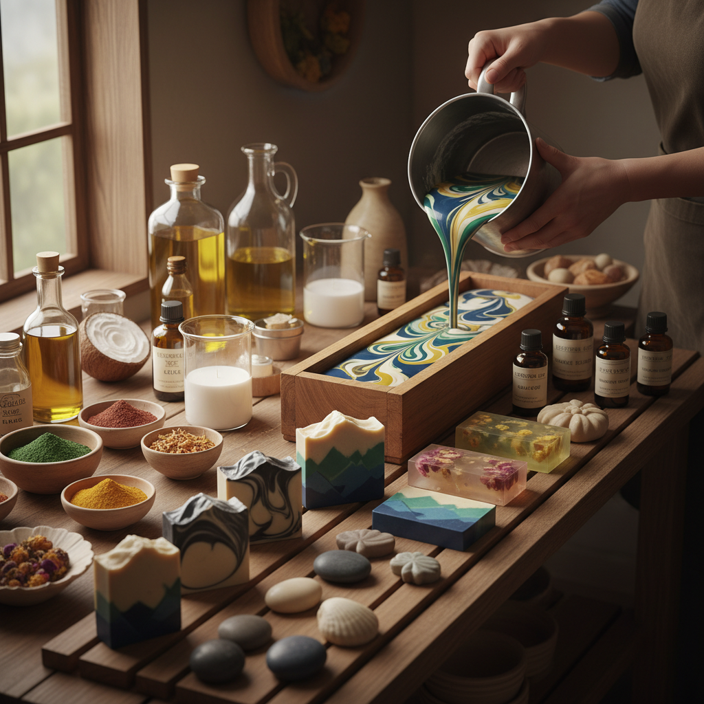

# Soap Making 皂艺

> "Soap making is chemistry turned art — oils and lye transform through saponification into something that cleanses both body and spirit." — Unknown

## 概述

皂艺（Soap Making）是将油脂与碱液（氢氧化钠或氢氧化钾）通过皂化反应（saponification）制作成肥皂的工艺。手工皂制作已从单纯的清洁用品生产发展为一门融合化学、色彩设计、香氛调配和雕塑造型的综合艺术。当代手工皂的技法包括：冷制法（cold process）、热制法（hot process）、融化再制法（melt and pour）和手工研磨法。艺术家通过分层浇注、旋转混合、嵌入装饰物和精确的温度控制，创造出如同大理石纹、渐变色、风景画般的美丽截面图案。

皂艺的哲学在于：日常的美学——将最平凡的日用品转化为视觉和嗅觉的双重享受。

## 核心特征

| 特征 | 描述 |
|------|------|
| 皂化 | 油脂与碱的化学反应 |
| 配方 | 精确的油脂配方 |
| 色彩 | 丰富的色彩设计 |
| 香氛 | 精油或香精调配 |
| 造型 | 多样的造型设计 |
| 截面 | 美丽的截面图案 |

## 视觉特征

- **色彩**：丰富的色彩组合
- **纹理**：大理石纹、渐变等
- **截面**：美丽的切割截面
- **光泽**：皂体的柔和光泽
- **造型**：精美的造型
- **自然**：天然材料的质感

## 代表作品

| 作品 | 艺术家 | 年代 | 意义 |
|------|--------|------|------|
| *Aleppo soap* | 匿名 | 古代 | 最古老的手工皂 |
| *Marseille soap* | Various | 17世纪+ | 法国马赛皂传统 |
| *Artisan cold process soaps* | Various | 当代 | 当代冷制皂艺术 |
| *Landscape soaps* | Various | 当代 | 风景截面皂 |
| *Sculptural soaps* | Various | 当代 | 雕塑造型皂 |

## 历史时间线

| 时期 | 事件 |
|------|------|
| 公元前2800年 | 巴比伦最早的肥皂记录 |
| 7世纪 | 阿勒颇皂的传统 |
| 17世纪 | 马赛皂的工业化 |
| 19世纪 | 现代肥皂工业 |
| 1990s+ | 手工皂运动的兴起 |
| 当代 | 皂艺的艺术化发展 |

## 中国语境

手工皂在中国近年来发展迅速——从2010年代开始，手工皂制作成为流行的手工爱好和创业方向。中国的手工皂社区活跃，有大量的教程、工作坊和品牌。中国的手工皂艺术家将中国传统元素融入设计——如中药材（艾草、当归）、中国传统色彩和中国风图案。中国的手工皂市场从最初的模仿西方发展到形成自己的风格，特别是在冷制皂的截面设计和造型皂方面有独特的创新。

## AI生成概念图

## 与其他风格的关系

- **Candle Making** → 蜡烛制作
- **Perfumery** → 调香
- **Chemistry** → 化学
- **Sculpture** → 雕塑
- **Color Theory** → 色彩理论
- **Craft** → 手工艺

---

*浮光艺志 | Chronicle of Artistry*
