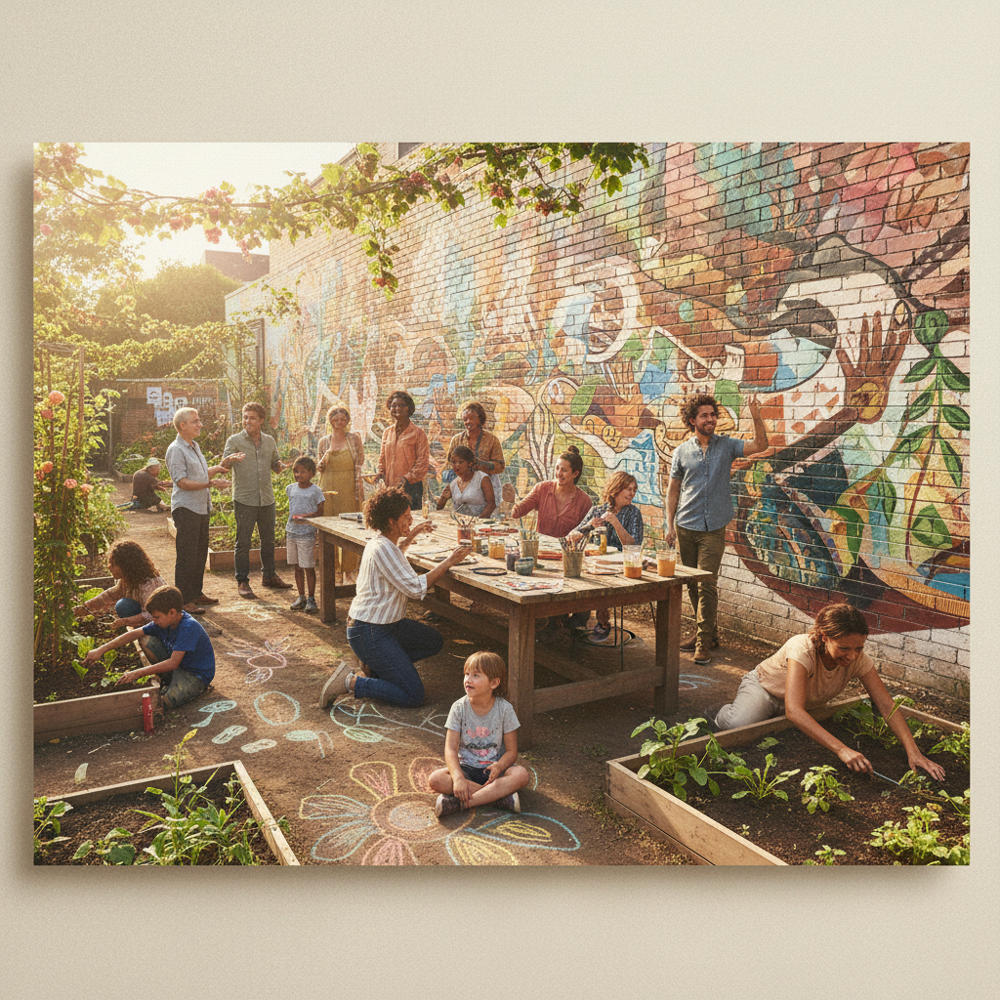

# Social Practice Art 社会实践艺术

> "Art is not about making objects. It's about making things happen." — Tania Bruguera

## 概述

社会实践艺术（Social Practice Art / Socially Engaged Art）是以社会参与、社区合作和公共对话为核心的艺术形式。艺术家不再在工作室中独自创作物品，而是走入社区，与人们一起工作，通过艺术行动推动社会变革。

社会实践艺术模糊了艺术与社会工作、教育、政治行动的边界。它的"作品"可能是一个社区花园、一次公共对话、一个教育项目、或一次集体行动——重要的不是最终的物质产品，而是过程中发生的人际关系和社会变化。

## 核心特征

| 特征 | 描述 |
|------|------|
| 社会参与 | 与社区和公众直接合作 |
| 过程导向 | 过程比最终产品更重要 |
| 对话性 | 通过对话和交流创造意义 |
| 变革意图 | 追求实际的社会变化 |
| 去作者化 | 艺术家是促进者而非唯一创作者 |
| 长期性 | 项目可能持续数月甚至数年 |

## 视觉特征

- **空间**：社区中心、街道、学校、公园——非画廊空间
- **人**：参与者是作品的核心"材料"
- **文档**：照片、视频、文字记录是作品的"遗物"
- **过程**：工作坊、对话、集体行动的过程
- **关系**：人与人之间建立的联系是真正的"作品"
- **日常**：融入日常生活而非独立于生活之外

## 代表作品

| 作品 | 艺术家 | 年代 | 意义 |
|------|--------|------|------|
| *7000 Oaks* | Joseph Beuys | 1982 | 在卡塞尔种7000棵橡树——社会雕塑 |
| *Immigrant Movement International* | Tania Bruguera | 2010-15 | 为移民提供服务的艺术项目 |
| *The Land* | Rirkrit Tiravanija | 1998+ | 泰国的艺术家社区农场 |
| *Project Row Houses* | Rick Lowe | 1993+ | 将废弃房屋改造为社区艺术空间 |
| *Gramsci Monument* | Thomas Hirschhorn | 2013 | 在公共住宅区建造的临时纪念碑 |
| *Pad Thai* | Rirkrit Tiravanija | 1990 | 在画廊里为观众做饭——关系美学 |

## 历史时间线

| 时期 | 事件 |
|------|------|
| 1960s | Happening和Fluxus——参与式艺术的先驱 |
| 1970s | Beuys的"社会雕塑"概念 |
| 1982 | *7000 Oaks*——社会实践的里程碑 |
| 1990s | 关系美学（Bourriaud）——理论化 |
| 1993 | Project Row Houses——社区艺术的典范 |
| 2000s | 社会实践成为MFA项目的正式方向 |
| 2010s | Bruguera、Hirschhorn——政治化的社会实践 |
| 2020s | 疫情后——社会实践的数字化和远程化 |

## 子类型

| 子类型 | 特征 |
|--------|------|
| 社会雕塑 | Beuys——社会本身作为可塑造的材料 |
| 关系美学 | Tiravanija——人际相遇作为艺术 |
| 社区艺术 | Lowe——与特定社区的长期合作 |
| 对话艺术 | 通过对话和讨论创造的艺术 |
| 行动主义艺术 | Bruguera——艺术作为政治行动 |
| 教育艺术 | 教学和学习作为艺术形式 |

## 中国语境

社会实践艺术在中国有独特的发展路径。中国的"乡建"运动（如碧山计划、许村计划）将艺术家带入乡村，通过艺术推动乡村复兴。城市中的社区艺术项目、公共艺术节、以及艺术家驻留计划都是社会实践的中国形式。中国的社会实践艺术面临独特的挑战——如何在特定的政治环境中开展真正的社会参与？如何避免"艺术下乡"变成城市精英的自我满足？

## AI生成概念图

## 与其他风格的关系

- **Relational Aesthetics** → 关系美学是社会实践的理论基础之一
- **Happening** → 偶发艺术的参与性是社会实践的先驱
- **Situationism** → 情境主义的社会变革意图与社会实践相通
- **Conceptual Art** → 概念艺术的去物质化为社会实践提供理论支持
- **Public Art** → 公共艺术与社会实践共享公共空间
- **Institutional Critique** → 制度批判的反体制精神延续到社会实践

---

*浮光艺志 | Chronicle of Artistry*
