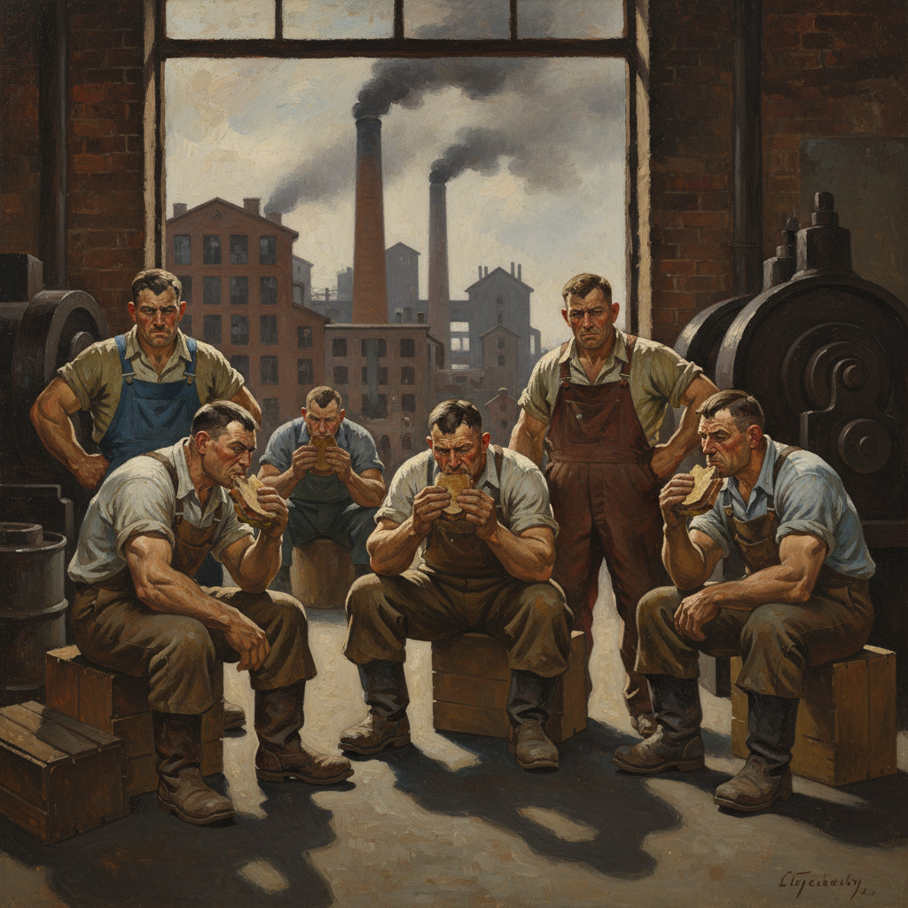

# Social Realism Art 社会现实主义

> **时期：** 1930年代–1960年代  
> **关键词：** 工人阶级、社会批判、政治参与、大萧条、公共艺术

## 概述

Social Realism（社会现实主义）是以描绘工人阶级生活和社会不公为核心的艺术运动，在1930年代大萧条时期达到高峰。画家们走出画室，记录工厂、矿井、贫民窟和抗议现场——艺术不再是象牙塔中的审美游戏，而是社会变革的武器和底层人民的声音。

## 风格特征

- **工人题材**：劳动场景、贫困、抗争
- **写实手法**：直接、有力的视觉叙事
- **政治立场**：明确的社会批判态度
- **公共性**：壁画、版画等大众可及的形式
- **情感力量**：愤怒、同情、团结的表达

## 代表人物与作品

- 迭戈·里维拉 底特律工业壁画
- 本·沙恩《萨科和万泽蒂》
- 雅各布·劳伦斯《迁徙》系列
- 多萝西娅·兰格 大萧条摄影

## 概念图

