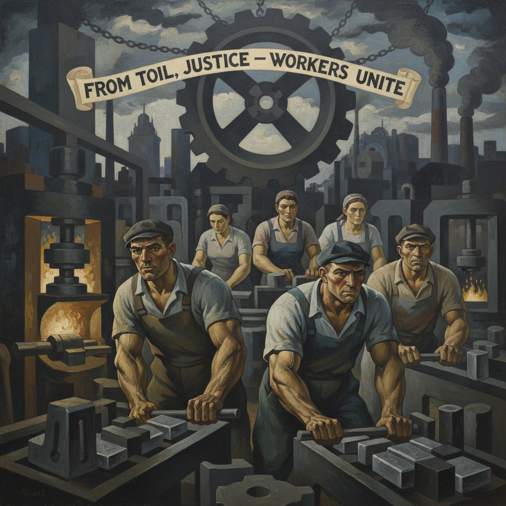

# Social Realism Painting 社会现实主义绘画

> **时期：** 1930年代–1960年代  
> **关键词：** 工人阶级、社会不公、大萧条、政治艺术、美国左翼

## 概述

Social Realism Painting（社会现实主义绘画）是1930年代美国大萧条时期兴起的艺术运动——画家们用写实手法描绘工人阶级的苦难、种族不平等和社会不公。本·沙恩的冤案控诉、雅各布·劳伦斯的非裔迁徙——他们相信艺术应该为社会正义服务，用画笔做武器，让被忽视的人群被看见。

## 风格特征

- **叙事写实**：讲述底层人民的故事
- **政治立场**：明确的社会批判态度
- **简洁有力**：去除装饰，直击主题
- **壁画传统**：公共空间的大型创作
- **暗沉色调**：反映社会的压抑氛围

## 代表人物与作品

- 本·沙恩 萨科和万泽蒂系列
- 雅各布·劳伦斯 大迁徙系列
- 迭戈·里维拉 底特律工业壁画
- 菲利普·埃弗古德 美国悲剧

## 概念图

