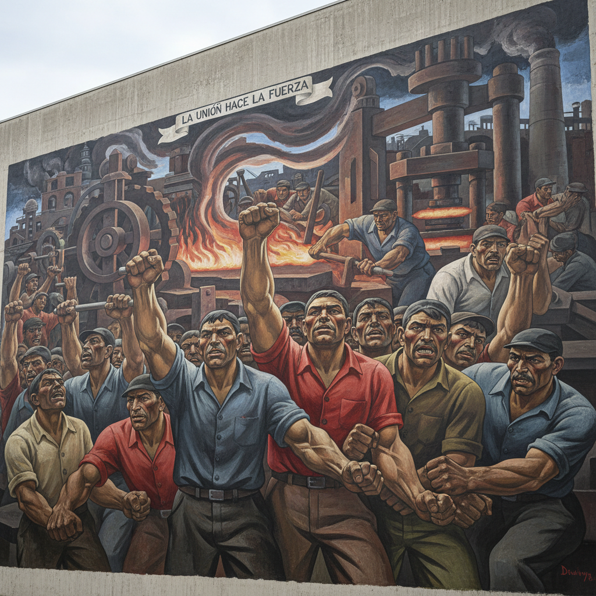

# Social Realism 社会现实主义

> "Art is a weapon in the struggle for freedom." — Diego Rivera

## 概述

社会现实主义（Social Realism）是1930年代大萧条时期兴起的艺术运动，以描绘社会不公、工人阶级生活和政治抗议为核心。它不同于苏联的"社会主义现实主义"（Socialist Realism），后者是国家宣传工具，而社会现实主义是自发的批判性艺术。

社会现实主义相信艺术应该为社会变革服务——画笔是武器，画布是战场。

## 核心特征

| 特征 | 描述 |
|------|------|
| 社会批判 | 揭露贫困、不公和剥削 |
| 工人阶级 | 以劳动者为主角 |
| 叙事性 | 讲述具体的社会故事 |
| 可读性 | 拒绝抽象——大众能看懂 |
| 政治性 | 明确的政治立场和诉求 |
| 壁画传统 | 公共空间的大型壁画 |

## 视觉特征

- **人物**：强壮的工人、疲惫的母亲、抗议者
- **色调**：沉重的灰褐色调或强烈的壁画色彩
- **构图**：戏剧性的、纪念碑式的人物安排
- **表情**：坚毅、愤怒、疲惫、团结
- **场景**：工厂、矿井、农田、示威游行
- **风格**：写实的、可辨认的、叙事性的

## 代表作品

| 作品 | 年代 | 意义 |
|------|------|------|
| *Detroit Industry Murals* (Rivera) | 1932–33 | 工业劳动的史诗 |
| *Guernica* (Picasso) | 1937 | 战争暴行的控诉 |
| *American Gothic* (Wood) | 1930 | 美国农村的象征 |
| *Migration Series* (Lawrence) | 1940–41 | 非裔美国人的大迁徙 |
| *Migrant Mother* (Lange) | 1936 | 大萧条的图标 |

## 真实作品（公共领域）

| 作品 | 来源 |
|------|------|
| *Detroit Industry Murals* | [DIA](https://www.dia.org/art/rivera-court) |
| *Migration Series* | [MoMA](https://www.moma.org/interactives/exhibitions/2015/onewayticket/) |
| *American Gothic* | [Art Institute Chicago](https://www.artic.edu/artworks/6565) |

## AI生成概念图

## 与其他风格的关系

- **Ashcan School** → 垃圾箱画派的政治化延续
- **Mexican Muralism** → 墨西哥壁画运动的核心精神
- **WPA Art** → 罗斯福新政艺术项目的主流
- **Realism** → 现实主义传统的社会化转向
