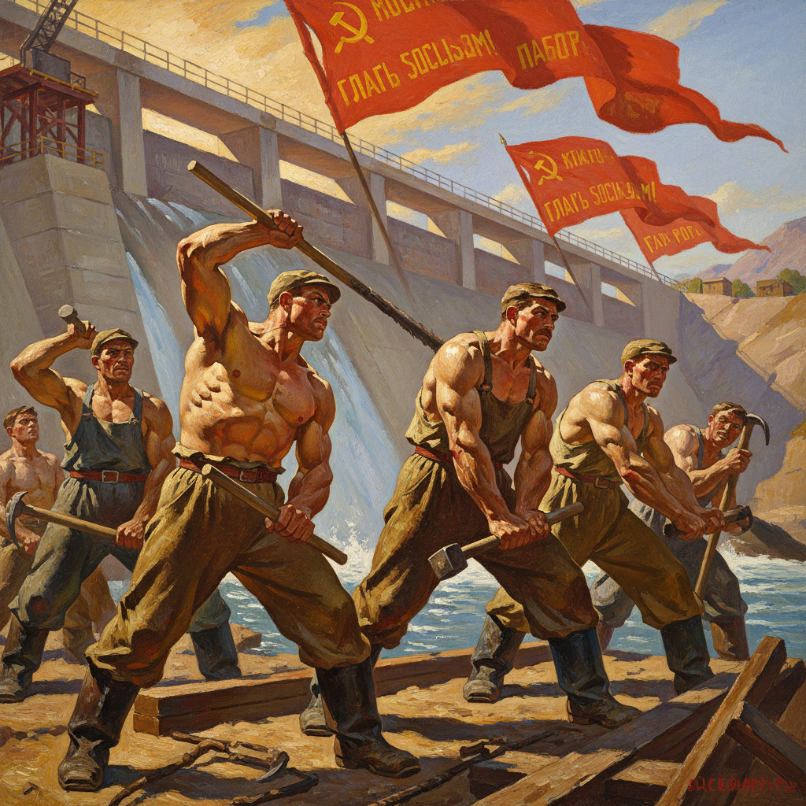

# Socialist Realism Art 社会主义现实主义艺术

> "Socialist realism demands of the artist a truthful, historically concrete representation of reality in its revolutionary development." — First Soviet Writers' Congress, 1934

## 概述

社会主义现实主义艺术（Socialist Realism Art）是1930年代至1980年代苏联官方确立的艺术创作方法和美学体系。社会主义现实主义于1934年被正式确立为苏联文艺的唯一创作方法——它要求艺术家以"真实地、历史具体地"描绘现实，同时展现社会主义建设的理想和人民的英雄形象。这一体系深刻影响了整个社会主义阵营的艺术创作——包括中国、东欧和其他社会主义国家。

社会主义现实主义继承了19世纪俄罗斯批判现实主义（巡回展览画派）的写实技法，但将其服务对象从"揭露社会黑暗"转变为"歌颂社会主义建设"。它的代表作品包括描绘工人、农民、士兵的英雄形象，社会主义建设的宏大场景，以及领袖肖像等。虽然这一体系在艺术自由方面受到批评，但它也产生了一批技法精湛、具有纪念碑性的作品。

社会主义现实主义艺术的核心要素包括：1）党性——服务于共产党的政治目标；2）人民性——以工农兵为主要表现对象；3）典型性——塑造典型环境中的典型人物；4）理想性——展现社会主义的光明前景；5）写实技法——继承学院派的写实传统；6）纪念碑性——宏大叙事和英雄主义；7）乐观主义——积极向上的情感基调。

## 核心特征

| 特征 | 描述 |
|------|------|
| 党性 | 服务共产党政治目标 |
| 人民性 | 以工农兵为表现对象 |
| 典型性 | 典型环境典型人物 |
| 理想性 | 展现社会主义光明前景 |
| 写实技法 | 继承学院派写实传统 |
| 纪念碑性 | 宏大叙事英雄主义 |

## 视觉特征

- **英雄人物**：高大健壮的工人农民形象
- **明亮色调**：积极乐观的明亮色彩
- **宏大场景**：工厂、农场、建设工地
- **仰视构图**：仰视角度突出人物高大
- **红色元素**：红旗、红星等革命符号
- **群像构图**：集体劳动和庆祝的场景

## 代表作品

| 作品 | 年代 | 意义 |
|------|------|------|
| *列宁在十月* (Lenin in October) | 格拉西莫夫, 1930年代 | 领袖形象 |
| *拖拉机手的晚餐* (Dinner of Tractor Drivers) | 普拉斯托夫, 1951 | 农村生活 |
| *又是一个二分* (Failed Again) | 列舍特尼科夫, 1952 | 日常生活 |
| *新莫斯科* (New Moscow) | 皮梅诺夫, 1937 | 城市建设 |
| *工人与集体农庄女庄员* 雕塑 | 穆希娜, 1937 | 纪念碑雕塑 |
| *开国大典* | 董希文, 1953 | 中国社会主义现实主义 |

## 历史时间线

| 时期 | 事件 |
|------|------|
| 1932年 | 苏联解散所有独立艺术团体 |
| 1934年 | 第一次苏联作家代表大会确立社会主义现实主义 |
| 1930-1950年代 | 社会主义现实主义的鼎盛期 |
| 1953年 | 斯大林去世，开始松动 |
| 1960-1970年代 | "严峻风格"等变体出现 |
| 1980年代 | 戈尔巴乔夫改革，体系瓦解 |

## 中国语境

社会主义现实主义对中国美术的影响极为深远——可以说是20世纪下半叶中国美术的主导范式。1949年后，中国全面引入苏联美术教育体系——从教学方法到创作理念都以社会主义现实主义为标准。中国美术学院的素描教学、油画创作和主题性创作都深受这一体系的影响。中国产生了大量社会主义现实主义的经典作品——如董希文的《开国大典》、罗工柳的《地道战》、王式廓的《血衣》等。改革开放后，中国艺术界开始反思和超越社会主义现实主义的局限——但其写实技法传统和"艺术为人民"的理念至今仍有深远影响。社会主义现实主义在中国的接受、改造和超越，是理解中国当代美术发展的关键线索。

## 概念图

## 与其他风格的关系

- **Peredvizhniki** → 巡回展览画派（技法来源）
- **Repin** → 列宾（精神先驱）
- **Critical Realism** → 批判现实主义
- **Academic Art** → 学院派
- **Propaganda Art** → 宣传艺术
- **Chinese Realism** → 中国现实主义（后继）

---

*浮光艺志 | Chronicle of Artistry*
