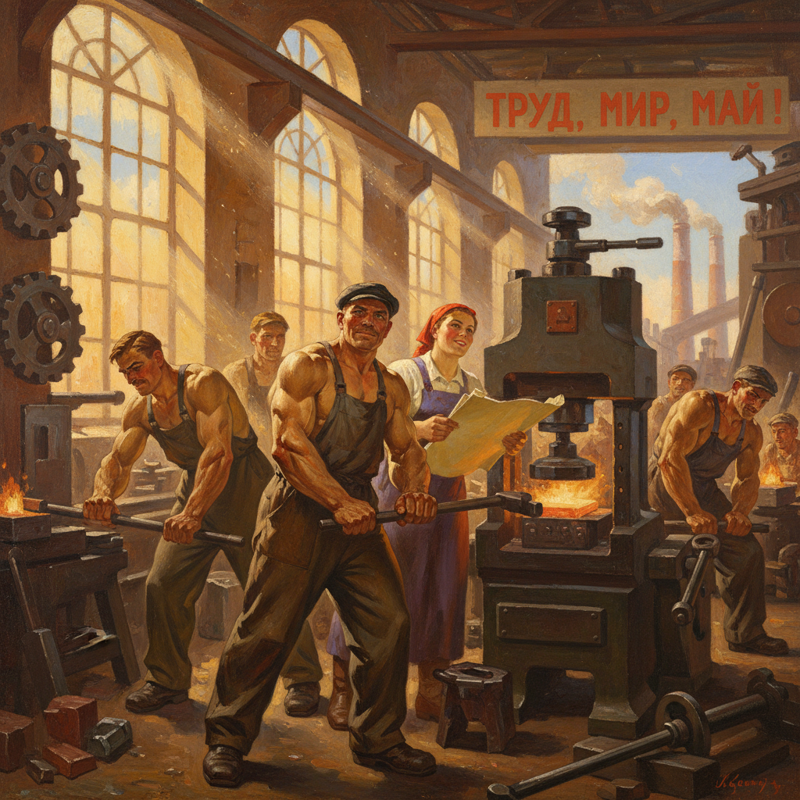

# Socialist Realism Painting 社会主义现实主义绘画

> **时期：** 1932年–1991年  
> **关键词：** 苏联官方、英雄叙事、乐观主义、宣传功能、学院技法

## 概述

Socialist Realism（社会主义现实主义）是1932年起苏联官方规定的唯一合法艺术风格，要求艺术"以社会主义精神从现实的革命发展中真实地、历史具体地描写现实"。它用19世纪学院派的写实技法描绘理想化的工人、农民和领袖形象——永远健康、乐观、向前看，永远沐浴在金色的阳光中。

## 风格特征

- **英雄人物**：理想化的工人、农民、士兵
- **乐观叙事**：永远积极向上的情感基调
- **学院技法**：传统写实主义的精湛技巧
- **宏大场景**：工厂、农场、战场的壮观构图
- **宣传功能**：服务于政治教育目的

## 代表人物与作品

- 亚历山大·盖拉西莫夫 领袖肖像
- 亚历山大·杰伊涅卡《塞瓦斯托波尔保卫战》
- 阿尔卡季·普拉斯托夫 农村生活
- 尤里·皮缅诺夫《新莫斯科》

## 概念图

