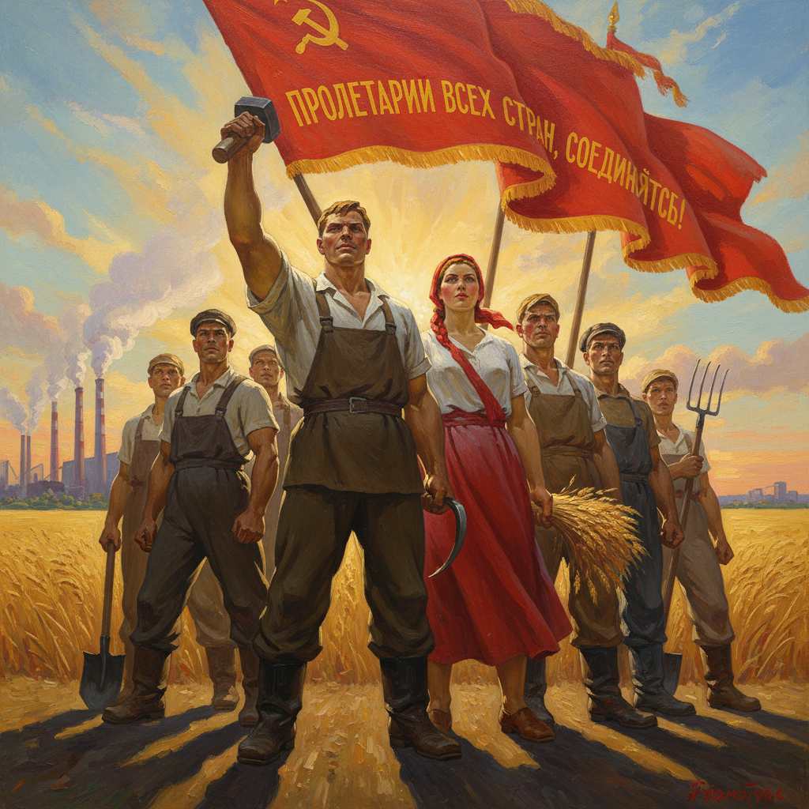

# Socialist Realism 社会主义现实主义



> **"艺术为人民服务——英雄的工人、丰收的田野、光明的未来。"**

## 概述

社会主义现实主义（Socialist Realism）是1932年至1991年间苏联及社会主义阵营国家的官方艺术教条。它要求艺术以"革命浪漫主义"的方式描绘社会主义建设的理想化现实，服务于无产阶级教育和国家宣传。

## 时代背景

| 维度 | 内容 |
|------|------|
| 时间 | 1932–1991（苏联）；1949–1976（中国） |
| 确立 | 1934年第一次全苏作家代表大会正式定义 |
| 政治背景 | 斯大林时期文艺政策统一化 |
| 终结标志 | 苏联解体 / 各国改革开放 |

## 视觉特征

- **英雄化人物**：肌肉发达的工人、健康的农民、英勇的士兵
- **仰视构图**：低角度拍摄/绘画，使人物显得高大伟岸
- **明亮色调**：阳光普照、金色麦田、红旗飘扬
- **叙事性场景**：劳动、战斗、集会、丰收
- **领袖肖像**：理想化的政治领袖形象
- **工业符号**：烟囱、齿轮、锤子镰刀、拖拉机
- **向前的动势**：人物朝向右方或前方，象征进步

## 四项基本原则（日丹诺夫教条）

1. **无产阶级性**（Proletarskaya）：反映工人阶级利益
2. **典型性**（Tipichnost）：展现"典型环境中的典型人物"
3. **现实性**（Ideinost）：忠于现实但高于现实
4. **党性**（Partiinost）：服从党的领导和意识形态

## 代表人物

| 人物 | 国家 | 领域 | 代表作 |
|------|------|------|------|
| Vera Mukhina | 苏联 | 雕塑 | 《工人与集体农庄女庄员》(1937) |
| Alexander Deineka | 苏联 | 绘画 | 《塞瓦斯托波尔保卫战》 |
| Isaak Brodsky | 苏联 | 绘画 | 列宁肖像系列 |
| 董希文 | 中国 | 绘画 | 《开国大典》(1953) |
| 王式廓 | 中国 | 绘画 | 《血衣》 |
| Wojciech Fangor | 波兰 | 绘画 | 社会主义现实主义→抽象的转型 |

## 跨国传播

| 国家 | 时期 | 本土化特征 |
|------|------|------|
| 苏联 | 1932–1991 | 原型，最教条化 |
| 中国 | 1949–1976 | 融合中国画技法，"红光亮" |
| 朝鲜 | 1948–至今 | 延续至今的唯一国家 |
| 东德 | 1949–1989 | 工业美学突出 |
| 古巴 | 1959–1980s | 融合拉美革命浪漫 |

## 与其他风格的关系

```
19世纪俄国巡回画派 → 批判现实主义
         ↓
俄国先锋派(1910s-20s) ←→ 构成主义/至上主义
         ↓ (被压制)
社会主义现实主义(1932-91) ← 斯大林文艺政策
         ↓
中国革命美术 / 朝鲜主体美术
         ↓ (解体后)
Sots Art(苏联波普) / 政治波普(中国)
```

## 当代遗产

- **Sots Art**：苏联地下艺术家对社会主义现实主义的戏仿
- **政治波普**：中国当代艺术中对革命图像的挪用（王广义等）
- **怀旧美学**：东欧/前苏联地区的"Ostalgie"（东方怀旧）
- **Meme文化**：苏联宣传画在互联网上的讽刺性再利用
- **游戏/影视**：冷战题材作品中的视觉参照

## 多语言名称

| 语言 | 名称 |
|------|------|
| 俄语 | Социалистический реализм (Соцреализм) |
| 中文 | 社会主义现实主义 |
| 德语 | Sozialistischer Realismus |
| 英语 | Socialist Realism (SocRealism) |
| 韩语 | 사회주의 리얼리즘 |
| 日语 | 社会主義リアリズム |

## 延伸阅读

- Matthew Cullerne Bown《Socialist Realist Painting》
- Boris Groys《The Total Art of Stalinism》
- 中国美术馆革命历史画收藏

---

*最后更新：2026-07-26*
