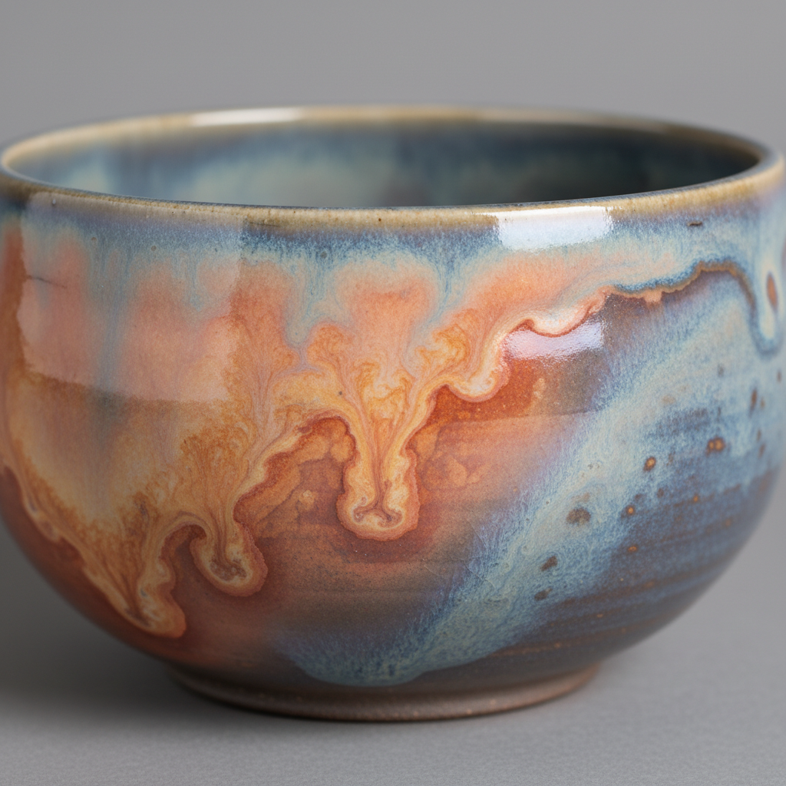

# Soda Firing Art 苏打烧艺术

> "Soda firing is salt glazing's gentler cousin — sodium bicarbonate sprayed into the kiln as solution rather than rock salt thrown onto coals, the sodium still vaporizing and bonding with silica in the clay but without the toxic chlorine gas, producing surfaces that flash from warm orange to cool grey with a softer, more varied texture than traditional salt, atmospheric glazing made environmentally responsible without sacrificing the magic of vapor-deposited glass." — Unknown

## 概述

苏打烧艺术（Soda Firing Art）是一种通过在高温烧制过程中向窑内喷入碳酸钠（苏打）溶液，使钠蒸气与陶瓷坯体表面反应形成天然釉面的烧制技法。苏打烧是盐烧的环保替代——它产生类似的气相釉化效果，但不会释放有害的氯气。苏打烧的效果比盐烧更柔和、更多变，色彩从温暖的橙色到冷灰色，质感从光滑到哑光。

苏打烧艺术的核心要素包括：1）苏打溶液——碳酸钠水溶液喷入窑内；2）气相釉化——钠蒸气与坯体反应成釉；3）环保替代——不产生氯气的环保方式；4）色彩丰富——从暖橙到冷灰的色彩变化；5）质感柔和——比盐釉更柔和的质感；6）位置差异——窑内不同位置效果不同；7）当代发展——20世纪后期发展的技法。

## 核心特征

| 特征 | 描述 |
|------|------|
| 苏打釉化 | 碳酸钠蒸气形成釉面 |
| 环保 | 不产生有害氯气 |
| 色彩丰富 | 暖橙到冷灰的变化 |
| 质感柔和 | 比盐釉更柔和 |
| 位置差异 | 窑内位置决定效果 |
| 当代技法 | 相对较新的技法 |

## 视觉特征

- **温暖闪色**：温暖的橙色闪色效果
- **冷灰区域**：背火面的冷灰色调
- **柔和质感**：比盐釉更柔和的表面
- **渐变效果**：从受苏打面到背面的渐变
- **自然流动**：苏打蒸气流动的痕迹
- **坯体显现**：薄釉下坯体色泽可见

## 代表作品

| 作品 | 艺术家/文化 | 年代 | 意义 |
|------|-------------|------|------|
| *Gail Nichols作品* | Gail Nichols | 当代 | 苏打烧先驱 |
| *当代苏打烧* | 各地陶艺家 | 当代 | 苏打烧的全球实践 |
| *苏打烧餐具* | 各地陶艺家 | 当代 | 功能性苏打烧 |
| *大型苏打烧雕塑* | 当代陶艺家 | 当代 | 苏打烧的雕塑应用 |
| *苏打烧与其他技法结合* | 当代陶艺家 | 当代 | 混合技法探索 |

## 历史时间线

| 时期 | 事件 |
|------|------|
| 1970年代 | 苏打烧概念的提出 |
| 1980年代 | 苏打烧技术的系统化 |
| 1990年代 | 苏打烧在全球的传播 |
| 2000年代 | 苏打烧作为盐烧的主流替代 |
| 当代 | 苏打烧技术的持续优化 |

## 中国语境

苏打烧在中国当代陶艺中正在获得越来越多的关注。中国的一些陶艺工作室和院校已经建造了苏打窑——将这种环保的气相釉化技术引入中国陶艺实践。苏打烧的"自然"和"不可控"特性与中国传统美学中追求"天然去雕饰"的理念相契合。中国陶艺家正在探索将苏打烧与中国传统陶瓷材料结合——用中国的高岭土和本地泥料进行苏打烧实验，寻找独特的中国苏打烧语言。

## AI生成概念图

## 与其他风格的关系

- **Salt Kiln** → 盐窑
- **Wood Kiln** → 柴窑
- **Atmospheric Firing** → 气氛烧制
- **Gas Kiln** → 气窑
- **Stoneware** → 炻器
- **Studio Pottery** → 工作室陶艺

---

*浮光艺志 | Chronicle of Artistry*
