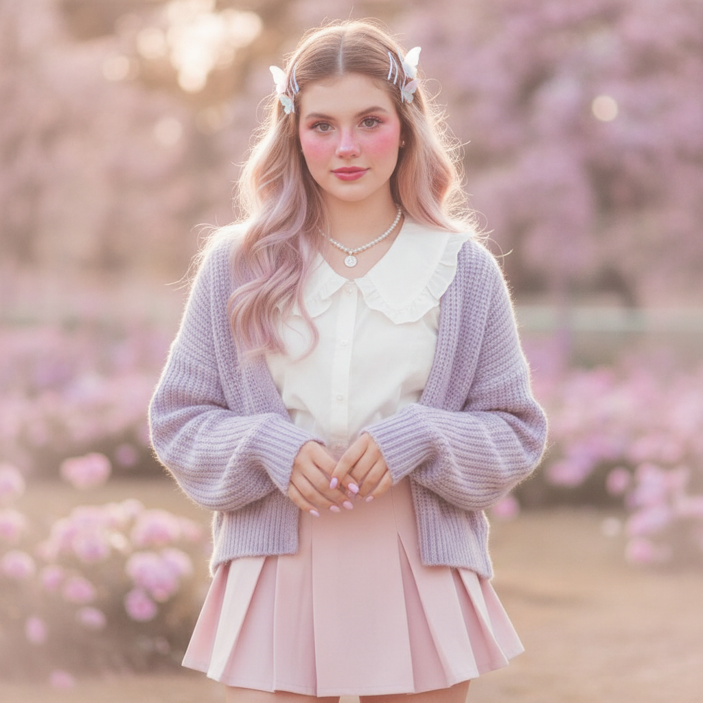
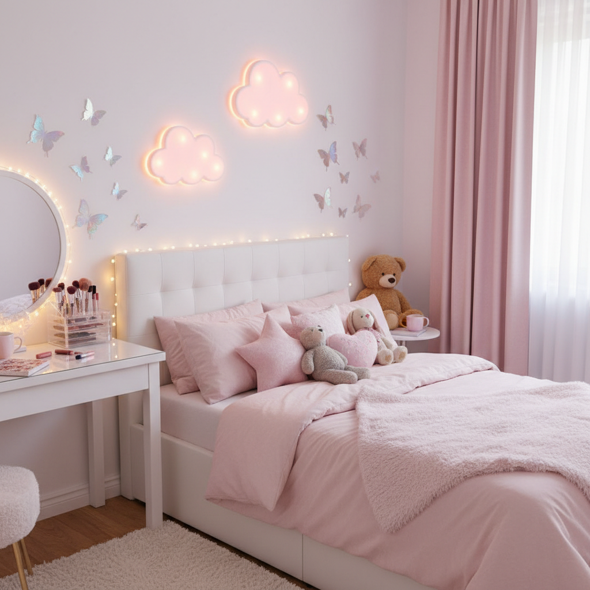

# Soft Girl 软妹风





> **"粉色云朵、蝴蝶发夹和腮红——TikTok 时代最甜的视觉糖果。"**

## 概述

| 维度 | 描述 |
|------|------|
| 时期 | 2019–至今 |
| 别名 | Soft Girl Aesthetic, VSCO Girl (近亲), Pastel Aesthetic |
| 核心色彩 | 婴儿粉、淡紫、奶油白、天蓝 |
| 关键元素 | 蝴蝶发夹、腮红妆、针织开衫、百褶裙、珍珠 |
| 代表人物 | 抖音/TikTok 博主群体、Ariana Grande 部分造型 |
| 关联风格 | Coquette Y2K, Barbiecore, Kawaii, E-Girl (对立面) |

---

## 历史脉络

### 2019：TikTok 上的诞生

Soft Girl 美学在 2019 年随 TikTok 的全球扩张而诞生，是 E-Girl 的"光明面"对应物：

- **E-Girl** = 暗黑、链条、动漫、游戏 → 夜晚
- **Soft Girl** = 粉彩、蝴蝶、花朵、甜美 → 白天

两者共享同一个平台（TikTok）和同一代人（Z世代），但代表了完全相反的情感表达：E-Girl 表达叛逆和忧郁，Soft Girl 表达温柔和甜美。

### 文化基因

Soft Girl 并非凭空出现，它融合了多种前辈美学：

| 来源 | 贡献 |
|------|------|
| Kawaii (日本) | 可爱至上的哲学、粉色崇拜 |
| Coquette (法式) | 蝴蝶结、蕾丝、"女性气质即力量" |
| VSCO Girl (2019) | 自然感、水壶、贝壳项链 |
| 2000s Y2K | 蝴蝶元素、亮片、低腰裤 |
| Korean Beauty | 玻璃肌、腮红妆、自然眉 |

### 2020–2021：疫情期间的爆发

COVID-19 封城期间，Soft Girl 美学成为一种**情感避难所**：
- 在焦虑和不确定中，粉色和柔软提供了心理安慰
- 居家穿搭 → 舒适的针织衫和宽松裤成为主流
- "comfort dressing"（安慰穿搭）概念兴起
- 粉色房间改造视频在 TikTok 爆发

### 2022–至今：商业化与分化

Soft Girl 已经从亚文化变成了主流商业美学：
- SHEIN、Romwe 等快时尚品牌大量生产 Soft Girl 风格
- 美妆品牌推出"soft girl makeup"系列
- 风格开始分化：Clean Soft Girl、Dark Soft Girl、Cottagecore Soft Girl

---

## 视觉语法

### 色彩系统

```
主色（全部高明度、低饱和）：
  婴儿粉 (#FFD1DC) — 最核心的 Soft Girl 色
  淡紫/薰衣草 (#E6E6FA) — 第二常见
  奶油白 (#FFFDD0) — 背景色
  天蓝 (#BFEFFF) — 点缀色
  蜜桃色 (#FFDAB9) — 腮红色

禁忌色：
  纯黑（太暗）
  荧光色（太刺激）
  深色系（太沉重）

质感：
  毛绒/针织 — 触感柔软
  丝绒 — 光泽但不锐利
  珍珠光泽 — 温润
  云朵/棉花糖 — 蓬松感
```

### 标志性元素

| 类别 | 元素 |
|------|------|
| 发饰 | 蝴蝶发夹（最标志性）、珍珠发夹、丝带发带 |
| 上衣 | 针织开衫（粉色/淡紫）、Peter Pan 领衬衫、crop top |
| 下装 | 百褶裙（格子/纯色）、高腰阔腿裤 |
| 鞋履 | 白色运动鞋、Mary Jane、厚底凉鞋 |
| 配饰 | 珍珠项链、心形坠饰、蝴蝶结耳环 |
| 妆容 | 重腮红（苹果肌+鼻尖）、玻璃唇、自然眉 |
| 指甲 | 法式美甲、粉色渐变、小花/蝴蝶贴纸 |
| 手机壳 | 粉色毛绒壳、云朵壳、蝴蝶装饰壳 |

### Soft Girl 房间美学

Soft Girl 不仅是穿搭，更是一种**空间美学**：
- LED 云朵灯/星星灯串
- 粉色窗帘和床品
- 毛绒玩具堆满床头
- 化妆台上的亚克力收纳盒
- 墙上的蝴蝶贴纸/照片墙
- 粉色地毯

---

## 与千禧怀旧的关系

Soft Girl 与千禧怀旧的关系是**间接但深刻**的：

### Y2K 元素的回收
- 2000年代的蝴蝶元素 → Soft Girl 的蝴蝶发夹
- Paris Hilton 的粉色 → Soft Girl 的粉色崇拜
- 2000年代的亮片和珠光 → Soft Girl 的珍珠光泽
- Bratz 娃娃的妆容 → Soft Girl 的重腮红

### 情感连接
Soft Girl 怀念的是一种**被允许"幼稚"的时代**：
- 小时候可以喜欢粉色而不被嘲笑
- 可以收集贴纸、发夹、小饰品
- 可以把房间装饰成公主房
- 长大后重新拥抱这些"幼稚"的东西 = 一种自我疗愈

---

## 中国语境

Soft Girl 在中国有非常强的本土化表达：

### "软妹"文化
- 2015年前后就已经在中国互联网出现"软妹"概念
- 小红书上的"奶fufu穿搭"
- 抖音上的"甜妹妆容"教程
- 淘宝"软妹风""甜系"店铺

### 与日韩文化的交叉
- 日本 Kawaii 文化的直接影响
- 韩国"清纯妆"的妆容技术
- JK制服文化中的"甜系"分支
- 三丽鸥（Hello Kitty、美乐蒂）周边

---

## 设计应用

| 场景 | 应用方式 |
|------|----------|
| 品牌设计 | 粉彩色板 + 圆角 + 手写字体 |
| 包装 | 粉色+白色+珍珠光泽+蝴蝶元素 |
| UI设计 | 圆角卡片+渐变背景+柔和阴影 |
| 摄影 | 高调+柔光+粉色滤镜+花朵道具 |

---

## 延伸阅读

- Aesthetics Wiki: [Soft Girl](https://aesthetics.fandom.com/wiki/Soft_Girl)
- TikTok #softgirl 标签演变
- "Soft Girl vs E-Girl" 对比分析

---

## 相关风格

← [Coquette Y2K 蝴蝶结千禧](coquette-y2k.md) | [Barbiecore 芭比核](barbiecore.md) →

↑ [返回千禧怀旧目录](README.md) | [返回总目录](../README.md)
