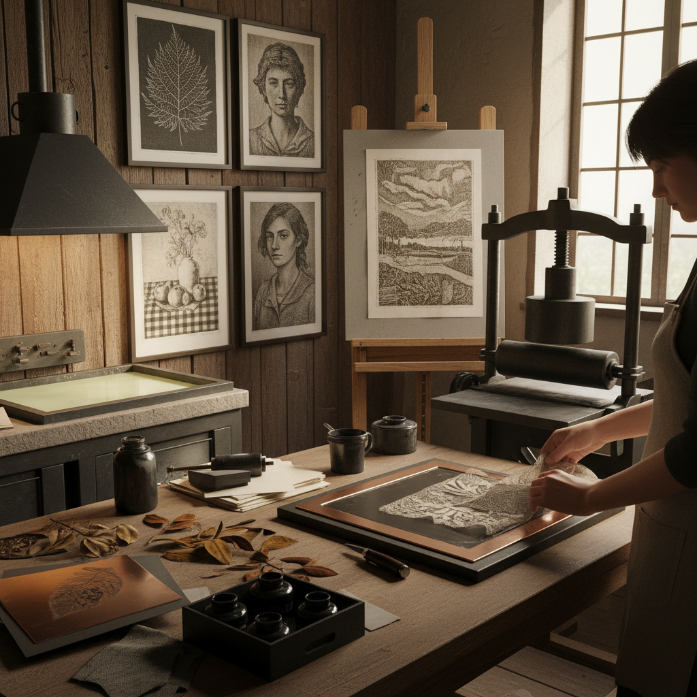

# Soft Ground Etching 软蜡蚀刻

> "Soft ground etching captures the ghost of texture — press fabric, leaves, or lace into the yielding wax, lift it away, and the acid bites only where the ground was disturbed, printing with a softness that hard ground etching can never achieve." — Unknown

## 概述

软蜡蚀刻（Soft Ground Etching）是一种版画技法——使用柔软的、不完全干燥的防腐蚀层（soft ground）覆盖金属版面。与硬蜡蚀刻（hard ground etching）不同，软蜡蚀刻的防腐蚀层保持柔软和粘性，可以通过压印各种材料（织物、树叶、纸张、线条等）来转移纹理，也可以在上面覆盖纸张用铅笔画线——铅笔的压力会使纸张粘起下方的软蜡，暴露金属表面。

软蜡蚀刻的独特之处在于：它能捕捉各种材料的纹理和质感——从织物的编织纹到树叶的脉络，从铅笔线条的粗糙感到指纹的纹路。这种"间接"的制版方式产生的印刷效果柔和、有机，具有独特的手工质感——与硬蜡蚀刻的锐利线条形成鲜明对比。

## 核心特征

| 特征 | 描述 |
|------|------|
| 软蜡 | 柔软的防腐蚀层 |
| 压印 | 压印各种材料纹理 |
| 柔和 | 柔和的线条效果 |
| 纹理 | 捕捉材料纹理 |
| 间接 | 间接的制版方式 |
| 版画 | 凹版印刷技法 |

## 视觉特征

- **柔和**：柔和的线条
- **纹理**：丰富的纹理效果
- **有机**：有机的自然感
- **手工**：手工的质感
- **间接**：间接转印的特质
- **层次**：丰富的层次

## 代表作品

| 作品 | 艺术家 | 年代 | 意义 |
|------|--------|------|------|
| *Soft ground etchings* | Thomas Gainsborough | 18世纪 | 早期软蜡蚀刻 |
| *Texture prints* | Various | 19世纪 | 纹理压印版画 |
| *Contemporary soft ground* | Various | 当代 | 当代软蜡蚀刻 |
| *Mixed intaglio prints* | Various | 当代 | 混合凹版印刷 |
| *Experimental soft ground* | Various | 当代 | 实验性软蜡蚀刻 |

## 历史时间线

| 时期 | 事件 |
|------|------|
| 17世纪 | 软蜡蚀刻技法的早期发展 |
| 18世纪 | Gainsborough等艺术家的应用 |
| 19世纪 | 软蜡蚀刻在版画中的标准化 |
| 20世纪 | 实验性软蜡蚀刻的发展 |
| 当代 | 软蜡蚀刻在当代版画中的复兴 |
| 当代 | 与其他版画技法的创新结合 |

## 中国语境

软蜡蚀刻在中国的版画教育中有一定的教学。中国的美术院校版画系通常会教授软蜡蚀刻作为凹版技法之一。中国的版画艺术家使用软蜡蚀刻创作具有丰富纹理的作品。软蜡蚀刻的"捕捉自然纹理"特点与中国传统艺术对自然的关注有共鸣。中国的一些当代版画家将软蜡蚀刻与中国传统元素结合。

## AI生成概念图

## 与其他风格的关系

- **Etching** → 蚀刻版画
- **Acid Etching** → 酸蚀
- **Drypoint** → 干刻
- **Aquatint** → 飞尘腐蚀
- **Printmaking** → 版画
- **Intaglio** → 凹版印刷

---

*浮光艺志 | Chronicle of Artistry*
