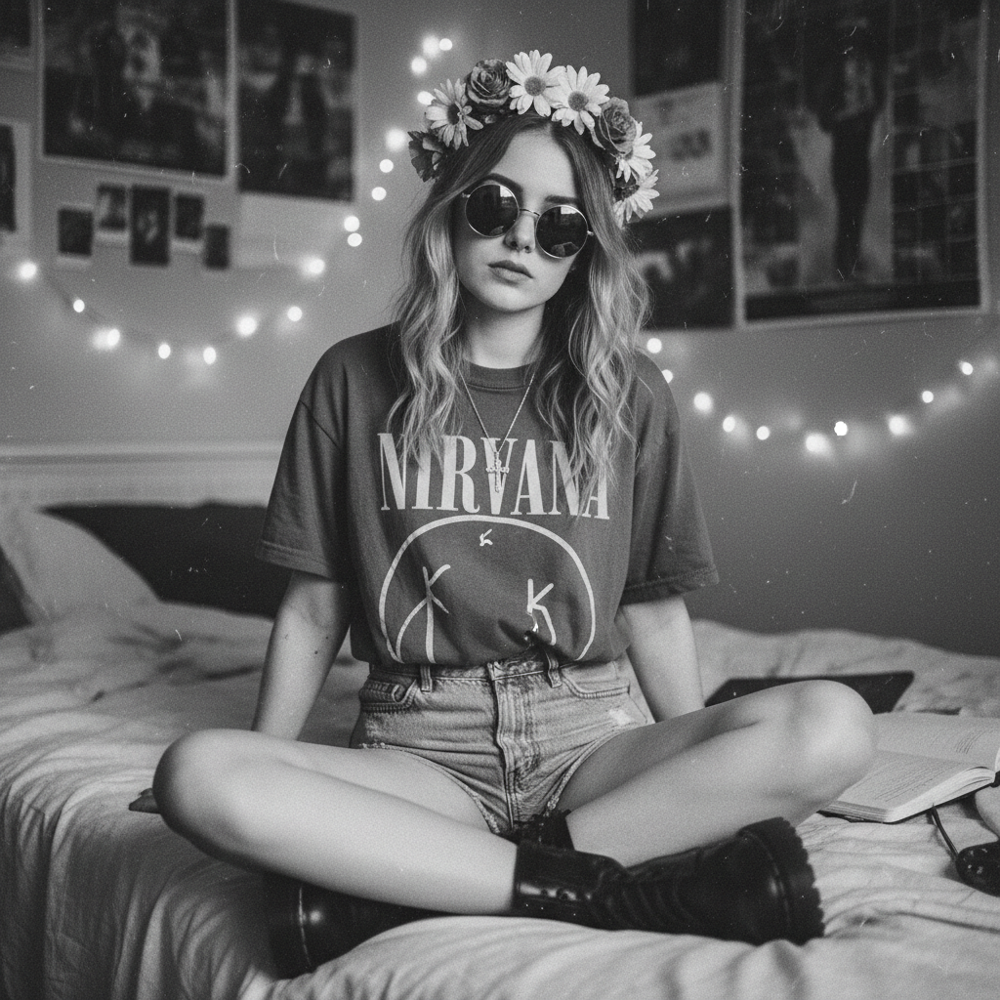
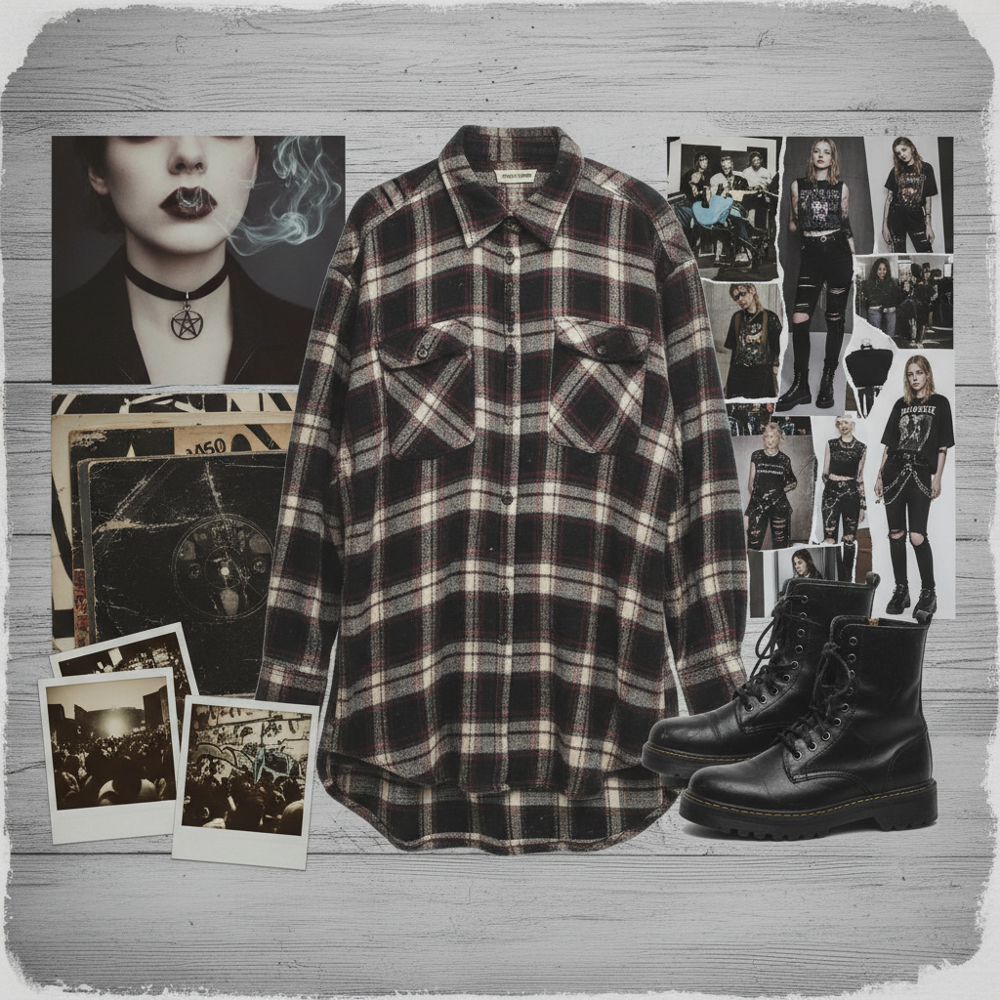

# Soft Grunge 软垃圾摇滚





> **"Nirvana T恤配花冠，黑色指甲油配粉色唇膏——Tumblr 把叛逆变成了美学。"**

## 概述

| 维度 | 描述 |
|------|------|
| 时期 | 2011–2015 |
| 别名 | Soft Grunge, Tumblr Grunge, 90s Grunge Revival |
| 核心色彩 | 黑色、深紫、酒红、灰色、偶尔的粉色 |
| 关键元素 | 格子衬衫、Doc Martens、花冠、十字架、band tee |
| 代表人物 | Sky Ferreira、Lana Del Rey (早期)、Tumblr 博主 |
| 关联风格 | Grunge, Pale Grunge, Pastel Goth, Indie, Emo |

---

## 历史脉络

### 2011：Tumblr 的 Grunge 复兴

Soft Grunge 是 Tumblr 上对 1990s Grunge 的**美学化重新诠释**：

**原版 Grunge (1990s)**：
- 真正的愤怒和反体制
- 不洗头是因为不在乎
- 穿旧衣服是因为买不起新的
- Kurt Cobain 的痛苦是真实的

**Soft Grunge (2010s)**：
- 愤怒被美学化为"态度"
- 不洗头是一种造型选择
- 穿旧衣服是从 Urban Outfitters 买的做旧款
- 痛苦被转化为 Tumblr 上的黑白照片

### 核心矛盾

Soft Grunge 的有趣之处在于它的**内在矛盾**：
- 它声称叛逆，但本质上是消费主义的
- 它引用 Nirvana，但更关心穿搭
- 它看起来"不在乎"，但每张照片都精心构图
- 这种矛盾本身就是它的魅力——一种"安全的叛逆"

### 与 Pale Grunge 的区别

| 维度 | Soft Grunge | Pale Grunge |
|------|------------|-------------|
| 色调 | 更暗、更饱和 | 更淡、更褪色 |
| 情绪 | 叛逆、态度 | 忧郁、疏离 |
| 元素 | band tee、格子衬衫 | 白色、极简、烟 |
| 平台 | Tumblr 早期 | Tumblr 2013–2015 |

---

## 视觉语法

### 色彩系统

```
主色：
  黑色 (#000000) — 基础色
  深紫 (#4B0082) — 神秘感
  酒红 (#722F37) — 唇色、指甲
  灰色 (#696969) — 褪色质感
  白色 (#FFFFFF) — 对比

辅色：
  粉色 (#FF69B4) — 花冠、唇膏
  牛仔蓝 (#4682B4) — 高腰短裤
  军绿 (#556B2F) — 军装外套

质感：
  做旧/褪色 — 衣物、照片
  网格/格子 — 衬衫
  皮革 — 靴子、夹克
  蕾丝 — 内搭
  金属 — 十字架、耳环
```

### 标志性元素

| 类别 | 元素 |
|------|------|
| 上衣 | Band tee (Nirvana/Arctic Monkeys)、格子衬衫 |
| 下装 | 高腰牛仔短裤、黑色紧身裤、网袜 |
| 鞋 | Doc Martens、Creepers、Converse |
| 配饰 | 花冠、十字架项链、choker、圆形墨镜 |
| 妆容 | 烟熏眼、深色唇、黑色指甲油 |
| 摄影 | 黑白滤镜、颗粒感、自拍、镜子照 |

---

## 与千禧怀旧的关系

### Tumblr 黄金时代
- Soft Grunge 是 Tumblr 2011–2015 的标志性美学
- 与 Pale Grunge、Pastel Goth 共同定义了"Tumblr 美学"
- 代表了一种"在网上构建身份"的体验

### 90s 怀旧的第一波
- Soft Grunge 是最早的"90s 怀旧"浪潮之一
- 它让 Z 世代第一次接触到 Grunge 文化
- 虽然被"稀释"了，但它确实传播了 90s 的视觉语言

---

## 中国语境

- "暗黑少女"穿搭风格
- 格子衬衫+黑色紧身裤的校园穿搭
- 淘宝"欧美风"/"暗黑系"关键词
- 与"非主流"文化的部分重叠
- 豆瓣/Lofter 上的 Grunge 美学社区

---

## 设计应用

| 场景 | 应用方式 |
|------|----------|
| 品牌 | 黑白+做旧字体+十字架/花冠元素 |
| 摄影 | 颗粒感+低饱和+自然光+随意构图 |
| 包装 | 黑色+手写字体+极简信息 |
| 数字 | 黑白滤镜+Tumblr 风格排版 |

---

## 延伸阅读

- "What is Soft Grunge?" (Dazed, 2013)
- Tumblr 美学史回顾
- 90s Grunge vs 2010s Soft Grunge 对比分析

---

## 相关风格

← [Pale Grunge 苍白垃圾摇滚](pale-grunge.md) | [Pastel Goth 粉彩哥特](pastel-goth.md) →

↑ [返回千禧怀旧目录](README.md) | [返回总目录](../README.md)
