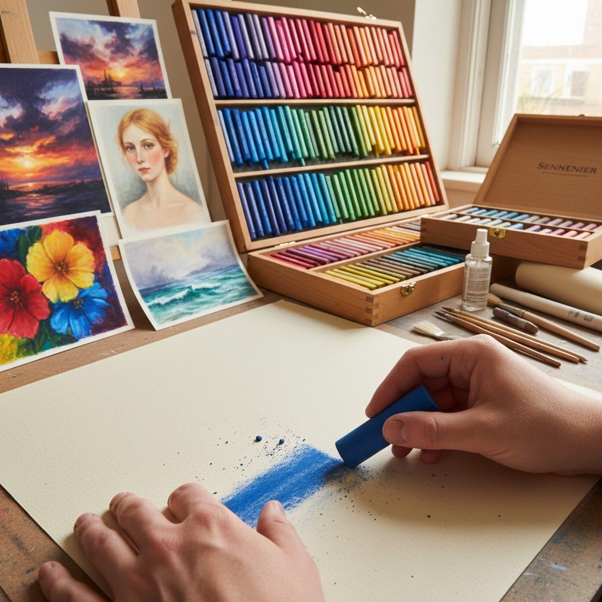

# Soft Pastel 软色粉

> "Soft pastel is the purest form of color application — barely bound pigment that crumbles at a touch, leaving behind a velvet bloom of pure chroma that no varnish or medium can ever replicate." — Unknown

## 概述

软色粉（Soft Pastel）是色粉笔家族中粘合剂含量最少、质地最柔软的一种——由纯颜料粉末与极少量的阿拉伯胶或甲基纤维素粘合剂压制而成。软色粉的颜料含量可达95%以上，因此色彩极其纯净、鲜艳、饱和。软色粉触感柔软如粉笔，轻轻一触就能在纸面留下浓郁的色彩。

软色粉与硬色粉（hard pastel）和色粉铅笔（pastel pencil）的区别在于粘合剂含量——软色粉最少，因此最柔软、色彩最浓郁，但也最容易碎裂和产生粉尘。软色粉特别适合：大面积的色彩铺设、柔和的混合过渡、浓郁的色彩表现。著名的软色粉品牌包括Sennelier、Schmincke、Unison和Mount Vision。

## 核心特征

| 特征 | 描述 |
|------|------|
| 超软 | 极其柔软的质地 |
| 高纯 | 颜料含量极高 |
| 浓郁 | 色彩浓郁饱和 |
| 粉质 | 粉质的触感 |
| 易碎 | 容易碎裂 |
| 纯净 | 最纯净的色彩 |

## 视觉特征

- **浓郁**：浓郁饱和的色彩
- **柔和**：柔和的过渡
- **天鹅绒**：天鹅绒般的质感
- **发光**：内在的发光感
- **丰富**：丰富的色彩层次
- **粉质**：粉质的表面

## 代表作品

| 作品 | 艺术家 | 年代 | 意义 |
|------|--------|------|------|
| *Ballet scenes* | Edgar Degas | 1870s-1890s | 软色粉大师 |
| *Portraits* | Mary Cassatt | 19世纪 | 印象派色粉画 |
| *Landscapes* | Wolf Kahn | 20世纪 | 当代色粉风景 |
| *Contemporary soft pastels* | Various | 当代 | 当代软色粉艺术 |
| *Plein air pastels* | Various | 当代 | 户外写生色粉 |

## 历史时间线

| 时期 | 事件 |
|------|------|
| 15世纪 | 早期色粉笔的制作 |
| 18世纪 | 法国色粉画的黄金时代 |
| 19世纪 | 印象派对软色粉的推广 |
| 20世纪 | 高品质软色粉品牌的建立 |
| 当代 | 手工软色粉的复兴 |
| 当代 | 软色粉在户外写生中的流行 |

## 中国语境

软色粉在中国的色粉画社区中有一定的知名度。中国的色粉画家对高品质软色粉品牌（如Sennelier、Schmincke）有需求。中国的一些画材店和在线平台销售进口软色粉。中国的色粉画教学中，软色粉被用于色彩表现力的训练。中国的一些色粉画家使用软色粉进行户外写生和创作。中国也有一些本土品牌开始生产软色粉产品。

## AI生成概念图

## 与其他风格的关系

- **Pastel Painting** → 色粉画
- **Pan Pastel** → 盘式色粉
- **Oil Pastel** → 油画棒
- **Charcoal Drawing** → 炭笔画
- **Impressionism** → 印象派
- **Plein Air** → 户外写生

---

*浮光艺志 | Chronicle of Artistry*
