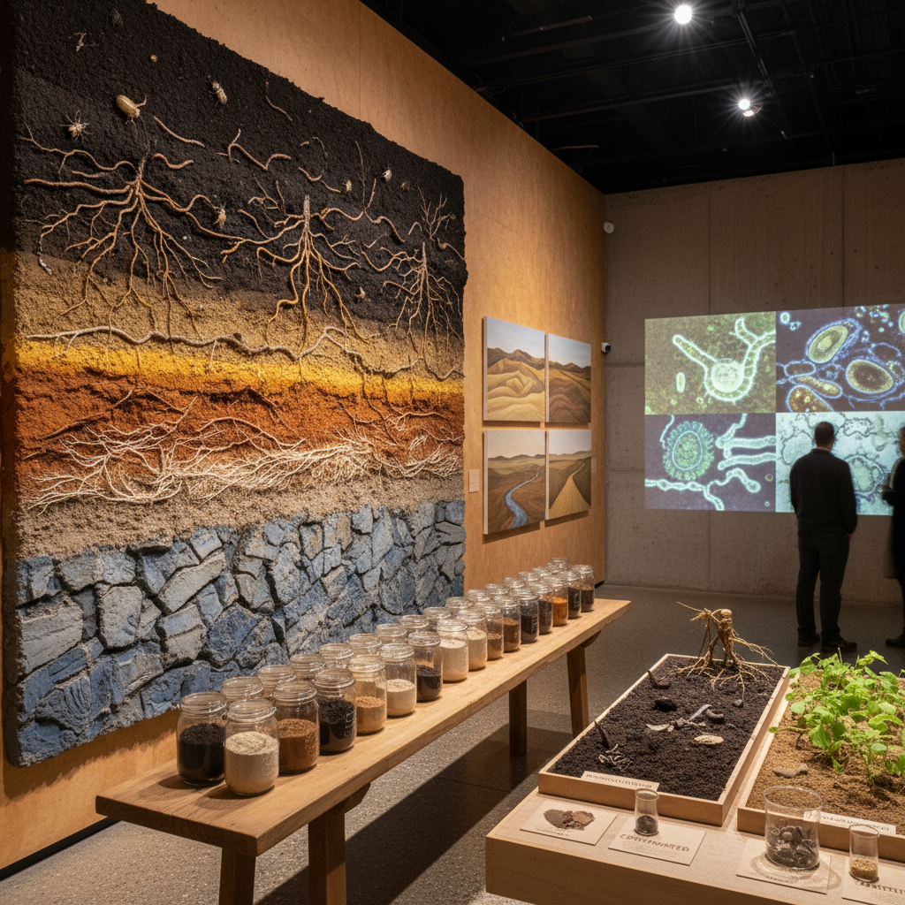

# Soil Art 土壤艺术

> "Soil art begins with the recognition that soil is not dirt — it is the most complex ecosystem on Earth, a living skin containing more organisms in a single handful than there are humans on the planet, a medium that transforms death into life, a archive of geological and biological history, and the foundation upon which all terrestrial civilization rests. To make art with and about soil is to honor this complexity, to make visible the invisible world beneath our feet, and to remind ourselves that we are, in the end, creatures of the earth." — Unknown

## 概述

土壤艺术（Soil Art）是以土壤为媒介、主题和灵感来源的艺术实践。土壤——地球表面的活体层——是一个极其复杂的生态系统，包含了细菌、真菌、原生动物、线虫、昆虫和植物根系的密集网络。土壤艺术将这个通常被忽视的世界带入艺术的视野。

土壤艺术的实践包括：1）以土壤为颜料和材料——用不同颜色和质地的土壤创作绘画和雕塑；2）土壤生态的可视化——将土壤中的微生物世界和生态过程转化为可见的艺术形式；3）土壤修复作为艺术——将被污染或退化的土壤的修复过程视为一种创作行为；4）土壤的文化意义——探索土壤与身份、记忆、归属和死亡的关系。

## 核心特征

| 特征 | 描述 |
|------|------|
| 大地 | 大地的物质性 |
| 生命 | 土壤中的生命 |
| 颜色 | 土壤的色彩 |
| 层次 | 土壤的层次 |
| 修复 | 土壤修复 |
| 记忆 | 土壤的记忆 |

## 视觉特征

- **色谱**：不同土壤的颜色光谱
- **层理**：土壤剖面的层次
- **质地**：粗砂到细黏土的质地
- **根系**：植物根系的网络
- **微观**：土壤微生物的放大
- **大地色**：棕、赭、红、黄的色调

## 代表作品

| 作品 | 艺术家 | 年代 | 意义 |
|------|--------|------|------|
| *Earth paintings* | Various | 2000年代 | 土壤绘画 |
| *Soil chromatography* | Various | 2010年代 | 土壤色谱 |
| *Remediation art* | Various | 2010年代 | 修复艺术 |
| *Soil archives* | Various | 2020年代 | 土壤档案 |
| *Underground installations* | Various | 当代 | 地下装置 |

## 历史时间线

| 时期 | 事件 |
|------|------|
| 1970年代 | 大地艺术运动 |
| 2000年代 | 土壤科学的公众化 |
| 2015 | 联合国国际土壤年 |
| 2010年代 | 土壤艺术的独立发展 |
| 当代 | 与气候变化和碳封存的结合 |

## 中国语境

土壤艺术在中国有深刻的文化共鸣。中国文明是典型的"土地文明"——"社稷"（社=土地神，稷=谷神）是国家的代名词，"土"是五行之中、五色之黄、五方之中央。中国传统文化中对土地有深厚的情感——"故土"、"乡土"、"入土为安"都表达了人与土地的深层联系。中国的黄土高原——世界上最厚的黄土堆积——本身就是一部地质和文化的史诗。中国当代的一些艺术家在探索土壤艺术：用中国不同地区的土壤（红土、黄土、黑土）作为颜料创作，探索土地与身份的关系，以及关注中国的土壤污染和修复问题。

## AI生成概念图

## 与其他风格的关系

- **Land Art** → 大地艺术
- **Eco-Art** → 生态艺术
- **Earth Art** → 泥土艺术
- **Process Art** → 过程艺术
- **Material Art** → 材料艺术
- **Remediation Art** → 修复艺术

---

*浮光艺志 | Chronicle of Artistry*
