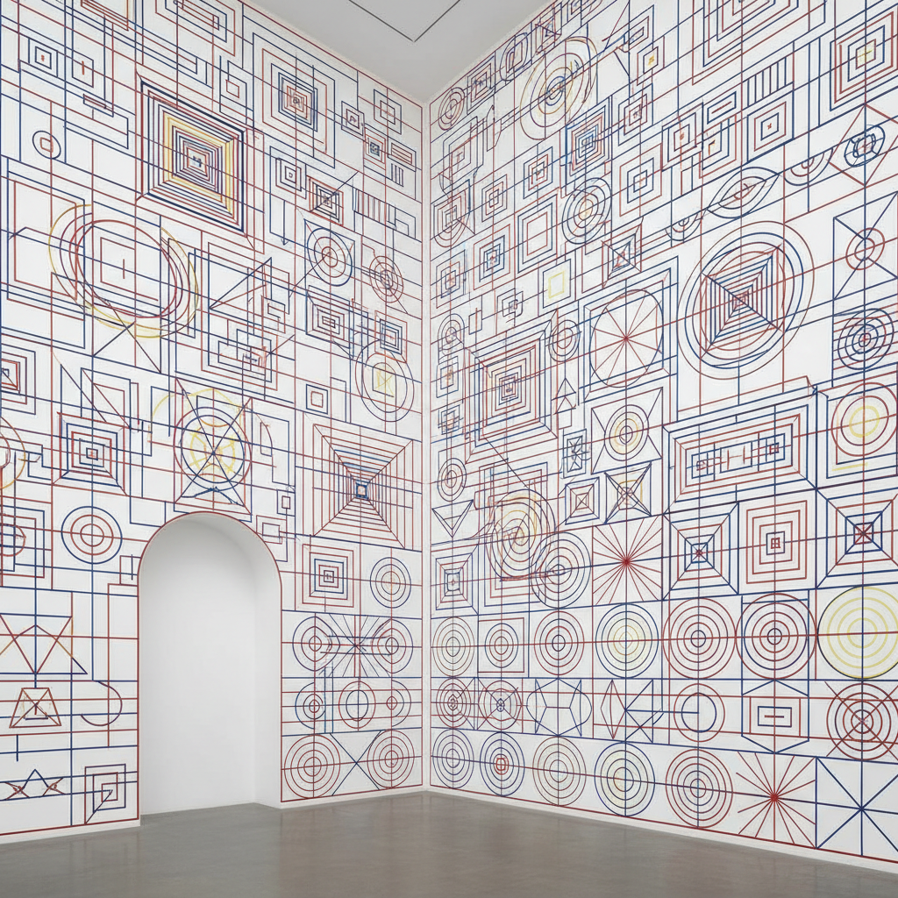

# Sol LeWitt 索尔·勒维特

> **流派**: 极简主义 · 概念艺术  
> **时期**: 1928–2007 美国  
> **关键词**: 墙面绘画、指令艺术、几何结构、观念先行

## 概述

索尔·勒维特是概念艺术和极简主义的奠基人之一。他最著名的创新是"墙面绘画"——艺术家只提供文字指令，由他人执行绘制。这一做法将艺术的核心从手工技巧转移到了观念本身。

## 视觉特征

- **几何网格**: 直线、曲线、网格构成基本词汇
- **系统性变化**: 通过排列组合穷尽所有可能性
- **墙面尺度**: 作品直接绘制在建筑墙面上
- **纯色与渐变**: 使用基本色彩的系统性组合
- **白色立方体**: 早期雕塑为开放的白色网格结构

## 代表作品

- 《墙面绘画》系列 (1968–2007)
- 《不完整的开放立方体》(1974)
- 《四基本色的所有组合》(1977)
- 墙面绘画 #1136 (2004)

## 历史影响

勒维特重新定义了"艺术家"的角色——从手工制作者变为观念的提出者。他的指令式创作方法预示了算法艺术和生成艺术的到来。

## 相关风格

- [Minimalism 极简主义](minimalism.md)
- [Donald Judd 唐纳德·贾德](donald-judd.md)
- [Frank Stella 弗兰克·斯特拉](frank-stella.md)
