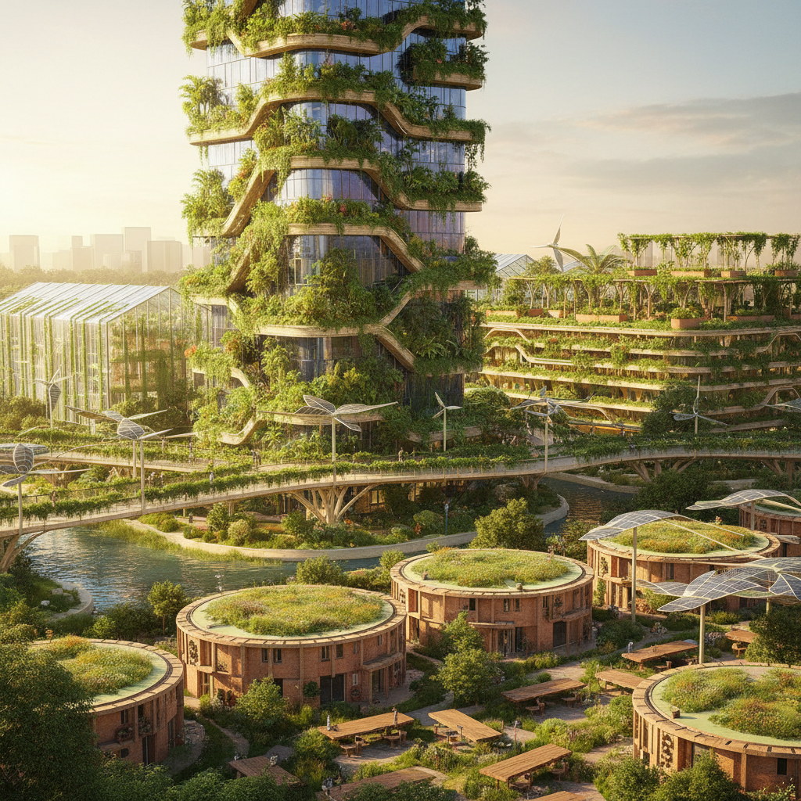

# Solar Punk Architecture 太阳朋克建筑

> "Solar punk architecture is the built environment of a world that chose hope — buildings that breathe through living walls, cities where every rooftop is a garden and every facade a solar collector, infrastructure that works with nature rather than against it, architecture that proves sustainability need not be austere or punishing but can be lush, colorful, joyful, and abundant, structures that grow and adapt like organisms, neighborhoods designed for community rather than isolation, a vision of the future where technology serves ecology and beauty serves justice, where the built world heals rather than harms." — Unknown

## 概述

太阳朋克建筑（Solar Punk Architecture）是太阳朋克（Solarpunk）运动在建筑和城市设计领域的表现，想象一种将可再生能源、生态设计、社区参与和美学愉悦融为一体的建筑未来。太阳朋克建筑不是简单的"绿色建筑"，而是一种更激进的想象——建筑不仅减少对环境的伤害，而且积极修复生态系统、促进社区连接、并创造视觉上令人愉悦的环境。

太阳朋克建筑的视觉特征包括：大量的植被覆盖（垂直花园、屋顶农场、绿色走廊）、整合的太阳能系统（光伏玻璃、太阳能瓦片）、有机的建筑形态（模仿自然结构）、本地材料的使用（竹子、夯土、再生材料）、以及社区共享空间的设计。代表性的参照包括新加坡的垂直花园建筑、哥本哈根的CopenHill、以及各种生态社区的设计方案。

## 核心特征

| 特征 | 描述 |
|------|------|
| 生态 | 生态修复性设计 |
| 太阳能 | 整合的可再生能源 |
| 植被 | 大量的植被覆盖 |
| 社区 | 社区导向的设计 |
| 有机 | 有机的建筑形态 |
| 乐观 | 乐观和美学愉悦 |

## 视觉特征

- **绿色**：大量的绿色植被
- **曲线**：有机的曲线形态
- **玻璃**：光伏玻璃和温室
- **木材**：木材和竹子结构
- **水**：水系统的可见化
- **社区**：开放的社区空间

## 代表作品

| 作品 | 艺术家/建筑师 | 年代 | 意义 |
|------|--------|------|------|
| *Bosco Verticale* | Stefano Boeri | 2014 | 米兰的垂直森林 |
| *Gardens by the Bay* | Various | 2012 | 新加坡的超级树 |
| *CopenHill* | BIG | 2019 | 哥本哈根的滑雪发电厂 |
| *Solarpunk concept art* | Various | 2010年代 | 太阳朋克概念设计 |
| *Earthship homes* | Michael Reynolds | 1970年代起 | 地球船自给自足住宅 |

## 历史时间线

| 时期 | 事件 |
|------|------|
| 1970年代 | 生态建筑的早期实验 |
| 2008 | Solarpunk概念的萌芽 |
| 2014 | 垂直森林的建成 |
| 2010年代 | 太阳朋克建筑概念的流行 |
| 当代 | 从概念到实践的转化 |

## 中国语境

太阳朋克建筑在中国有巨大的实践空间。中国是全球最大的太阳能和风能生产国，也是绿色建筑发展最快的国家之一。中国的一些建筑项目已经体现了太阳朋克的精神——如深圳的"垂直城市"概念、成都的"城市森林花园"住宅、以及各地的生态城市规划。中国传统建筑中的"天人合一"理念、园林设计中的自然融合、以及风水学中的环境意识都与太阳朋克建筑有深层的文化共鸣。中国的快速城市化也为太阳朋克建筑提供了大规模实践的机会——如何在高密度城市中创造生态、美丽和社区性的建筑环境。

## AI生成概念图

## 与其他风格的关系

- **Solarpunk** → 太阳朋克
- **Green Architecture** → 绿色建筑
- **Biomimicry** → 仿生设计
- **Parametric Design** → 参数化设计
- **Eco Art** → 生态艺术
- **Utopian Architecture** → 乌托邦建筑

---

*浮光艺志 | Chronicle of Artistry*
