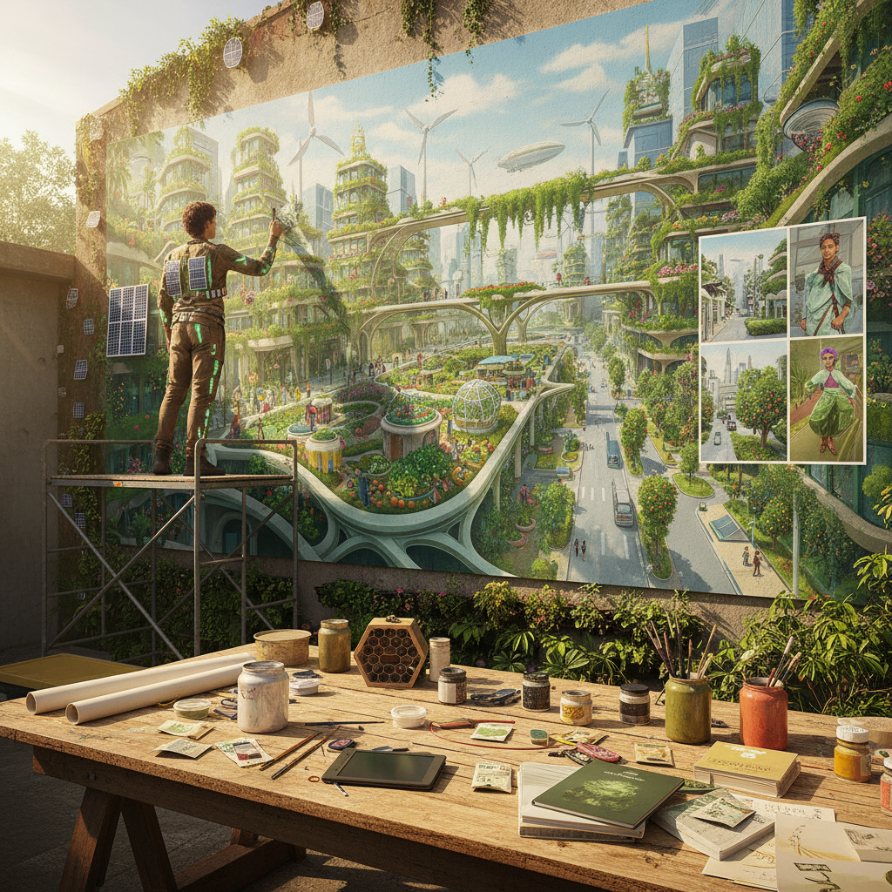

# Solarpunk Art 太阳朋克艺术

> "Solarpunk imagines the world we actually want to live in — not the dystopia we fear or the nostalgia we mourn, but a future where technology serves ecology, where cities are gardens, where energy is clean and abundant, where community thrives and diversity flourishes, a radical act of optimism that insists we can design our way to a beautiful sustainable civilization if we have the courage to imagine it first and then build it together." — Unknown

## 概述

太阳朋克（Solarpunk）是2010年代兴起的一种文化和美学运动，想象一个可持续的、生态友好的、社会公正的乐观未来。与赛博朋克的反乌托邦不同，太阳朋克是一种"建设性的乌托邦"——它不仅批判现状，更积极地想象和设计一个更好的世界。太阳朋克的视觉美学融合了可再生能源技术、有机建筑、城市农业、生物设计和多元文化元素。

太阳朋克的起源可以追溯到2008年左右的巴西博客圈，后来通过Tumblr和Reddit等平台在全球传播。太阳朋克不仅是一种美学风格，也是一种社会运动——它与可持续发展、社区花园、开源技术、合作经济等实践紧密相连。太阳朋克的核心信念是：未来不必是黑暗的——通过设计、技术和社区合作，我们可以创造一个美丽、公正、可持续的世界。

## 核心特征

| 特征 | 描述 |
|------|------|
| 乐观 | 乐观的未来想象 |
| 生态 | 生态友好的技术 |
| 可持续 | 可持续的文明 |
| 社区 | 社区和合作 |
| 花园 | 城市花园和绿色建筑 |
| 太阳能 | 可再生能源 |

## 视觉特征

- **绿色**：大量的植物和绿色
- **太阳能**：太阳能板和风力发电
- **有机**：有机的建筑形态
- **花园**：屋顶花园和垂直农场
- **多彩**：多彩的社区生活
- **融合**：自然与技术的融合

## 代表作品

| 作品 | 艺术家 | 年代 | 意义 |
|------|--------|------|------|
| *Solarpunk concept art* | Various | 2010年代 | 太阳朋克概念设计 |
| *Sunvault anthology* | Various | 2017 | 太阳朋克文学选集 |
| *Imperial Radch covers* | Various | 2013-15 | 太阳朋克风格封面 |
| *Chobani Dear Alice* | Animation | 2021 | 太阳朋克动画广告 |
| *Solarpunk cities* | Vincent Callebaut | 2010年代 | 生态建筑设计 |

## 历史时间线

| 时期 | 事件 |
|------|------|
| 2008 | 巴西博客圈的早期讨论 |
| 2012 | "Solarpunk"一词的流行 |
| 2014 | Tumblr上的太阳朋克美学 |
| 2017 | 《Sunvault》选集出版 |
| 当代 | 太阳朋克的全球化发展 |

## 中国语境

太阳朋克在中国有独特的发展空间。中国作为全球最大的太阳能和风能生产国，其可再生能源基础设施的快速发展本身就是一种"太阳朋克现实"。中国的生态城市规划（如雄安新区的绿色设计）、垂直农场、高铁网络等都与太阳朋克的愿景有共鸣。中国传统的"天人合一"哲学和园林美学也与太阳朋克的自然-技术融合理念相通。中国的一些科幻作家和概念设计师开始探索"中国太阳朋克"的可能性——将中国传统美学与可持续未来想象结合。

## AI生成概念图

## 与其他风格的关系

- **Cyberpunk** → 赛博朋克（对立面）
- **Eco Art** → 生态艺术
- **Speculative Design** → 推测设计
- **Utopian Art** → 乌托邦艺术
- **Art Nouveau** → 新艺术运动（美学影响）
- **Afrofuturism** → 非洲未来主义

---

*浮光艺志 | Chronicle of Artistry*
