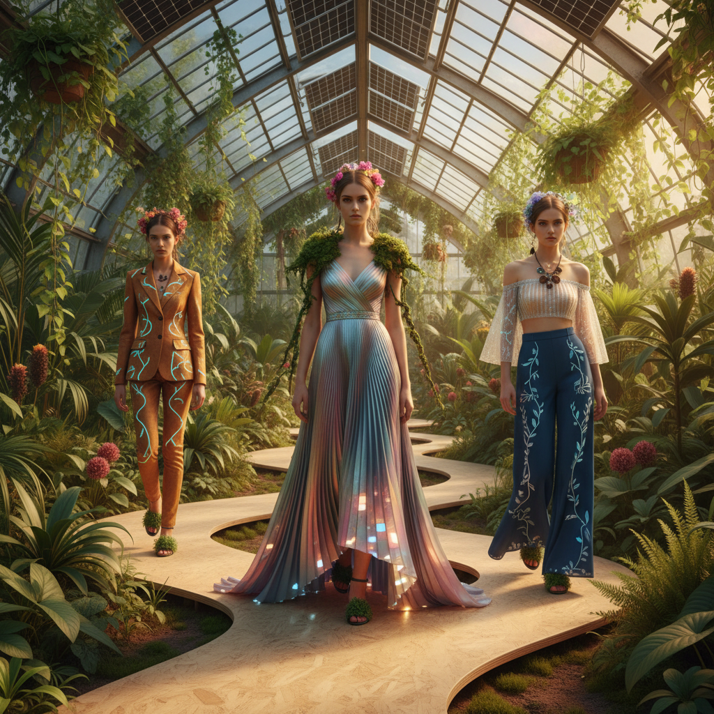

# Solarpunk Fashion Art 太阳朋克时尚艺术

> "Solarpunk fashion imagines what we would wear in a world that chose hope — garments grown from mycelium and algae, dyed with bacteria, woven with solar-collecting fibers, designed for repair and composting rather than disposal, clothing that generates energy, purifies air, and connects us to living systems, fashion that refuses the false choice between beauty and sustainability, proving that the most radical garment is one that gives back more than it takes, that style and ecology are not enemies but lovers waiting to be introduced." — Unknown

## 概述

太阳朋克时尚（Solarpunk Fashion）是太阳朋克运动在服装和身体装饰领域的延伸，想象一种与自然和谐共存的未来时尚。太阳朋克时尚不仅是一种美学风格，也是一种设计哲学——探索如何通过服装来体现可持续、再生和与自然共生的价值观。

太阳朋克时尚的特征包括：使用可持续和生物基材料（如菌丝体皮革、藻类纤维、细菌染色）、整合可再生能源技术（如太阳能纤维、压电材料）、设计为可修补和可堆肥、融合自然形态和植物元素、以及结合高科技与手工艺。太阳朋克时尚的视觉语言融合了Art Nouveau的有机曲线、未来主义的技术感、以及各种传统服装文化的元素——创造一种既古老又未来的美学。

## 核心特征

| 特征 | 描述 |
|------|------|
| 可持续 | 可持续材料和工艺 |
| 生物 | 生物基材料的使用 |
| 能源 | 整合可再生能源 |
| 修补 | 设计为可修补 |
| 自然 | 自然形态的融入 |
| 未来 | 乐观的未来想象 |

## 视觉特征

- **绿色**：绿色和自然色调
- **有机**：有机的曲线和形态
- **植物**：植物元素的整合
- **光**：发光和太阳能元素
- **层次**：多层次的穿搭
- **手工**：可见的手工细节

## 代表作品

| 作品 | 设计师 | 年代 | 意义 |
|------|--------|------|------|
| *Mycelium leather* | Bolt Threads/Stella McCartney | 2021 | 菌丝体皮革 |
| *Algae-based textiles* | Various | 2020年代 | 藻类纺织品 |
| *Solar fiber clothing* | Various | 2020年代 | 太阳能纤维 |
| *Bacterial dye* | Various | 2010年代 | 细菌染色 |
| *Solarpunk cosplay* | Various | 2020年代 | 太阳朋克角色扮演 |

## 历史时间线

| 时期 | 事件 |
|------|------|
| 2014 | 太阳朋克运动的兴起 |
| 2018 | 太阳朋克时尚概念的流行 |
| 2020年代 | 生物材料时尚的发展 |
| 当代 | 从概念到商业化的过渡 |

## 中国语境

太阳朋克时尚在中国有独特的发展空间。中国是全球最大的纺织品生产国，也面临着严重的时尚产业环境问题——这使得可持续时尚的探索尤为重要。中国的一些设计师和研究者在探索太阳朋克时尚的可能性：使用竹纤维、荷叶纤维等中国特色的可持续材料，将传统的植物染色技术与现代科技结合，以及探索中国传统服装（如汉服）中的可持续设计智慧。中国的"国潮"运动与太阳朋克时尚有潜在的交叉——将中国传统美学与未来主义和可持续理念结合，创造具有中国特色的太阳朋克时尚。

## AI生成概念图

## 与其他风格的关系

- **Solarpunk** → 太阳朋克
- **Sustainable Fashion** → 可持续时尚
- **Bio Design** → 生物设计
- **Wearable Technology** → 可穿戴技术
- **Art Nouveau** → 新艺术运动
- **Futurism** → 未来主义

---

*浮光艺志 | Chronicle of Artistry*
