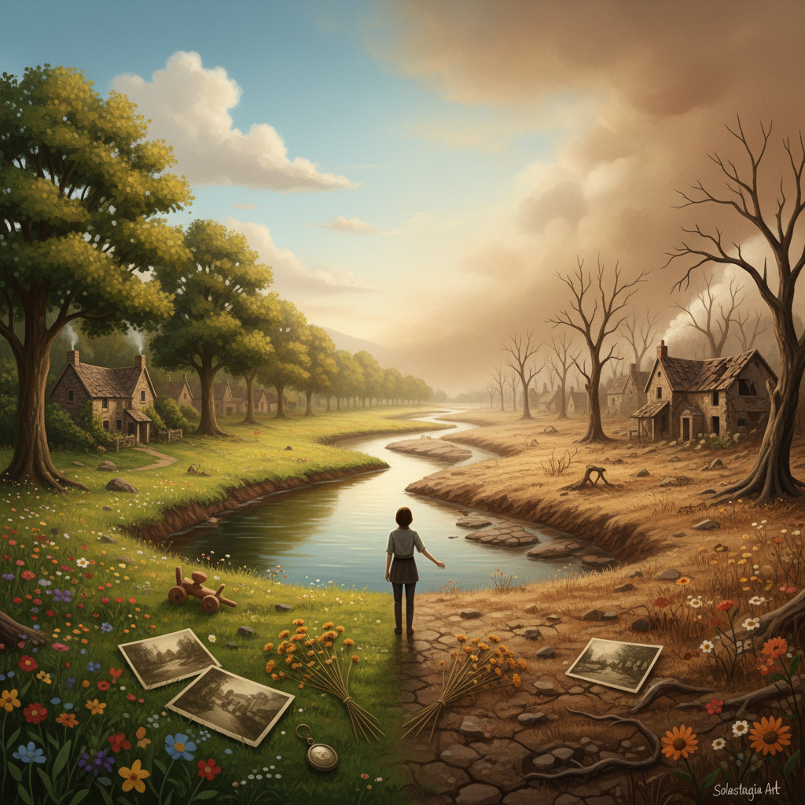

# Solastalgia Art 生态乡愁艺术

> "Solastalgia is the homesickness you feel while still at home — the grief of watching your familiar landscape transform into something unrecognizable under the pressure of climate change, mining, development, or ecological collapse, the particular pain of losing your sense of place without physically moving, the mourning for a world that is disappearing in real time around you while you stand in it, and the art that emerges from this condition is necessarily an art of witness, of elegy, of documentation, and sometimes of rage at the forces that make home unhomeable." — Glenn Albrecht

## 概述

生态乡愁艺术（Solastalgia Art）是围绕"生态乡愁"（Solastalgia）这一概念发展的艺术实践。Solastalgia是澳大利亚哲学家格伦·阿尔布雷希特（Glenn Albrecht）在2003年创造的术语，描述一种"身在家中却感到无家可归"的痛苦——当你熟悉的环境因气候变化、采矿、开发或生态崩溃而变得面目全非时所感受到的悲伤和失落。

生态乡愁艺术记录和表达这种特殊的情感状态：对正在消失的景观的哀悼、对环境变化的见证、对"家"的概念在生态危机中的瓦解。这种艺术实践包括：记录冰川消退的摄影、描绘珊瑚白化的绘画、用消失物种的材料创作的装置、以及将环境数据转化为情感体验的多媒体作品。生态乡愁艺术不同于一般的环境艺术——它更关注情感和心理层面，关注失去和哀悼，而非简单的环保倡导。

## 核心特征

| 特征 | 描述 |
|------|------|
| 哀悼 | 对消失景观的哀悼 |
| 见证 | 环境变化的见证 |
| 情感 | 情感和心理的表达 |
| 地方 | 地方感的丧失 |
| 时间 | 时间和变化的记录 |
| 记忆 | 景观记忆的保存 |

## 视觉特征

- **对比**：过去与现在的对比
- **消逝**：正在消失的事物
- **空旷**：空旷和缺失
- **色彩**：褪色和灰化
- **水**：水位变化、干旱
- **冰**：冰川和冰的消融

## 代表作品

| 作品 | 艺术家 | 年代 | 意义 |
|------|--------|------|------|
| *Ice Watch* | Olafur Eliasson | 2014 | 冰川消融的见证 |
| *Coral reef documentation* | Various | 2010年代 | 珊瑚白化的记录 |
| *Before/After landscapes* | Various | 2000年代起 | 景观变化的对比 |
| *Ghost forests* | Various | 2020年代 | 幽灵森林的记录 |
| *Solastalgia* concept | Glenn Albrecht | 2003 | 概念的提出 |

## 历史时间线

| 时期 | 事件 |
|------|------|
| 2003 | Albrecht提出Solastalgia概念 |
| 2010年代 | 气候艺术的兴起 |
| 2015 | 巴黎协定后的艺术回应 |
| 2020年代 | 生态焦虑的普遍化 |
| 当代 | 生态哀悼作为艺术实践 |

## 中国语境

生态乡愁在中国有深刻的现实基础。中国过去几十年的快速城市化和工业化导致了大量景观的剧烈变化——村庄的消失、河流的污染、山体的开采、海岸线的改变。许多中国人经历着"故乡已不是故乡"的感受，这正是solastalgia的核心体验。中国的一些艺术家在记录和表达这种生态乡愁：摄影师拍摄被拆迁的村庄、被污染的河流、被开发的山地；画家描绘记忆中的故乡风景与现实的对比；装置艺术家用消失的乡村物件创作。中国传统文化中的"乡愁"概念——对故土的思念——在生态危机的语境下获得了新的维度：不是因为离开了家而想家，而是因为家本身在改变而感到失落。

## AI生成概念图

## 与其他风格的关系

- **Eco-Art** → 生态艺术
- **Land Art** → 大地艺术
- **Documentary Photography** → 纪实摄影
- **Climate Art** → 气候艺术
- **Ruin Photography** → 废墟摄影
- **Memory Art** → 记忆艺术

---

*浮光艺志 | Chronicle of Artistry*
