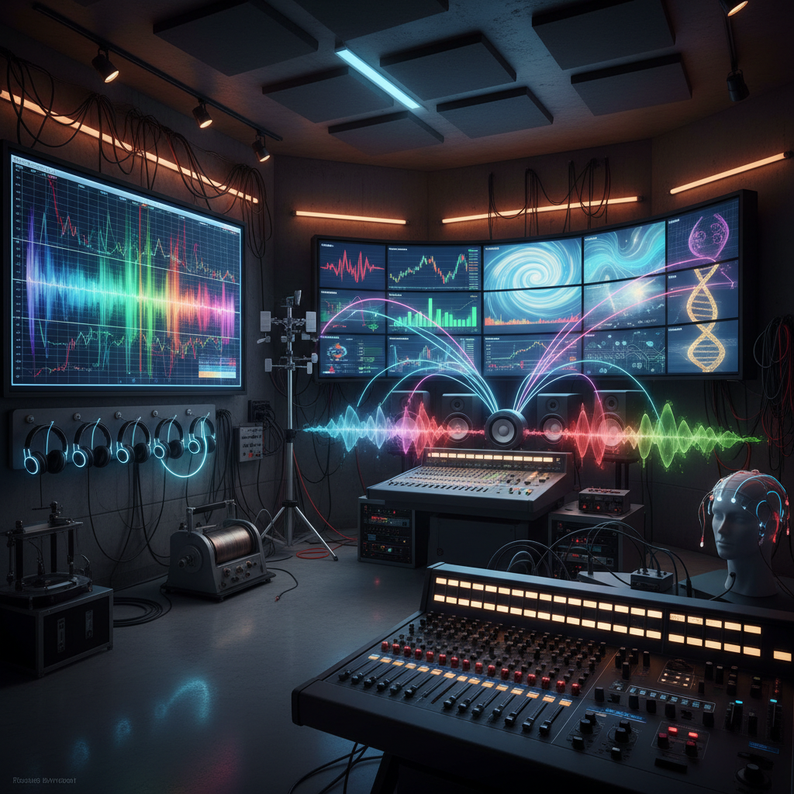

# Sonification Art 声化艺术

> "Sonification art makes the inaudible audible — it translates data, processes, and phenomena that have no natural sound into acoustic experiences, revealing hidden patterns and rhythms in everything from stock markets to seismic activity, from DNA sequences to cosmic radiation, proving that the universe is full of music we simply lack the ears to hear without technological mediation." — Andrea Polli

## 概述

声化艺术（Sonification Art）是将非声学数据转化为声音的艺术实践。声化（sonification）是数据可视化的听觉对应物——将数据映射到声音参数（音高、音量、节奏、音色等），使人们能够通过听觉来感知和理解数据中的模式和关系。

声化艺术的实践包括：1）科学数据的声化——将天文数据、地震数据、气象数据等转化为音乐或声景；2）生物数据的声化——将脑电波、心跳、植物电信号等生物数据转化为声音；3）社会数据的声化——将经济数据、社交网络数据、城市数据等转化为声音；4）实时声化——将实时数据流转化为持续变化的声音环境；5）参数映射——探索数据到声音的不同映射方式及其美学效果。

## 核心特征

| 特征 | 描述 |
|------|------|
| 转译 | 数据到声音的转译 |
| 映射 | 参数映射 |
| 模式 | 听觉模式识别 |
| 实时 | 实时声化 |
| 多感官 | 多感官体验 |
| 科学 | 科学与艺术结合 |

## 视觉特征

- **波形**：声波的可视化
- **频谱**：频谱分析图
- **数据流**：数据到声音的流程图
- **设备**：传感器和音频设备
- **图表**：数据图表与声音的对应
- **空间**：声音装置的空间布局

## 代表作品

| 作品 | 艺术家 | 年代 | 意义 |
|------|--------|------|------|
| *Sonification of solar wind* | Robert Alexander | 2010年代 | 太阳风声化 |
| *Seismic sonification* | Various | 2000年代 | 地震声化 |
| *DNA sonification* | Various | 2010年代 | DNA声化 |
| *Climate data music* | Various | 2010年代 | 气候数据音乐 |
| *Brain sonification* | Various | 2020年代 | 脑电波声化 |

## 历史时间线

| 时期 | 事件 |
|------|------|
| 1908 | 盖革计数器（早期声化） |
| 1990年代 | 声化研究的学术化 |
| 2000年代 | 声化艺术的兴起 |
| 2010年代 | NASA的宇宙声化项目 |
| 当代 | AI辅助的声化 |

## 中国语境

声化艺术在中国有独特的发展空间。中国传统音乐理论中有"天人合一"的观念——认为音乐应该反映宇宙的运行规律，这与声化艺术将自然数据转化为音乐的理念有深刻的共鸣。中国古代的"律历同源"思想——认为音律和历法（天文数据）有内在联系——可以被视为声化的古老先驱。中国当代的一些艺术家在探索声化艺术：将中国城市的环境数据转化为声景、用中国传统乐器的音色来声化科学数据、以及将中国的空气质量和水质数据转化为可听的环境音乐。

## AI生成概念图

## 与其他风格的关系

- **Sound Art** → 声音艺术
- **Data Art** → 数据艺术
- **Electronic Music** → 电子音乐
- **Science Art** → 科学艺术
- **Interactive Art** → 互动艺术
- **New Media Art** → 新媒体艺术

---

*浮光艺志 | Chronicle of Artistry*
