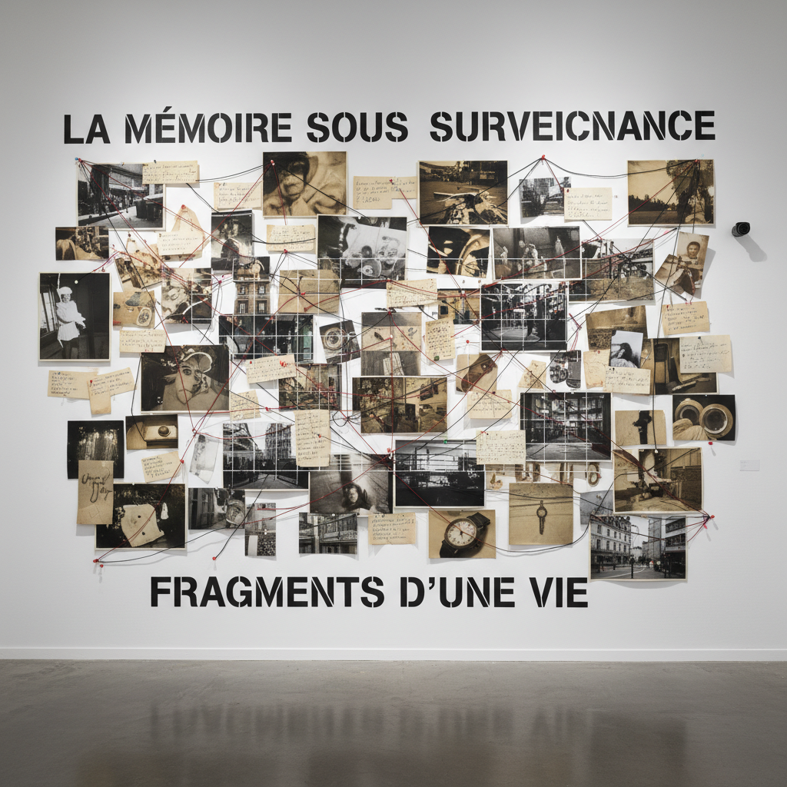

# Sophie Calle 苏菲·卡尔

> **时期：** 1953–至今  
> **关键词：** 自传性观念艺术、窥视与暴露、文本与图像、私人侦探美学

## 概述

Sophie Calle 是法国艺术家，以将个人生活转化为艺术项目而闻名。她跟踪陌生人、雇佣私人侦探跟踪自己、邀请陌生人睡在她的床上、请盲人描述美——每个项目都模糊了艺术与生活、真实与虚构、公共与私密的边界。

## 风格特征

- **规则性游戏**：每个项目都有明确的规则和限制条件
- **文本与图像并置**：照片配以叙事性文字，两者相互补充又矛盾
- **窥视与暴露**：同时扮演观察者和被观察者
- **私密公开化**：将最私密的经历（失恋、丧亲）转化为公共艺术
- **档案美学**：作品以档案、证据和文件的形式呈现

## 代表作品

- *Suite Vénitienne*（1980）
- *The Hotel*（1981）
- *Take Care of Yourself*（2007）
- *Blind*系列（1986）

## 概念图

