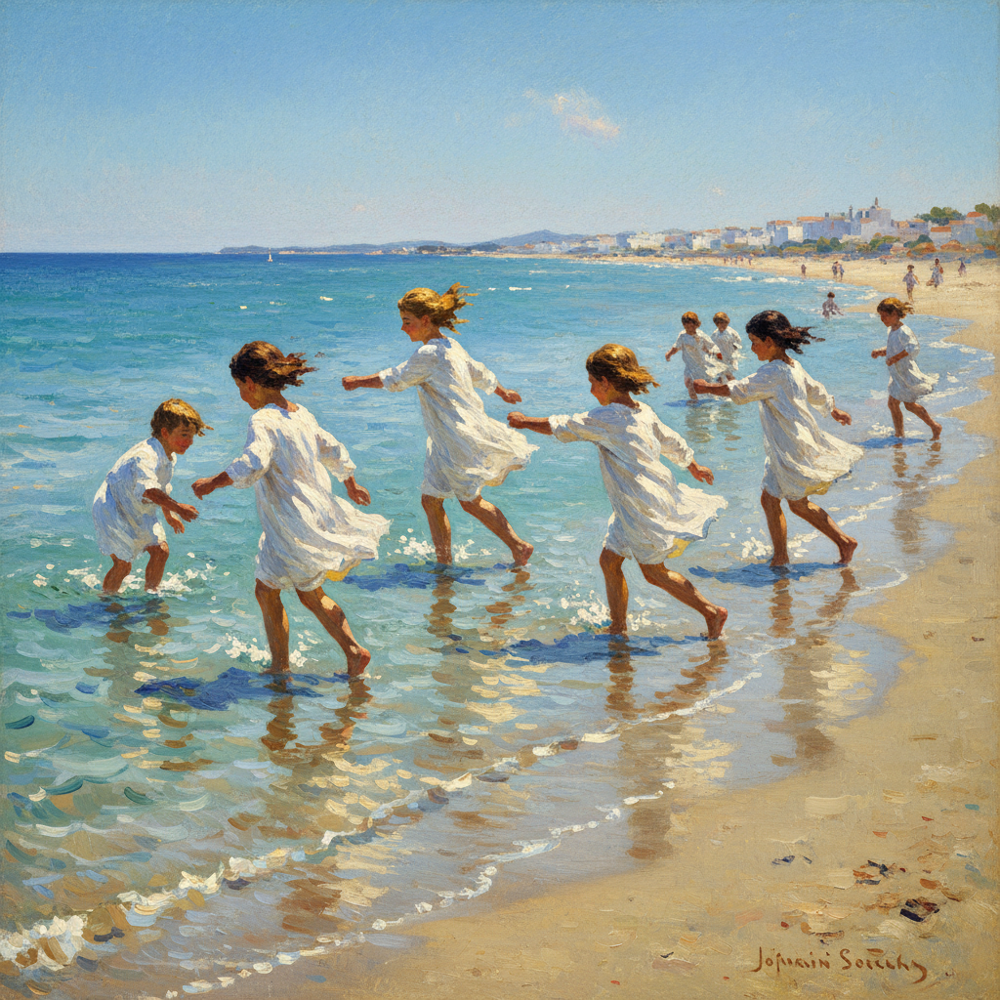

# Joaquín Sorolla 索罗拉

> "I could not paint at all if I had to paint slowly." — Joaquín Sorolla

## 概述

华金·索罗拉（Joaquín Sorolla，1863–1923）是西班牙印象派画家，被誉为"光之画家"。他以描绘地中海海滩上的阳光、白色衣物和嬉戏的儿童闻名，将西班牙的强烈阳光转化为画布上的纯粹光辉。

索罗拉的画面如同被阳光浸透——白色的衣裙在海风中飘动，赤脚的孩子在浅水中奔跑，一切都沐浴在地中海正午的灿烂光线中。

## 核心特征

| 特征 | 描述 |
|------|------|
| 地中海光线 | 强烈的、直射的西班牙阳光 |
| 白色表现 | 阳光下白色衣物的极致描绘 |
| 海滩场景 | 儿童、渔民、沐浴者的海边生活 |
| 快速笔触 | 户外写生的即时性和速度感 |
| 色彩饱和 | 阳光下饱和的蓝、白、金色 |
| 巨幅创作 | 大尺幅的户外场景 |

## 视觉特征

- **光线**：强烈的正午阳光——几乎刺眼
- **色彩**：白、蓝、金——地中海色调
- **笔触**：宽阔的、快速的、充满能量
- **水面**：浅水中的光线折射和反射
- **人物**：运动中的——奔跑、游泳、行走
- **衣物**：风中飘动的白色布料

## 代表作品

| 作品 | 年代 | 意义 |
|------|------|------|
| *Walk on the Beach* | 1909 | 光与白色的极致 |
| *Children on the Beach* | 1910 | 阳光下的童年 |
| *Sewing the Sail* | 1896 | 劳动与光线 |
| *Vision of Spain* (Hispanic Society murals) | 1911–19 | 西班牙的全景 |
| *My Wife and Daughters in the Garden* | 1910 | 家庭的光辉 |

## 真实作品（公共领域）

| 作品 | 来源 |
|------|------|
| *Walk on the Beach* | [Sorolla Museum](https://www.culturaydeporte.gob.es/msorolla/) |
| *Vision of Spain* | [Hispanic Society](https://hispanicsociety.org/) |
| *Children on the Beach* | [Museo del Prado](https://www.museodelprado.es/) |

> ⚠️ 本条目优先使用真实作品。

## AI生成概念图

## 与其他风格的关系

- **Impressionism** → 西班牙印象派的最高代表
- **Luminism** → 光辉主义的地中海版本
- **Velázquez** → 继承委拉斯开兹的笔触传统
- **Sargent** → 与萨金特互相欣赏的同代人
