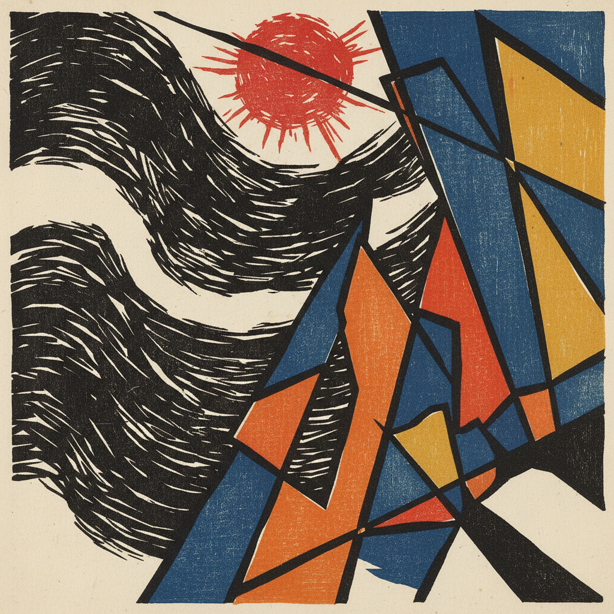

# Sōsaku-Hanga 创作版画

> **时期：** 1904年–至今  
> **关键词：** 自画自刻自摺、艺术家主体性、表现主义、民艺精神、个人创作

## 概述

Sōsaku-Hanga（創作版画）是与新版画同时期但理念截然不同的日本版画运动。它强调"自画、自刻、自摺"——艺术家独立完成从设计到印刷的全部过程，拒绝浮世绘时代的分工制度。这种对艺术家主体性的强调使创作版画更接近西方现代版画的精神，风格也更加个人化和表现主义化。

## 风格特征

- **个人完成**：艺术家独立完成全部工序
- **表现主义**：主观情感的直接表达
- **粗犷刀法**：保留刻刀痕迹的原始力量
- **抽象倾向**：从具象走向抽象的探索
- **材质感**：强调木纹、纸质等物质特性

## 代表人物与作品

- 恩地孝四郎（抽象版画先驱）
- �的栋方志功《释迦十大弟子》
- 平�的塚运一（色彩版画）
- 斋藤清《会津之冬》系列

## 概念图

