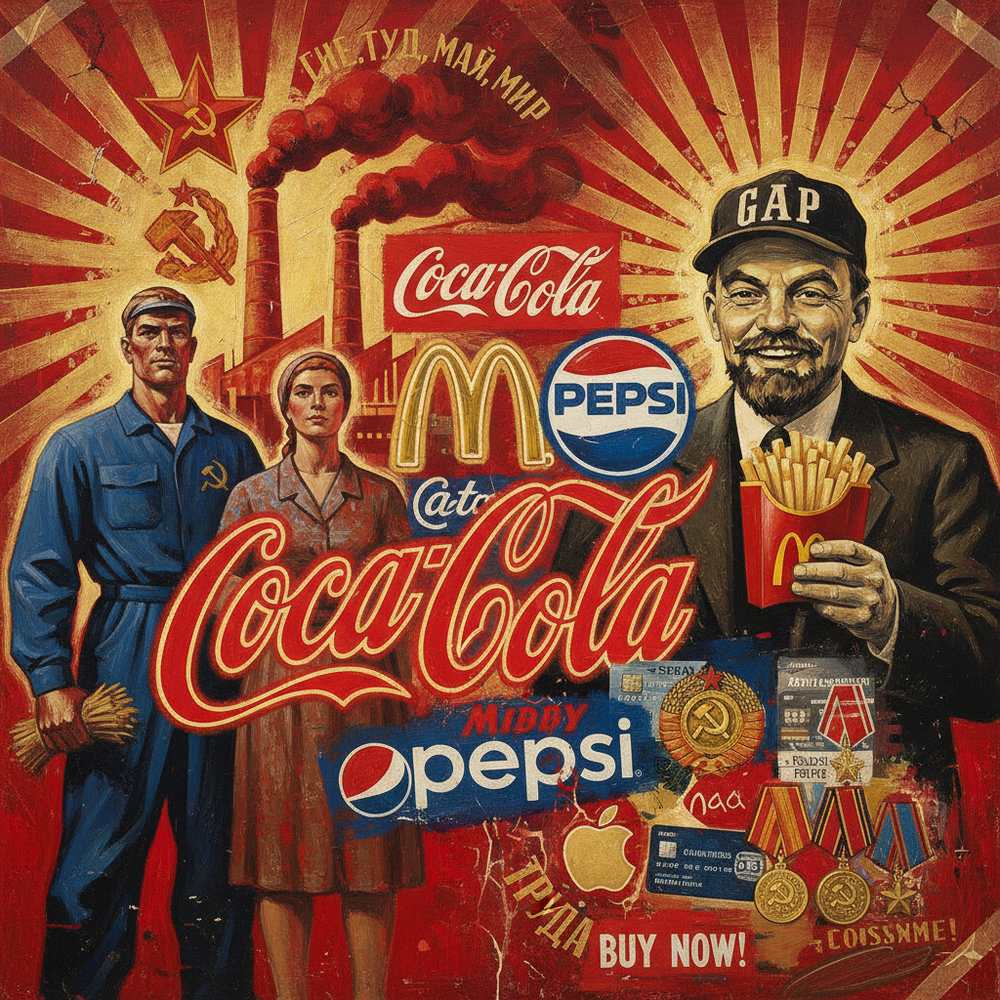

# 苏茨艺术 · Sots Art

> "我们不创造新的神话，我们解剖旧的神话。" —— 维塔利·科马尔 & 亚历山大·梅拉米德

## 概述

苏茨艺术（Sots Art）是1970年代诞生于苏联的艺术运动，由科马尔和梅拉米德于1972年创立，名称融合了"社会主义现实主义"（Socialist Realism）与"波普艺术"（Pop Art）。正如安迪·沃霍尔挪用美国消费文化符号，苏茨艺术家挪用苏联政治宣传的视觉语言——列宁肖像、红旗、标语、社会主义现实主义绘画范式——进行反讽、解构和再语境化，揭示意识形态话语的空洞与荒诞。

## 核心特征

| 特征 | 描述 |
|------|------|
| 时期 | 1972年–1990年代 |
| 地域 | 莫斯科、纽约（流亡后） |
| 媒介 | 绘画、拼贴、装置、行为、文本 |
| 核心理念 | 以波普策略解构社会主义现实主义的视觉霸权 |
| 色彩 | 苏联宣传画的红、金、黑 + 波普的鲜艳对比 |

## 视觉特征

- **符号挪用**：直接使用苏联政治图像（列宁、镰刀锤子、红星）
- **风格模仿**：精确复制社会主义现实主义绘画技法后加以颠覆
- **文本游戏**：将政治标语置于荒诞语境中
- **双重编码**：作品同时可被读为顺从与反叛
- **商品化讽刺**：将意识形态符号当作消费品处理

## 代表作品

| 作品 | 艺术家 | 年代 | 类型 |
|------|--------|------|------|
| 《双重自画像》 | 科马尔 & 梅拉米德 | 1973 | 油画 |
| 《不要靠近！》 | 埃里克·布拉托夫 | 1973 | 油画 |
| 《基本原则》 | 亚历山大·科索拉波夫 | 1982 | 拼贴 |
| 《列宁与可口可乐》 | 亚历山大·科索拉波夫 | 1980s | 丝网印刷 |
| 《最受欢迎的颜色》 | 科马尔 & 梅拉米德 | 1994 | 参与式项目 |

## 发展时间线

| 时期 | 事件 |
|------|------|
| 1972 | 科马尔和梅拉米德创造"Sots Art"概念 |
| 1974 | 推土机展览，苏茨艺术家参与 |
| 1977 | 科马尔和梅拉米德移居纽约 |
| 1970s-80s | 布拉托夫、科索拉波夫等在苏联地下继续创作 |
| 1982 | 纽约Ronald Feldman画廊举办苏茨艺术展 |
| 1986 | 戈尔巴乔夫改革开放，苏茨艺术公开化 |
| 1990s | 苏联解体后，苏茨艺术成为历史性运动 |

## 中国语境

苏茨艺术对中国当代艺术影响显著。王广义的"大批判"系列直接借鉴了苏茨艺术的策略——将文革宣传画与西方商业品牌并置。中国"政治波普"（Political Pop）运动在方法论上与苏茨艺术一脉相承，都是以波普手法解构社会主义视觉遗产。岳敏君、张晓刚等艺术家的创作也带有苏茨艺术的精神基因。

## AI 概念图

*AI 生成概念图：苏茨艺术风格*

## 关联词条

- [[soviet-nonconformist-art]] - 苏联非官方艺术
- [[moscow-conceptualism-art]] - 莫斯科概念主义
- [[russian-avant-garde-art]] - 俄罗斯先锋派
- [[russian-constructivism-art]] - 俄罗斯构成主义

---

*浮光艺志 · Chronicle of Artistry*
