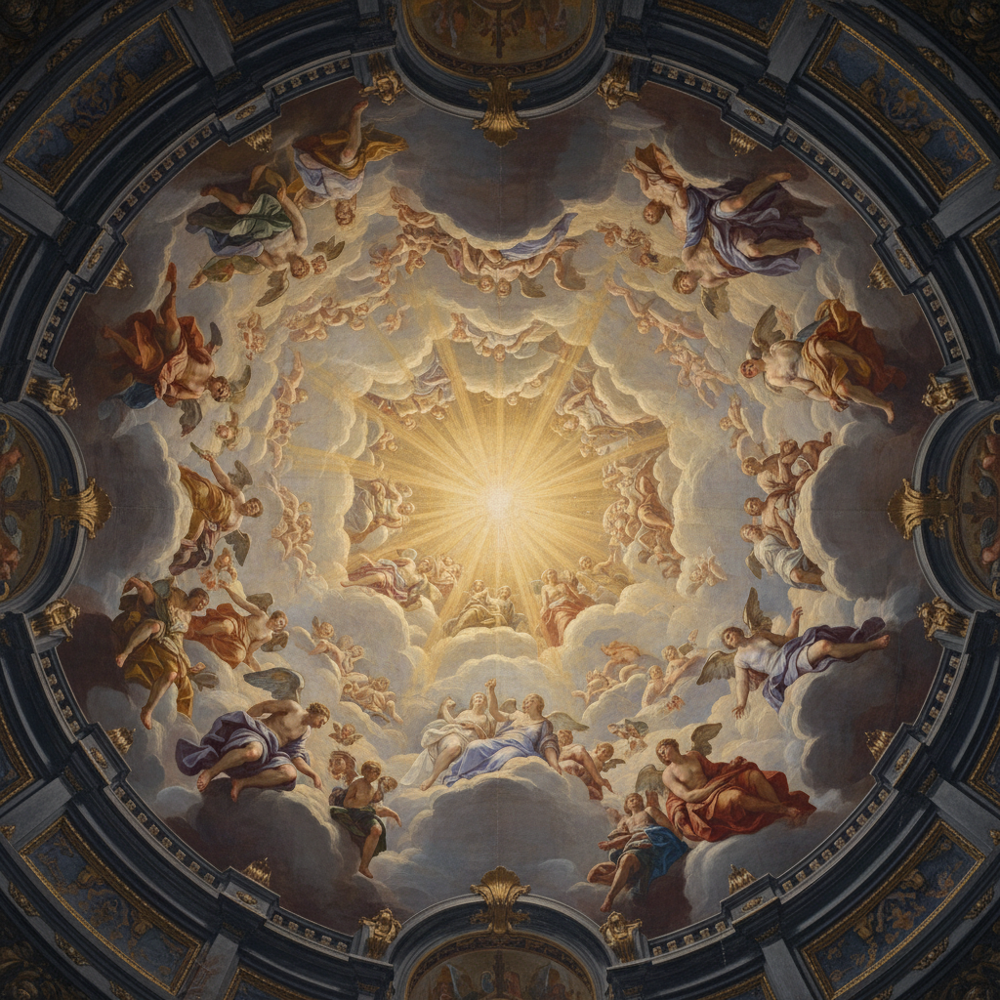

# Sotto in Sù 仰视透视法

> **时期：** 15世纪–18世纪  
> **关键词：** 极端仰角、天顶绘画、人物缩短、天堂幻觉、巴洛克戏剧

## 概述

Sotto in Sù（意大利语"从下往上看"）是一种极端仰视透视技法，用于天花板绘画中使人物看起来漂浮在观众上方的天空中。曼特尼亚在帕多瓦的"眼孔"天顶画首创了这一技法，巴洛克时期的科雷乔和提埃波罗将其发展到极致——天使、圣徒和云朵从天顶倾泻而下，打破了建筑的物理边界。

## 风格特征

- **极端缩短**：人体从脚底方向观看的透视变形
- **天空开口**：天花板仿佛打开通向天堂
- **漂浮人物**：圣徒和天使在云中翱翔
- **光线来源**：从天顶中心向下辐射的神圣光芒
- **螺旋构图**：人物沿螺旋上升的动态安排

## 代表人物与作品

- 安德烈亚·曼特尼亚《Camera degli Sposi》天顶
- 科雷乔《帕尔马大教堂圆顶》
- 乔瓦尼·巴蒂斯塔·提埃波罗 维尔茨堡宫天顶
- 安德烈亚·波佐 罗马耶稳会教堂

## 概念图

