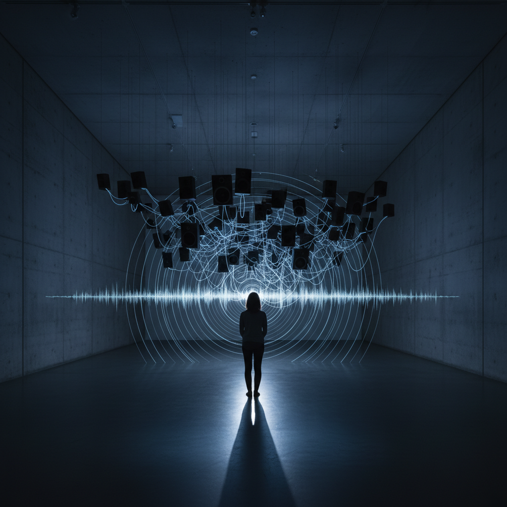

# Sound Art 声音艺术

> "Wherever we are, what we hear is mostly noise. When we ignore it, it disturbs us. When we listen to it, we find it fascinating." — John Cage

## 概述

声音艺术（Sound Art）是以声音为主要媒介的艺术形式，将声音从音乐的传统框架中解放出来，作为独立的艺术材料进行创作。声音艺术不是音乐——它不追求旋律、和声或节奏，而是探索声音本身的物质性、空间性和时间性。

从John Cage的"4'33""到Max Neuhaus的声音装置、从Alvin Lucier的"I Am Sitting in a Room"到当代的声音雕塑和场域录音，声音艺术跨越了音乐、视觉艺术和建筑的边界。

## 核心特征

| 特征 | 描述 |
|------|------|
| 声音媒介 | 声音本身是艺术的核心材料 |
| 非音乐 | 不追求传统音乐的结构和美学 |
| 空间性 | 声音在特定空间中的存在和传播 |
| 时间性 | 声音是时间的艺术——持续、变化、消逝 |
| 聆听 | 改变人们聆听世界的方式 |
| 跨界 | 融合视觉艺术、音乐、建筑、科技 |

## 视觉特征

- **装置**：扬声器、麦克风、电子设备的空间布置
- **不可见**：声音本身是不可见的——挑战视觉艺术的传统
- **空间**：特定空间的声学特性是作品的一部分
- **物理**：声波的物理振动——可以移动物体、产生图案
- **记录**：场域录音——将特定地点的声音带入画廊
- **沉默**：沉默作为声音的对立面和组成部分

## 代表作品

| 作品 | 艺术家 | 年代 | 意义 |
|------|--------|------|------|
| *4'33"* | John Cage | 1952 | 沉默作为音乐——聆听的革命 |
| *I Am Sitting in a Room* | Alvin Lucier | 1969 | 空间共振的声音实验 |
| *Times Square* | Max Neuhaus | 1977 | 公共空间的永久声音装置 |
| *The Forty Part Motet* | Janet Cardiff | 2001 | 40个扬声器的合唱空间化 |
| *Rainforest* | David Tudor | 1968 | 物体作为扬声器的声音雕塑 |
| *Dream House* | La Monte Young | 1962+ | 持续发声的声音环境 |

## 历史时间线

| 时期 | 事件 |
|------|------|
| 1913 | Luigi Russolo的"噪音的艺术"宣言 |
| 1952 | Cage的*4'33"*——沉默的革命 |
| 1960s | Fluxus的声音事件 |
| 1968 | Tudor的*Rainforest*——声音雕塑 |
| 1977 | Neuhaus的*Times Square*——公共声音装置 |
| 1980s | 声音艺术作为独立领域被认可 |
| 1990s | 数字技术——新的声音创作工具 |
| 2000s | Cardiff——声音装置进入主流美术馆 |
| 2010s-至今 | 场域录音、ASMR、声音冥想的流行 |

## 子类型

| 子类型 | 特征 |
|--------|------|
| 声音装置 | Neuhaus——空间中的持续声音 |
| 声音雕塑 | Tudor——物体作为声音发生器 |
| 场域录音 | 特定地点声音的记录和再现 |
| 声音行为 | 身体发声的表演 |
| 电子声音 | 电子设备生成的声音 |
| 声音环境 | 沉浸式的声音空间 |

## 中国语境

声音艺术在中国近年快速发展。中国的声音艺术家如颜峻、李劲松、冯昊等在国际上活跃。中国丰富的声音景观——从寺庙钟声到市场叫卖、从高铁呼啸到乡村虫鸣——为场域录音提供了独特素材。中国传统的"听觉文化"——古琴的"弦外之音"、园林的"听雨"——与声音艺术的聆听哲学有深层共鸣。

## AI生成概念图

## 与其他风格的关系

- **Fluxus** → 激浪派的声音事件是声音艺术的先驱
- **Minimalism** → 极简主义的重复和持续影响了声音艺术
- **Installation Art** → 声音装置是装置艺术的重要分支
- **Conceptual Art** → 概念艺术的去物质化在声音中找到理想载体
- **Immersive Art** → 沉浸式艺术大量使用声音作为环境元素
- **Data Art** → 数据声音化（sonification）连接数据艺术与声音艺术

---

*浮光艺志 | Chronicle of Artistry*
