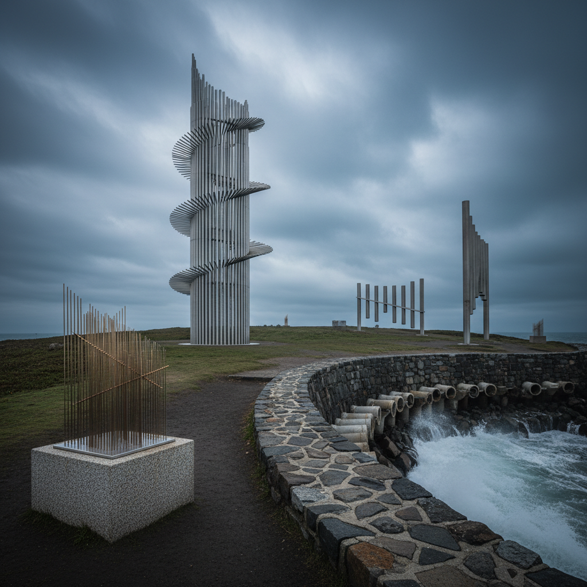

# Sound Sculpture Art 声音雕塑艺术

> "A sound sculpture occupies space twice — once as a physical object you can see and touch, and again as an invisible architecture of vibration that fills the air around it. It is sculpture that extends beyond its material boundaries, creating an aura of sound that changes with the wind, with touch, with the passage of time. The eye sees form; the ear discovers dimension." — Unknown

## 概述

声音雕塑艺术（Sound Sculpture Art）是将声音产生机制融入三维造型的艺术形式——创造既是视觉雕塑又是声音发生器的作品。声音雕塑可以是风驱动的、水驱动的、机械驱动的、电子驱动的或由观众互动触发的，它们模糊了雕塑、乐器和装置之间的界限。

声音雕塑的实践包括：1）风琴雕塑——利用风力发声的户外雕塑；2）水声雕塑——利用水流发声的雕塑；3）共鸣雕塑——利用材料共振特性的雕塑；4）机械声音雕塑——用机械装置产生声音的雕塑；5）互动声音雕塑——观众触摸或接近时发声的雕塑；6）环境声音雕塑——响应环境变化的声音装置；7）乐器雕塑——将乐器造型化为雕塑的作品。

## 核心特征

| 特征 | 描述 |
|------|------|
| 双重 | 视觉和听觉双重体验 |
| 空间 | 声音填充空间 |
| 互动 | 与环境或观众互动 |
| 时间 | 时间维度的艺术 |
| 材料 | 材料的声学特性 |
| 跨界 | 雕塑与音乐的跨界 |

## 视觉特征

- **金属**：金属管、片、弦的光泽
- **有机**：有机的流线造型
- **开放**：开放的结构允许空气流通
- **精密**：精密的机械结构
- **大型**：通常是大型户外作品
- **动态**：可见的振动和运动

## 代表作品

| 作品 | 艺术家 | 年代 | 意义 |
|------|--------|------|------|
| *Sea Organ* | Nikola Bašić | 2005 | 海浪风琴（克罗地亚） |
| *Singing Ringing Tree* | Tonkin Liu | 2006 | 风力声音雕塑 |
| *Sound sculptures* | Harry Bertoia | 1960-70年代 | 金属共鸣雕塑 |
| *Aeolian harps* | Various | 古代至今 | 风琴 |
| *Wave Organ* | Peter Richards | 1986 | 海浪管风琴 |

## 历史时间线

| 时期 | 事件 |
|------|------|
| 古代 | 风铃和风琴的发明 |
| 20世纪初 | 未来主义的噪音艺术 |
| 1960年代 | Harry Bertoia的声音雕塑 |
| 2000年代 | 大型公共声音雕塑 |
| 当代 | 数字和互动声音雕塑 |

## 中国语境

声音雕塑艺术在中国有深厚的文化根基。中国传统文化中的"编钟"——商周时期的青铜乐器组合——可以被视为最早的声音雕塑之一：它们既是精美的青铜雕塑，又是能演奏音乐的乐器。中国传统的风铃、磬、铜锣等也是声音与造型结合的典范。中国当代的一些艺术家在探索声音雕塑——将中国传统的声音元素（如编钟的音色、古琴的共鸣、竹笛的风声）融入当代雕塑创作。中国的一些公共艺术项目也开始引入声音雕塑——如城市公园中的互动声音装置。中国的声音艺术（Sound Art）领域在近年来快速发展，声音雕塑是其中重要的分支。

## AI生成概念图

## 与其他风格的关系

- **Kinetic Art** → 动态艺术
- **Sound Art** → 声音艺术
- **Installation Art** → 装置艺术
- **Public Art** → 公共艺术
- **Interactive Art** → 互动艺术
- **Wind Art** → 风艺术

---

*浮光艺志 | Chronicle of Artistry*
