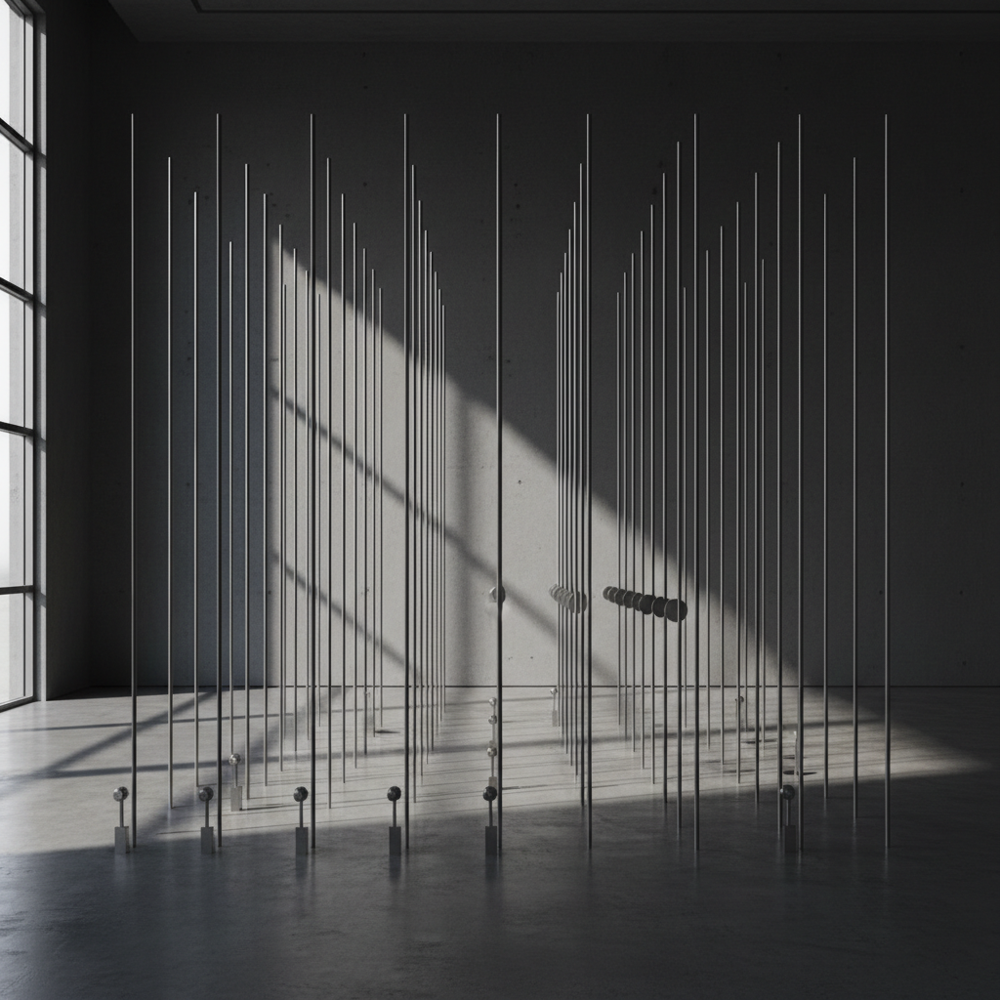

# Sound Sculpture 声音雕塑

> **时期：** 1960年代–至今  
> **关键词：** 声音物体、共振、动力装置、空间声学、物质振动

## 概述

声音雕塑是将声音生产与雕塑形态结合的艺术形式——物体本身既是视觉雕塑又是声音发生器。从风驱动的金属装置到电子感应的互动雕塑，声音雕塑探索物质振动、空间共振和听觉-视觉的跨感官体验，让观众同时"看见"和"听见"一件作品。

## 风格特征

- **物质共振**：利用材料本身的声学特性
- **动力驱动**：风、水、电机等驱动声音产生
- **空间性**：声音在特定空间中的传播和反射
- **互动性**：观众触发或改变声音
- **视听统一**：形态与声音的不可分割

## 代表人物与作品

- Harry Bertoia 金属音调雕塑
- Jean Tinguely 机械噪音装置
- Zimoun 工业材料声音装置
- Bill Fontana 声音桥梁项目

## 概念图

