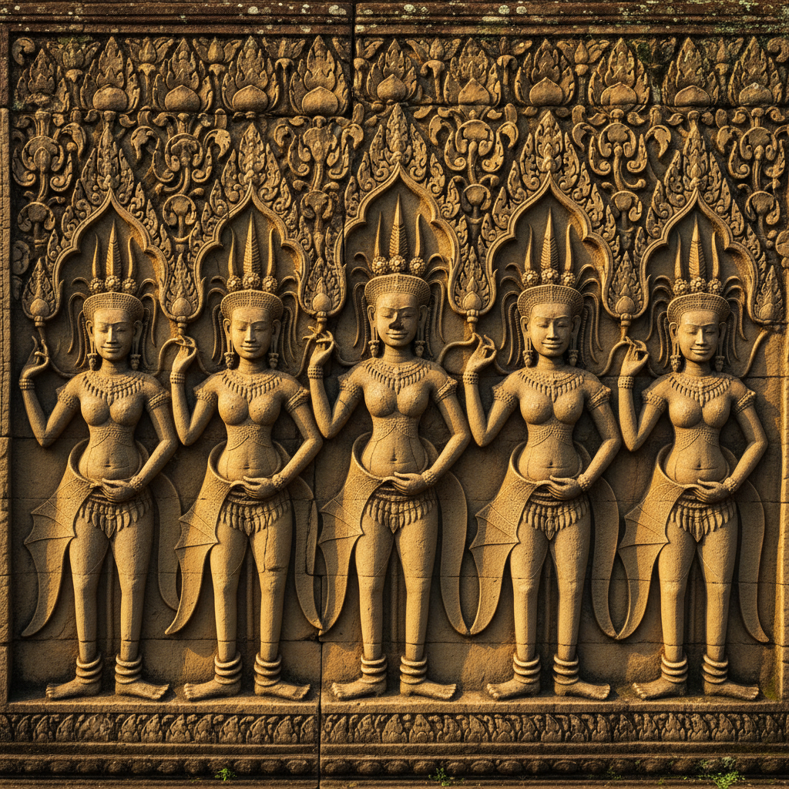

# 东南亚艺术 · Southeast Asian Art

> "每一座神庙都是须弥山的化身，每一尊佛像都是觉悟的微笑。" —— 东南亚佛教格言

## 概述

东南亚艺术（Southeast Asian Art）是从公元前数千年至今在中南半岛和马来群岛发展出的多元视觉艺术体系，融合了印度教-佛教文化、中国文化、伊斯兰文化和本土万物有灵信仰。从柬埔寨吴哥窟的宏伟浮雕到印尼婆罗浮屠的佛教叙事，从泰国素可泰的优美佛像到缅甸蒲甘的万塔林立，东南亚艺术以其对印度艺术的创造性转化和独特的热带美学著称。

## 核心特征

| 特征 | 描述 |
|------|------|
| 时期 | 约前3000年–至今 |
| 地域 | 柬埔寨、泰国、缅甸、印尼、越南、老挝 |
| 媒介 | 石雕、青铜、壁画、漆器、纺织（蜡染/织锦） |
| 核心理念 | 以印度教-佛教宇宙观构建神圣空间 |
| 色彩 | 金色、朱红、翠绿、黑漆、白色 |

## 视觉特征

- **神庙山（Temple Mountain）**：以建筑模拟须弥山的宇宙中心
- **连续叙事浮雕**：长廊式的史诗故事浮雕（如吴哥窟）
- **火焰纹光背**：佛像背后的火焰形光环
- **优美的S形体态**：受印度Tribhanga影响的柔美身姿
- **金箔与漆艺**：大量使用金箔装饰和黑漆底色

## 代表作品

| 作品 | 地点 | 年代 | 类型 |
|------|------|------|------|
| 吴哥窟 | 柬埔寨 | 12世纪 | 建筑/浮雕 |
| 婆罗浮屠 | 印尼爪哇 | 9世纪 | 佛教建筑 |
| 素可泰行走佛 | 泰国 | 14世纪 | 青铜造像 |
| 蒲甘阿难陀寺 | 缅甸 | 11世纪 | 建筑/壁画 |
| 占婆美山圣地 | 越南 | 7-13世纪 | 印度教建筑 |

## 发展时间线

| 时期 | 事件 |
|------|------|
| 前3000-前500 | 东山文化青铜鼓，本土艺术传统 |
| 1-6世纪 | 印度化时期，印度教-佛教艺术传入 |
| 7-13世纪 | 吴哥、室利佛逝、蒲甘等帝国艺术繁荣 |
| 9世纪 | 婆罗浮屠建成 |
| 12世纪 | 吴哥窟建成，高棉艺术巅峰 |
| 13-18世纪 | 上座部佛教艺术在中南半岛主导 |
| 15世纪后 | 伊斯兰艺术在马来群岛传播 |
| 当代 | 东南亚当代艺术在国际舞台崛起 |

## 中国语境

东南亚艺术与中国有深厚的历史渊源。中国陶瓷大量出口东南亚，影响了当地的陶瓷传统；越南艺术深受中国文化影响，其书法、水墨画和建筑都带有明显的中国元素。郑和下西洋促进了中国与东南亚的文化交流。当代中国-东盟文化合作框架下，两地区的艺术交流日益频繁。云南、广西等地的少数民族艺术与东南亚大陆艺术有共同的文化根源。

## AI 概念图

*AI 生成概念图：东南亚艺术风格*

## 关联词条

- [[indian-art]] - 印度艺术
- [[tibetan-art]] - 藏传佛教艺术
- [[mughal-miniature-art]] - 莫卧儿细密画

---

*浮光艺志 · Chronicle of Artistry*
