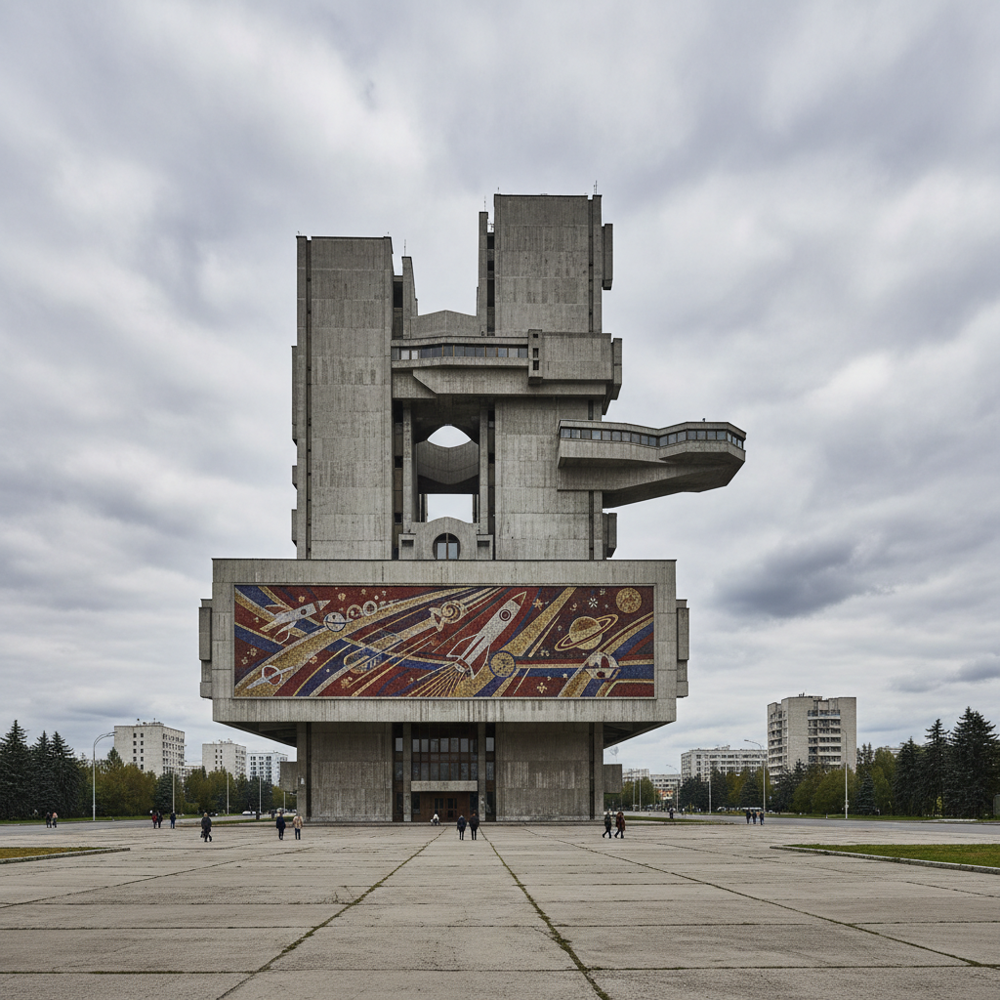

# Soviet Modernism 苏联现代主义



> **"赫鲁晓夫解冻后的混凝土乌托邦——功能至上，集体为先。"**

## 概述

苏联现代主义（Soviet Modernism）是1955年斯大林去世后至1991年苏联解体期间的建筑与设计风格。它标志着从斯大林帝国式的奢华装饰回归现代主义的功能性原则，同时保留了社会主义意识形态的纪念性表达。

## 时代背景

| 维度 | 内容 |
|------|------|
| 时间 | 1955–1991 |
| 地点 | 苏联及东欧社会主义国家 |
| 触发事件 | 1955年赫鲁晓夫"反对建筑中的铺张浪费"法令 |
| 文化语境 | 太空竞赛乐观主义、科技进步信仰、集体主义理想 |

## 视觉特征

- **裸露混凝土**：大面积清水混凝土表面
- **几何体量**：立方体、圆柱体、悬挑结构的大胆组合
- **马赛克壁画**：建筑外墙的大型彩色马赛克装饰
- **太空时代元素**：飞碟形屋顶、抛物线拱、卫星天线造型
- **纪念性尺度**：压倒性的体量感，强调集体高于个人
- **标准化模块**：预制板建筑（хрущёвка）的工业化重复

## 分期

### 赫鲁晓夫时期（1955–1964）
- 大规模住宅建设（赫鲁晓夫楼）
- 功能主义回归，装饰极简
- "五层楼"标准化住宅

### 勃列日涅夫时期（1964–1982）
- 公共建筑的纪念性回归
- 野兽派混凝土美学
- 科技乐观主义的视觉表达

### 晚期（1982–1991）
- 后现代主义影响渗入
- 地方民族元素的融合尝试

## 代表建筑

| 建筑 | 地点 | 年代 | 特点 |
|------|------|------|------|
| 莫斯科国际饭店 | 莫斯科 | 1961 | 国际主义风格高层 |
| 友谊疗养院 | 雅尔塔 | 1985 | 悬崖上的圆环形建筑 |
| 格鲁吉亚公路部大楼 | 第比利斯 | 1975 | 堆叠的混凝土模块 |
| 机器人大楼 | 里加 | 1971 | 科幻感的科研建筑 |
| 宇宙酒店 | 莫斯科 | 1979 | 太空时代造型 |

## 与其他风格的关系

```
俄国构成主义(1920s) → 斯大林帝国风格(1930s-50s)
                                    ↓
国际主义风格 ──────────→ 苏联现代主义(1955-91)
                                    ↓
                    粗野主义(Brutalism) ← 相互影响
                                    ↓
                         后苏联解构(1990s+)
```

## 设计领域延伸

- **家具**：功能主义批量生产，简洁线条
- **平面设计**：几何构图、红色与黑色主调
- **工业设计**：太空竞赛衍生的消费品美学
- **室内设计**：1960年代被视为苏联室内设计黄金时代

## 当代影响

- "苏联废墟美学"（Soviet Ruin Porn）摄影潮流
- 东欧独立游戏中的苏联建筑场景
- Brutalist Web Design 的精神源头之一
- 复古未来主义中的"共产主义乌托邦"分支

## 多语言名称

| 语言 | 名称 |
|------|------|
| 俄语 | Советский модернизм |
| 英语 | Soviet Modernism |
| 德语 | Sowjetischer Modernismus |
| 日语 | ソビエト・モダニズム |

## 延伸阅读

- Kristina Krasnyanskaya《Soviet Design: From Constructivism to Modernism 1920-1980》
- Frédéric Chaubin《CCCP: Cosmic Communist Constructions Photographed》
- BACU (Bureau for Art and Urban Research) 苏联现代主义建筑档案

---

*最后更新：2026-07-26*
