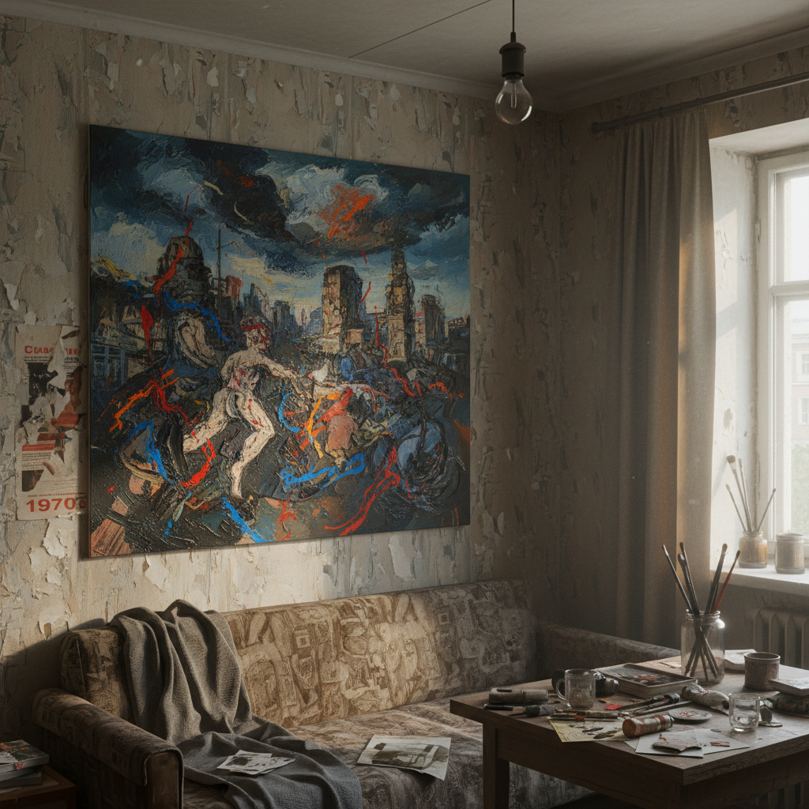

# 苏联非官方艺术 · Soviet Nonconformist Art

> "我们不是反对艺术，我们是反对谎言。" —— 奥斯卡·拉宾

## 概述

苏联非官方艺术（Soviet Nonconformist Art），又称"地下艺术"或"非顺从主义艺术"，是1950年代至1980年代苏联体制外艺术家创作的独立艺术运动。这些艺术家拒绝社会主义现实主义的官方教条，在公寓展览（apartment exhibitions）、工作室私下交流中发展出多元的现代主义和后现代主义风格。从抽象表现主义到概念艺术，从波普到行为艺术，非官方艺术构成了苏联文化中最具活力和反叛精神的暗流。

## 核心特征

| 特征 | 描述 |
|------|------|
| 时期 | 1953年–1991年 |
| 地域 | 莫斯科、列宁格勒 |
| 媒介 | 油画、装置、行为、摄影、文本 |
| 核心理念 | 艺术自由与个体表达对抗意识形态控制 |
| 色彩 | 多元，从灰暗压抑到鲜艳讽刺 |

## 视觉特征

- **公寓美学**：小尺幅作品适应私密展示空间
- **材料匮乏的创造力**：利用日常废弃物、工业材料创作
- **符号颠覆**：挪用苏联官方符号进行反讽
- **抽象与精神性**：追求超越物质现实的精神维度
- **文本与图像融合**：概念艺术中文字作为核心媒介

## 代表作品

| 作品 | 艺术家 | 年代 | 类型 |
|------|--------|------|------|
| 《护照》系列 | 奥斯卡·拉宾 | 1972 | 油画 |
| 《宇宙》系列 | 弗朗西斯科·因凡特 | 1960s | 动态装置 |
| 《甲虫》 | 伊利亚·卡巴科夫 | 1982 | 装置 |
| 《双重自画像》 | 埃里克·布拉托夫 | 1965 | 油画 |
| 推土机展览 | 多位艺术家 | 1974 | 户外展览/事件 |

## 发展时间线

| 时期 | 事件 |
|------|------|
| 1953 | 斯大林去世，文化管控略有松动 |
| 1956 | 赫鲁晓夫解冻，非官方艺术萌芽 |
| 1962 | 马涅日展览事件，赫鲁晓夫怒斥抽象艺术 |
| 1967 | 利安诺佐沃小组活跃 |
| 1974 | "推土机展览"被当局强行摧毁，引发国际关注 |
| 1970s-80s | 莫斯科概念主义兴起 |
| 1988 | 苏富比莫斯科拍卖，非官方艺术进入国际市场 |
| 1991 | 苏联解体，非官方/官方界限消失 |

## 中国语境

苏联非官方艺术与中国1980年代的"85新潮"运动有精神上的共鸣。两者都是在社会主义体制内寻求艺术自由的尝试。中国的"星星画会"（1979）与苏联的推土机展览（1974）在反叛姿态上异曲同工。当代中国艺术家如艾未未、王广义等人的创作策略，与苏联非官方艺术的符号颠覆手法有深层关联。

## AI 概念图

*AI 生成概念图：苏联非官方艺术风格*

## 关联词条

- [[sots-art]] - 苏茨艺术
- [[moscow-conceptualism-art]] - 莫斯科概念主义
- [[russian-avant-garde-art]] - 俄罗斯先锋派
- [[russian-constructivism-art]] - 俄罗斯构成主义

---

*浮光艺志 · Chronicle of Artistry*
