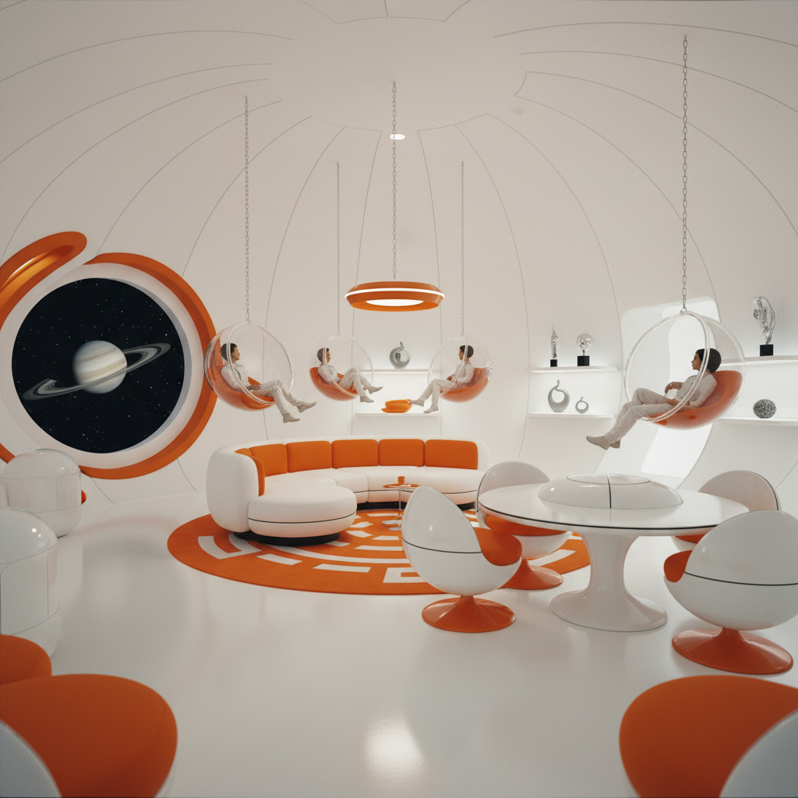

# Space Age 太空时代



> **"人类即将征服宇宙——每一件家具、每一栋建筑都应该像太空船。"**

## 概述

| 维度 | 描述 |
|------|------|
| 时期 | 1957–1972（核心）/ 影响至今 |
| 别名 | Space Age, 太空时代, Atomic Age Design, Jet Age |
| 核心色彩 | 太空白、银色、橙红、电蓝、月球灰 |
| 关键元素 | 飞碟造型、球形家具、白色塑料、太空服、原子图案 |
| 代表人物 | Eero Saarinen, Verner Panton, Pierre Cardin, André Courrèges |
| 关联风格 | Googie, Mid-Century Modern, Retro-Futurism, Atompunk |

---

## 历史脉络

| 年份 | 事件 |
|------|------|
| 1957 | 苏联发射Sputnik——太空时代正式开始 |
| 1961 | 加加林进入太空——人类成为太空物种 |
| 1962 | 西雅图太空针塔——太空时代建筑地标 |
| 1964 | Pierre Cardin"太空系列"——太空时代时尚 |
| 1966 | 《星际迷航》首播——太空时代的大众文化 |
| 1968 | 《2001太空漫游》——太空时代美学的电影巅峰 |
| 1969 | 阿波罗11号登月——太空时代的高潮 |
| 1972 | 阿波罗17号——最后一次登月，太空时代渐退 |

### 核心哲学

太空时代的精神是**"未来已经到来——我们正在成为星际文明"**：
- "如果我们能登月——我们能做任何事"
- "家具应该像太空舱——白色、圆形、塑料"
- "服装应该像太空服——银色、紧身、几何"
- "建筑应该像太空站——悬浮、球形、透明"
- "这不是幻想——这是正在发生的现实"

---

## 视觉语法

### 色彩系统

```
主色：
  太空白 (#FFFFFF) — 纯净、未来
  银色 (#C0C0C0) — 金属、太空服
  橙红 (#FF4500) — NASA、能量
  电蓝 (#0000FF) — 地球、科技

辅色：
  月球灰 (#808080) — 月球表面
  星空黑 (#000000) — 宇宙
  薄荷绿 (#98FB98) — 控制面板

材料：
  白色塑料 — 太空舱内饰
  铬金属 — 结构、装饰
  有机玻璃 — 透明、未来
  合成纤维 — 太空服、家具

造型：
  球形 — 太空舱、头盔
  椭圆 — 飞碟、舷窗
  悬浮 — 脱离重力
  流线 — 速度、飞行

规则：
  - 白色是默认——太空是白色的
  - 圆形/球形 > 方形
  - 塑料/合成 > 天然材料
  - 悬浮感——脱离地面
  - 极简但未来——不是极简主义
```

### 标志性元素

| 类别 | 元素 |
|------|------|
| 家具 | 球椅、郁金香椅、Panton椅 |
| 建筑 | 太空针塔、TWA航站楼、球形住宅 |
| 时尚 | 银色迷你裙、PVC靴、几何剪裁 |
| 产品 | 球形电视、太空收音机 |
| 图案 | 原子、轨道、星爆、行星 |
| 态度 | 乐观、进步、民主、普世 |

---

## 与千禧怀旧/当代的关系

### "失落的未来"
- "我们以为2000年会有飞行汽车——结果只有智能手机"
- 太空时代的乐观 vs 当代的焦虑 = 怀旧的核心
- SpaceX/Blue Origin = 太空时代精神的21世纪复兴？

### 对当代设计的影响
- Apple产品的白色+圆角 = 太空时代DNA
- 特斯拉Cybertruck的争议 = 太空时代美学的回归？
- "太空旅游"品牌设计 = 太空时代的商业延续

---

## 设计应用

| 场景 | 应用方式 |
|------|----------|
| 产品 | 白色+圆形+未来感 |
| 空间 | 太空舱风格+球形家具 |
| 品牌 | 科技+乐观+未来+纯净 |
| 时尚 | 银色+几何+太空服元素 |

---

## 相关风格

← [Googie 古吉风格](googie.md) | [Retro-Futurism 复古未来主义](retro-futurism.md) →

↑ [返回千禧怀旧目录](README.md) | [返回总目录](../README.md)
