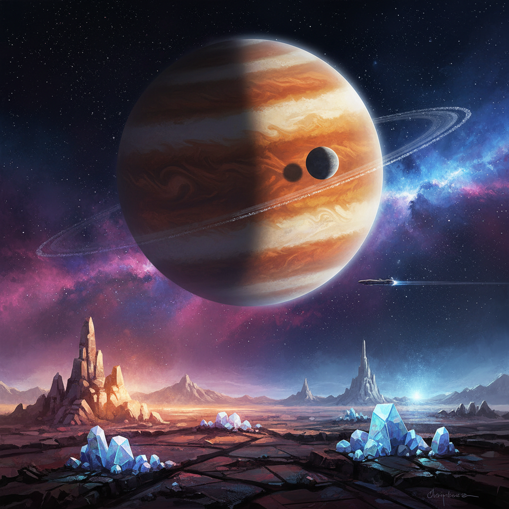

# Space Art 太空艺术

> "Space art is the visual imagination of the cosmos made tangible — paintings of worlds no human eye has seen, landscapes of planets we may never visit, the terrible beauty of stellar nurseries and dying suns rendered in pigment and pixel, an art form that serves simultaneously as scientific visualization, philosophical meditation, and pure aesthetic wonder, that asks us to feel the sublime not in mountains and storms but in the incomprehensible vastness of the universe, and that reminds us that we are both infinitely small and capable of imagining the infinite." — Unknown

## 概述

太空艺术（Space Art）是一种以宇宙、天体、太空探索和外星环境为主题的视觉艺术传统。太空艺术的历史可以追溯到19世纪的天文插画，但作为一个自觉的艺术运动，它在20世纪中期随着太空时代的到来而蓬勃发展。太空艺术家们创作的作品范围从科学精确的行星景观到纯粹想象的宇宙幻景。

太空艺术的主要类型包括：1）天文艺术——基于科学数据的精确天体描绘；2）硬科幻插画——为科幻小说和电影创作的太空场景；3）宇宙印象主义——对宇宙现象的主观艺术诠释；4）太空景观——想象中的外星地表风景；5）概念太空艺术——探索太空殖民、太空建筑等未来概念。代表性的太空艺术家包括Chesley Bonestell（被称为"太空艺术之父"）、Lucien Rudaux、Don Dixon、以及当代的数字太空艺术家们。

## 核心特征

| 特征 | 描述 |
|------|------|
| 宇宙 | 宇宙尺度的想象 |
| 科学 | 科学准确性 |
| 崇高 | 宇宙的崇高感 |
| 想象 | 对未知的想象 |
| 光 | 极端的光影条件 |
| 色彩 | 宇宙的色彩 |

## 视觉特征

- **星空**：深邃的星空背景
- **行星**：行星和卫星的表面
- **星云**：彩色的星云和气体
- **飞船**：太空飞行器
- **光**：恒星光和宇宙射线
- **尺度**：极端的尺度对比

## 代表作品

| 作品 | 艺术家 | 年代 | 意义 |
|------|--------|------|------|
| *Saturn as Seen from Titan* | Chesley Bonestell | 1944 | 太空艺术的奠基作品 |
| *2001: A Space Odyssey* designs | Various | 1968 | 电影中的太空艺术 |
| *Cosmos* illustrations | Various | 1980 | 科普中的太空艺术 |
| *NASA concept art* | Various | 1970年代起 | NASA的概念艺术 |
| *Digital space art* | Various | 2000年代起 | 数字太空艺术 |

## 历史时间线

| 时期 | 事件 |
|------|------|
| 19世纪 | 天文插画的传统 |
| 1944 | Bonestell的突破性作品 |
| 1960年代 | 太空时代的艺术繁荣 |
| 1980年代 | 国际太空艺术家协会成立 |
| 当代 | 数字工具和真实太空数据的融合 |

## 中国语境

太空艺术在中国随着航天事业的发展而获得了新的动力。中国的太空探索成就——从神舟载人飞船到嫦娥月球探测器到天问火星任务——激发了大量的太空艺术创作。中国的科幻文学繁荣（特别是刘慈欣的《三体》）也推动了太空视觉艺术的发展。中国的一些数字艺术家在创作具有中国文化特色的太空艺术——将传统的山水画美学与宇宙景观结合，将神话中的天宫、月宫意象与现代太空概念融合。中国航天局也委托艺术家创作概念图和宣传画，形成了具有中国特色的官方太空美学。

## AI生成概念图

## 与其他风格的关系

- **Science Fiction Art** → 科幻艺术
- **Futurism** → 未来主义
- **Sublime Art** → 崇高美学
- **Digital Art** → 数字艺术
- **Scientific Illustration** → 科学插画
- **Cosmic Art** → 宇宙艺术

---

*浮光艺志 | Chronicle of Artistry*
