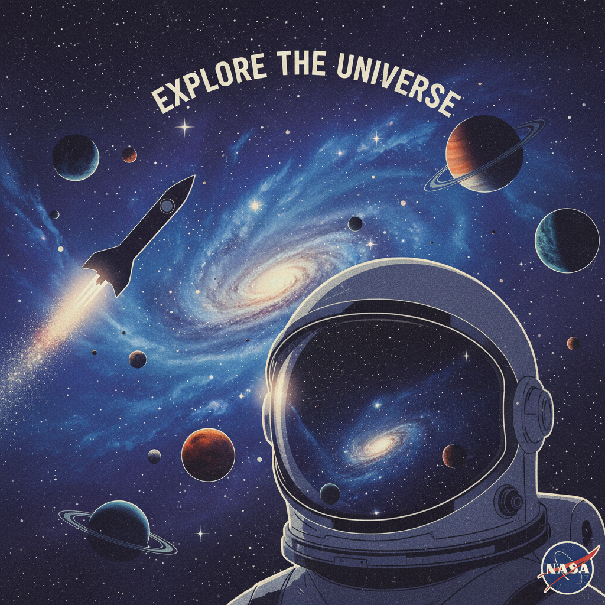

# Spacecore 太空核




> **"星云、黑洞、宇航员头盔——人类对无限的永恒迷恋。"**

## 概述

| 维度 | 描述 |
|------|------|
| 时期 | 持续存在 / 2010s–至今 美学标签化 |
| 别名 | Spacecore, Space Aesthetic, Cosmic, Astrocore |
| 核心色彩 | 深空黑、星云紫、银河蓝、星光白、火星橙 |
| 关键元素 | 星云、行星、宇航服、火箭、星座 |
| 代表人物 | NASA、SpaceX、Stanley Kubrick、Interstellar |
| 关联风格 | Vaporwave (部分), Cyberpunk, Retrofuturism, Y2K |

---

## 历史脉络

### 太空美学的永恒吸引力

太空美学不是某个时代的产物，而是人类对**未知和无限**的永恒迷恋：

| 时代 | 太空美学表现 |
|------|-------------|
| 1950s–60s | Space Age：原子时代的太空乐观主义 |
| 1968 | 《2001太空漫游》：太空的哲学化 |
| 1977 | 《星球大战》：太空的通俗化 |
| 1980s | 合成器音乐+太空视觉 |
| 2000s | Y2K 的银色太空感 |
| 2010s | NASA 美学的互联网传播 |
| 2020s | SpaceX/火星计划的新太空热 |

### 2010s：NASA 美学的互联网化

Spacecore 作为一种**美学标签**在 2010s 出现，主要因为：
- NASA 的高清太空照片在社交媒体上病毒传播
- Hubble/James Webb 望远镜的星云照片成为壁纸
- SpaceX 的火箭发射直播成为文化事件
- "太空"从科学变成了一种生活方式标签

### 核心哲学

Spacecore 的吸引力在于它提供了**终极的逃离**：
- 地球上的问题太多？看看宇宙吧
- 人类太渺小？但我们能想象无限
- 日常太无聊？太空永远是未知的
- 一种"cosmic perspective"——宇宙视角的安慰

---

## 视觉语法

### 色彩系统

```
主色：
  深空黑 (#0D0D0D) — 宇宙背景
  星云紫 (#800080) — 星云、气体云
  银河蓝 (#191970) — 深空
  星光白 (#FFFFFF) — 恒星
  火星橙 (#FF4500) — 火星、太阳

辅色：
  银色 (#C0C0C0) — 宇航服、飞船
  青色 (#00FFFF) — 星云边缘
  金色 (#FFD700) — 太阳、恒星

质感：
  发光/闪烁 — 恒星
  气态/流动 — 星云
  金属/反光 — 飞船、宇航服
  透明/玻璃 — 头盔面罩
  颗粒/尘埃 — 宇宙尘
```

### 标志性元素

| 类别 | 元素 |
|------|------|
| 天体 | 星云、行星、黑洞、银河、流星 |
| 装备 | 宇航服、头盔、火箭、空间站 |
| 符号 | 星座、月相、太阳系图 |
| 科学 | 望远镜、天文台、星图 |
| 服装 | 银色面料、全息材质、NASA logo |
| 空间 | 天文馆、观星台、暗室 |

---

## 与千禧怀旧的关系

### Y2K 的太空元素
- Y2K 美学中的银色、金属、太空感
- 2000s 的太空主题派对和服装
- 千禧虫恐慌中的"新千年=太空时代"想象

### NASA 怀旧
- 1960s–70s NASA 的复古logo和视觉
- "Worm" logo 的怀旧回潮
- 航天飞机时代的视觉记忆
- NASA T恤/卫衣成为时尚单品

---

## 中国语境

- 中国航天（神舟、天宫、嫦娥）的视觉文化
- "航天风"穿搭和设计
- 科幻电影（《流浪地球》）的太空美学
- 天文摄影在中国的流行
- 与"赛博朋克"的交叉

---

## 设计应用

| 场景 | 应用方式 |
|------|----------|
| 品牌 | 深色背景+星云渐变+未来字体 |
| 包装 | 全息材质+深蓝/黑色+星点装饰 |
| 空间 | 暗色+星空投影+金属材质 |
| 数字 | 粒子效果+深色模式+星云动效 |

---

## 相关风格

← [Cyberpunk 赛博朋克](cyberpunk.md) | [Auroracore 极光核](auroracore.md) →

↑ [返回千禧怀旧目录](README.md) | [返回总目录](../README.md)
