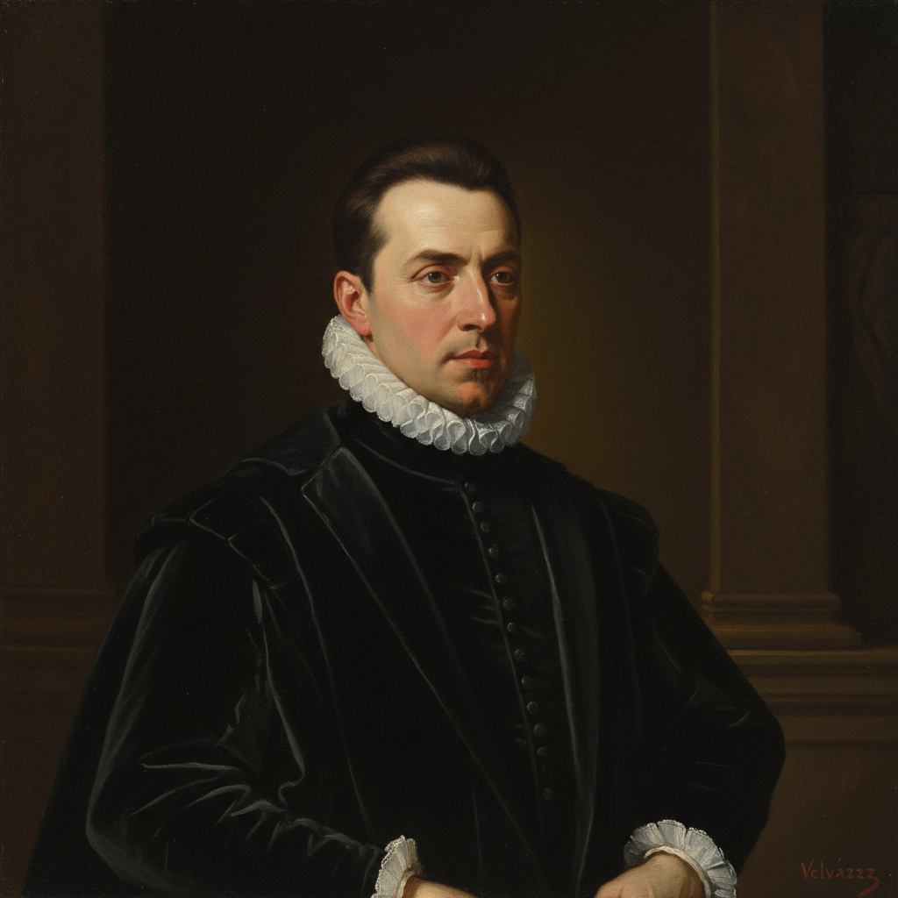

# Spanish Golden Age Painting 西班牙黄金时代绘画

> **时期：** 1580年代–1680年代  
> **关键词：** 委拉斯开兹、宗教热忱、宫廷肖像、静物画、现实主义

## 概述

Spanish Golden Age Painting（西班牙黄金时代绘画）是16世纪末至17世纪西班牙帝国鼎盛时期的艺术高峰——在天主教热忱和宫廷赞助的双重推动下，画家们创造了独特的西班牙写实传统。委拉斯开兹的心理肖像、苏巴朗的修道院静谧、穆里略的甜美圣母——西班牙画家用朴素的真实感表达最深沉的精神体验。

## 风格特征

- **朴素写实**：不美化的真实人物描绘
- **宗教热忱**：苦修、神秘体验、殉道
- **暗色调**：深褐、黑色为主的庄严氛围
- **心理深度**：人物内心世界的揭示
- **静物传统**：Bodegón（厨房静物画）

## 代表人物与作品

- 迭戈·委拉斯开兹《宫娥》
- 弗朗西斯科·德·苏巴朗 修道院系列
- 巴托洛梅·埃斯特万·穆里略 圣母像
- 胡塞佩·德·里贝拉 圣徒殉道

## 概念图

