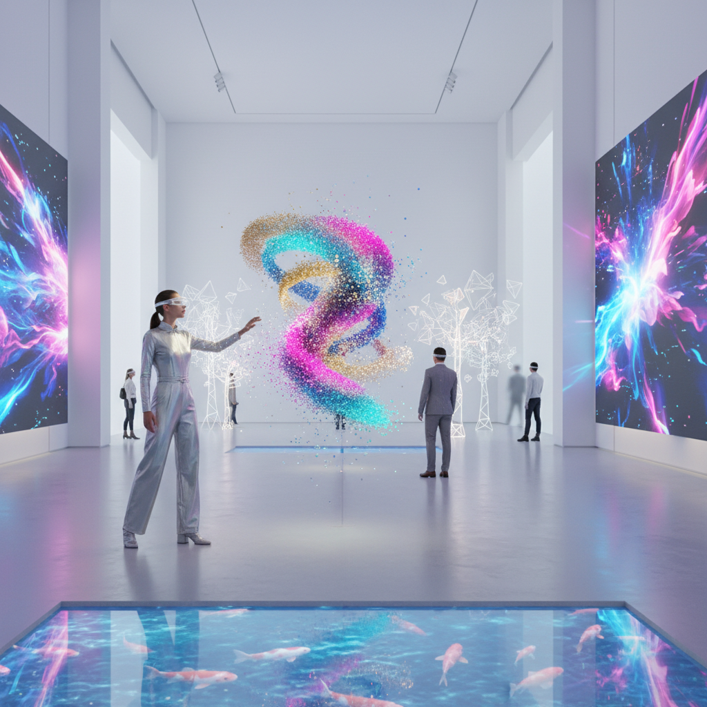

# Spatial Computing Art 空间计算艺术

> "Spatial computing art dissolves the boundary between the digital and the physical — it places virtual objects in real space, anchors data to geography, and lets us reach out and touch information with our hands. When computing becomes spatial, art becomes environmental — no longer confined to screens or frames but woven into the fabric of the world itself, responsive to our gaze, our gestures, and our movement through space." — Unknown

## 概述

空间计算艺术（Spatial Computing Art）是利用空间计算技术——增强现实（AR）、混合现实（MR）、空间锚定、手势追踪、眼动追踪等——创作的艺术实践。空间计算将数字信息从二维屏幕解放出来，嵌入到三维物理空间中。

空间计算艺术的实践包括：1）AR艺术——在现实空间中叠加虚拟艺术作品；2）MR装置——混合现实中的沉浸式艺术体验；3）空间锚定艺术——将数字作品锚定到特定地理位置；4）手势交互艺术——通过手势与虚拟艺术品互动；5）空间音频艺术——在三维空间中放置声音对象；6）数字孪生艺术——创建物理空间的数字镜像并在其中创作。

## 核心特征

| 特征 | 描述 |
|------|------|
| 空间 | 三维空间中的数字内容 |
| 混合 | 虚实混合 |
| 交互 | 自然交互 |
| 锚定 | 空间锚定 |
| 沉浸 | 沉浸式体验 |
| 实时 | 实时渲染 |

## 视觉特征

- **叠加**：虚拟与现实的叠加
- **透明**：半透明的数字元素
- **粒子**：空间中的粒子效果
- **光线**：虚拟光线与真实光线
- **手势**：手势交互的可视化
- **空间**：三维空间的深度感

## 代表作品

| 作品 | 艺术家 | 年代 | 意义 |
|------|--------|------|------|
| *AR art installations* | Various | 2010年代 | AR艺术装置 |
| *Spatial audio art* | Various | 2020年代 | 空间音频艺术 |
| *MR experiences* | Various | 2020年代 | 混合现实体验 |
| *Location-based AR* | Various | 2016至今 | 地理锚定AR |
| *Hand-tracked art* | Various | 2020年代 | 手势追踪艺术 |

## 历史时间线

| 时期 | 事件 |
|------|------|
| 1968 | Sutherland的头戴显示器 |
| 1990年代 | 早期AR研究 |
| 2016 | Pokémon GO普及AR |
| 2020年代 | Apple Vision Pro等空间计算设备 |
| 当代 | 空间计算艺术的爆发 |

## 中国语境

空间计算艺术在中国有快速发展的技术和市场基础。中国在AR/MR技术领域有大量投入——从华为、OPPO等公司的AR眼镜到各种空间计算创业公司。中国的博物馆和文化机构正在积极采用空间计算技术——故宫博物院的AR导览、敦煌莫高窟的数字化重建等。中国当代的一些艺术家在探索空间计算艺术：在中国历史建筑中创作AR叠加作品、用空间计算技术重现已消失的中国古代建筑、以及将中国传统的"借景"园林美学与空间计算的虚实叠加结合。中国的5G基础设施为大规模空间计算艺术体验提供了技术支撑。

## AI生成概念图

## 与其他风格的关系

- **VR Art** → 虚拟现实艺术
- **AR Art** → 增强现实艺术
- **Interactive Art** → 互动艺术
- **Digital Art** → 数字艺术
- **Immersive Art** → 沉浸式艺术
- **New Media Art** → 新媒体艺术

---

*浮光艺志 | Chronicle of Artistry*
