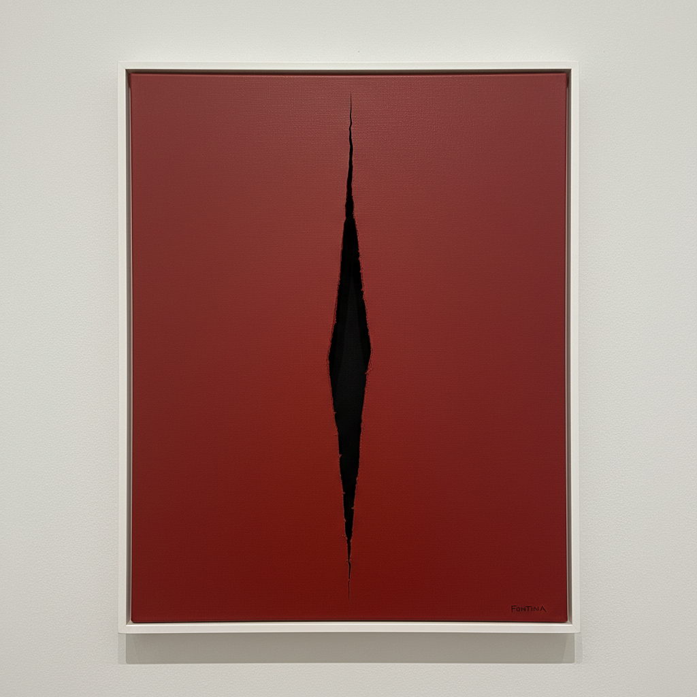

# Spatialism 空间主义

> **时期：** 1947年–1960年代  
> **关键词：** 卢齐奥·丰塔纳、割破画布、空间概念、第四维度、物质超越

## 概述

Spatialism（空间主义，意大利语Spazialismo）由卢齐奥·丰塔纳于1947年在米兰创立，通过"空间概念"宣言提出艺术必须超越传统的二维平面。丰塔纳用刀片割破画布——那些著名的切口不是破坏，而是打开：画布背后的黑暗空间成为作品的一部分，绘画从此拥有了真实的第三维度和无限的想象空间。

## 风格特征

- **切割画布**：刀片划开的精确切口
- **穿孔表面**：针刺或打孔的画布
- **单色背景**：纯色画布强调切口本身
- **空间概念**：画布背后的虚空作为作品
- **物质性**：强调画布作为物理对象

## 代表人物与作品

- 卢齐奥·丰塔纳《空间概念·等待》系列
- 卢齐奥·丰塔纳 穿孔画布
- 罗伯托·克里帕 软木拼贴
- 恩里科·卡斯特拉尼 凸起画布

## 概念图

