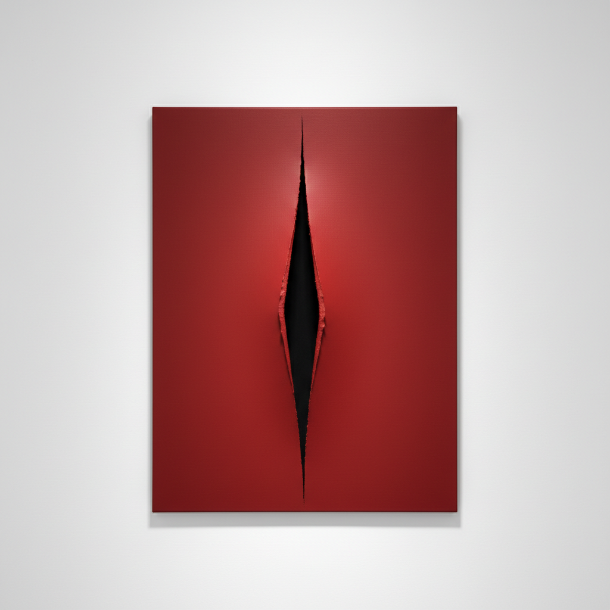

# Spazialismo 空间主义



> **"我不想画一幅画——我要打开空间，创造一个与无限宇宙相连的新维度。"**

## 概述

空间主义（Spazialismo / Spatialism）是由阿根廷裔意大利艺术家卢齐欧·封塔纳（Lucio Fontana, 1899–1968）于1947年创立的艺术运动。它主张超越传统绘画的二维平面，通过刺穿、切割画布来"打开"通向无限空间的通道，将艺术与太空时代的宇宙观相连。

## 时代背景

| 维度 | 内容 |
|------|------|
| 创立 | 1947年，封塔纳发表《空间主义宣言》 |
| 前身 | 1946年《白色宣言》（Manifesto Blanco，布宜诺斯艾利斯） |
| 活跃期 | 1947–1968（封塔纳逝世） |
| 时代语境 | 太空竞赛、核时代、人类首次太空飞行 |
| 宣言 | 共发表5份空间主义宣言（1947–1952） |

## 视觉特征

- **Buchi（孔洞）**：1949年起，在画布上刺穿孔洞
- **Tagli（切割）**：1958年起，用刀片在画布上划出利落的切口
- **单色画面**：纯色背景突出切割/穿孔的空间效果
- **黑纱衬底**：切口背后衬以黑色纱布，营造深邃的虚空感
- **霓虹灯装置**：1951年米兰三年展天花板霓虹"卷云"
- **空间环境**：黑暗房间中悬浮的荧光雕塑

## 核心理念

### "Concetto Spaziale"（空间概念）

封塔纳几乎所有后期作品都以此为标题——每一刀、每一孔都不是破坏，而是创造：打开画布的平面，揭示其背后的"第四维度"。

### 超越二维

> "通过这些切口，无限从那里穿过，光从那里穿过——不需要再画什么了。"

### 与太空时代的共振

封塔纳将艺术创作与人类探索宇宙的冲动相连——切割画布如同穿越大气层，进入未知的空间。

## 代表作品

| 作品 | 年代 | 特征 |
|------|------|------|
| Ambiente spaziale a luce nera | 1949 | 首个空间环境装置 |
| Concetto spaziale (Buchi系列) | 1949– | 孔洞系列 |
| Concetto spaziale (Tagli系列) | 1958– | 切割系列 |
| Concetto spaziale, La Fine di Dio | 1963–64 | 蛋形画布上的切割 |
| Fonti di Energia | 1961 | 为"意大利61"展创作的霓虹装置 |

## 与其他运动的关系

```
未来主义(1909) ──→ 空间主义(1947) ──→ 零派(ZERO, 1957)
                        ↓                      ↓
              贫穷艺术(1967)          光与空间运动(LA, 1960s)
                        ↓
              极简主义 · 观念艺术
```

## 当代影响

- 开创了"装置艺术"的先河
- 影响了ZERO运动、贫穷艺术、光与空间运动
- 当代极简主义设计中"减法"思维的艺术源头
- 对Anish Kapoor等当代雕塑家的空间观念有深远影响
- 封塔纳作品在拍卖市场持续创造高价

## 多语言名称

| 语言 | 名称 |
|------|------|
| 意大利语 | Spazialismo / Movimento Spaziale |
| 英语 | Spatialism / Spatial Movement |
| 中文 | 空间主义 |
| 法语 | Spatialisme |
| 西班牙语 | Espacialismo |

## 延伸阅读

- Lucio Fontana《Manifesto Blanco》(1946)
- Enrico Crispolti《Lucio Fontana: Catalogue Raisonné》
- Prada荣宅2025年封塔纳/皮斯特莱托展

---

*最后更新：2026-07-26*
