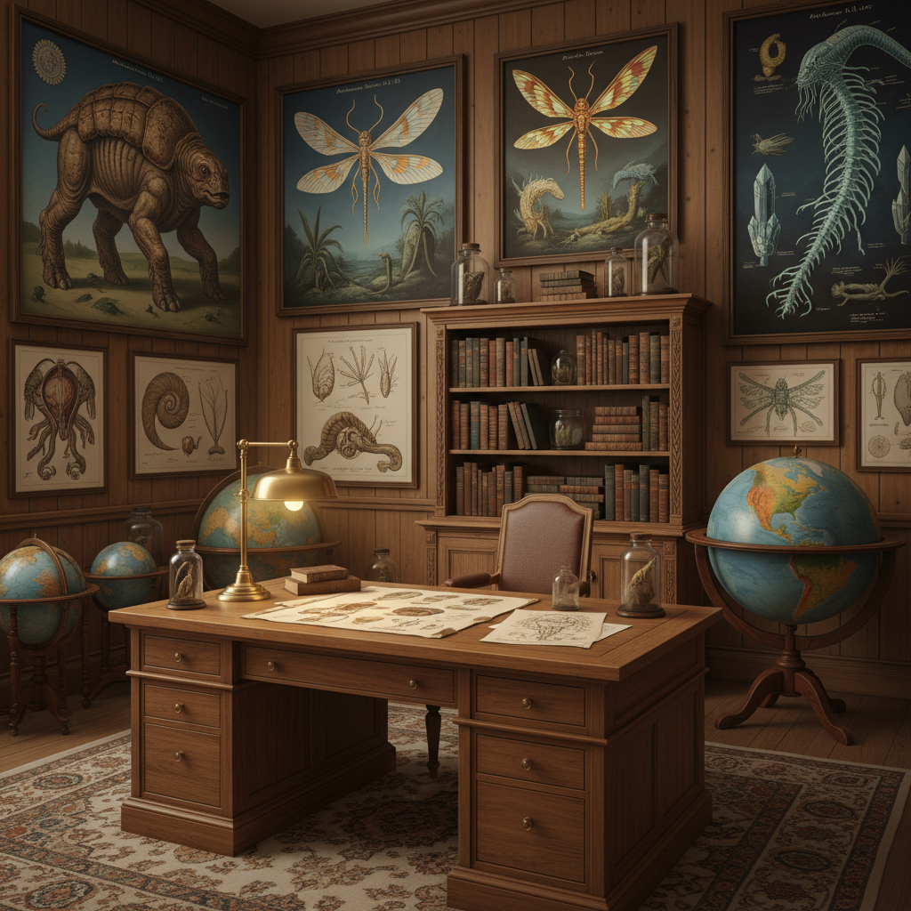

# Speculative Biology Art 推测生物学艺术

> "Speculative biology art imagines life as it could be — not the life that evolution happened to produce on this particular planet under these particular conditions, but the infinite variety of life that could exist under different physics, different chemistries, different histories. It asks: what would a tree look like on a planet with twice our gravity? How would eyes evolve under a red sun? What forms would intelligence take in an ocean of liquid methane? It is the art of biological possibility, of evolution unchained from Earth's contingencies." — Dougal Dixon

## 概述

推测生物学艺术（Speculative Biology Art）是想象和设计可能存在但实际不存在的生物形式的艺术实践。推测生物学（也称为推测进化、虚构生物学）基于进化生物学和生态学的原理，想象在不同条件下生命可能采取的形式。

推测生物学艺术的实践包括：1）外星生物设计——想象其他星球上可能进化出的生命形式；2）替代进化——想象如果地球历史不同（如恐龙未灭绝），生命会如何演化；3）未来进化——推测地球生命在遥远未来可能的演化方向；4）人工生命设计——设计理论上可行但自然界不存在的生物；5）生态系统设计——创造完整的虚构生态系统，包含相互依赖的物种。

## 核心特征

| 特征 | 描述 |
|------|------|
| 想象 | 生物学想象力 |
| 科学 | 科学基础 |
| 进化 | 进化逻辑 |
| 生态 | 生态系统思维 |
| 设计 | 生物设计 |
| 可能 | 可能性探索 |

## 视觉特征

- **解剖**：详细的解剖图
- **生态**：生态场景插画
- **图鉴**：博物学风格的图鉴
- **色彩**：自然但陌生的色彩
- **细节**：高度细节的生物设计
- **环境**：生物与环境的关系

## 代表作品

| 作品 | 艺术家 | 年代 | 意义 |
|------|--------|------|------|
| *After Man* | Dougal Dixon | 1981 | 推测生物学先驱 |
| *All Tomorrows* | C.M. Kosemen | 2006 | 人类未来进化 |
| *Snaiad* | C.M. Kosemen | 2000年代 | 外星生态系统 |
| *Serina* | Sheather | 2015至今 | 金丝雀星球 |
| *Biblaridion* | Various | 2010年代 | 推测进化视频 |

## 历史时间线

| 时期 | 事件 |
|------|------|
| 1981 | Dougal Dixon《After Man》 |
| 1988 | Dixon《The New Dinosaurs》 |
| 2000年代 | 网络推测生物学社区 |
| 2010年代 | 推测生物学的流行化 |
| 当代 | 与AI生成的结合 |

## 中国语境

推测生物学艺术在中国有独特的文化资源。中国传统文化中有丰富的"虚构生物"传统——从《山海经》中的奇异生物，到龙、凤、麒麟等神话动物，到《聊斋志异》中的变形生物。这些传统的"推测生物"虽然不基于现代进化论，但体现了中国文化对生物多样性和可能性的丰富想象。中国当代的一些艺术家和设计师在探索推测生物学：将《山海经》的生物用现代生物学知识重新设计、想象中国特有生态环境中可能的替代进化、以及为科幻作品设计基于科学的外星生物。

## AI生成概念图

## 与其他风格的关系

- **Science Fiction Art** → 科幻艺术
- **Concept Art** → 概念艺术
- **Natural History Illustration** → 博物画
- **Bio Art** → 生物艺术
- **Worldbuilding Art** → 世界构建艺术
- **Creature Design** → 生物设计

---

*浮光艺志 | Chronicle of Artistry*
