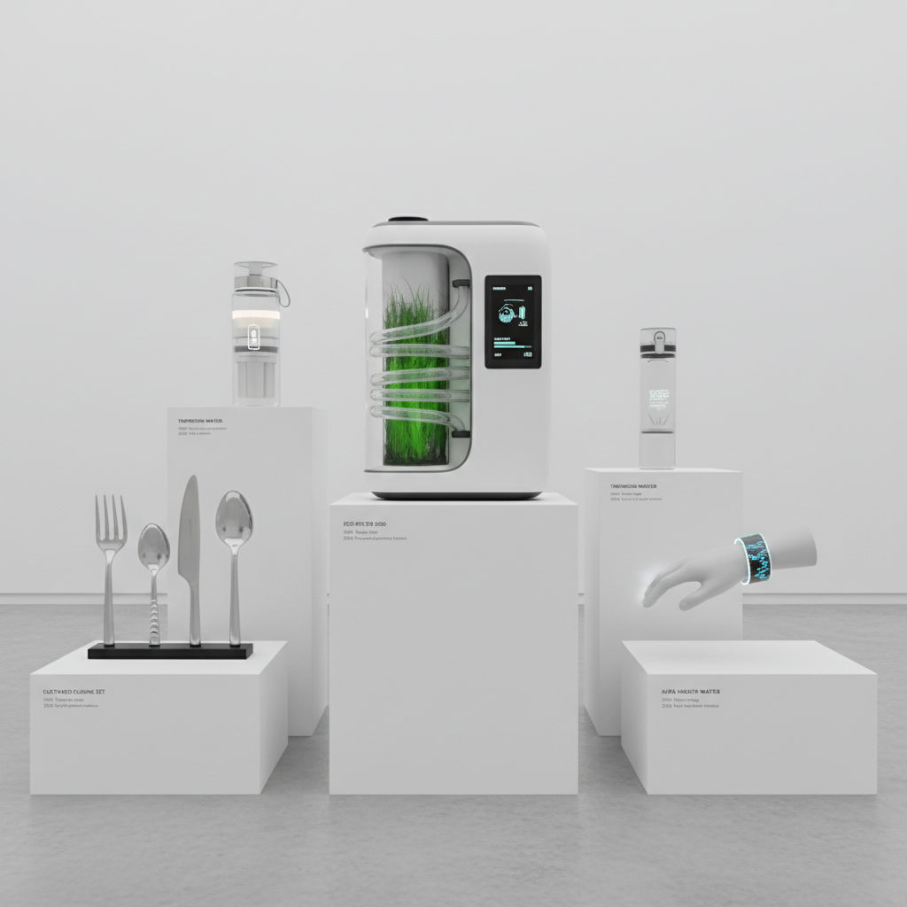

# Speculative Design Art 推测设计艺术

> "Speculative design does not solve problems — it creates them, deliberately and provocatively, designing objects and systems for worlds that do not yet exist in order to ask whether they should, using the language of design not to make the present more comfortable but to make the future more thinkable, to materialize possibilities and consequences so that we can debate them before they arrive, turning the design studio into a laboratory for social imagination and the prototype into a philosophical argument made tangible." — Anthony Dunne & Fiona Raby

## 概述

推测设计（Speculative Design）是一种使用设计方法来探索未来可能性、提出问题和激发辩论的实践，而非解决当前的实际问题。推测设计由Anthony Dunne和Fiona Raby在皇家艺术学院（RCA）发展和推广，其核心理念是：设计不仅可以服务于市场和用户需求，也可以作为一种批判性思考和社会想象的工具。

推测设计的实践包括：为虚构的未来场景设计产品和系统、创造"设计虚构"（Design Fiction）来探索技术和社会变革的后果、以及使用原型和展览来激发公众对未来的讨论。推测设计的作品通常不是为了生产和销售，而是为了展示和讨论——它们是"思想的道具"（props for thinking）。代表性的实践者包括：Dunne & Raby、Superflux、Near Future Laboratory等。

## 核心特征

| 特征 | 描述 |
|------|------|
| 未来 | 探索未来可能性 |
| 批判 | 批判性的立场 |
| 虚构 | 设计虚构的场景 |
| 辩论 | 激发公众辩论 |
| 原型 | 思想的原型化 |
| 问题 | 提出问题而非解决 |

## 视觉特征

- **原型**：精心制作的虚构产品
- **场景**：未来场景的再现
- **日常**：日常物品的陌生化
- **展览**：展览式的呈现
- **文档**：虚构的使用文档
- **材料**：新材料和新形态

## 代表作品

| 作品 | 艺术家 | 年代 | 意义 |
|------|--------|------|------|
| *Designs for an Overpopulated Planet* | Dunne & Raby | 2009 | 推测设计的经典 |
| *United Micro Kingdoms* | Dunne & Raby | 2013 | 政治推测 |
| *Mitigation of Shock* | Superflux | 2017 | 气候未来的推测 |
| *TBD Catalog* | Near Future Laboratory | 2014 | 设计虚构 |
| *Uninvited Guests* | Superflux | 2015 | 老龄化未来 |

## 历史时间线

| 时期 | 事件 |
|------|------|
| 1999 | Dunne的《Hertzian Tales》出版 |
| 2013 | 《Speculative Everything》出版 |
| 2010年代 | 推测设计的全球传播 |
| 2020年代 | 疫情后的未来想象 |
| 当代 | AI时代的推测设计 |

## 中国语境

推测设计在中国的设计教育和实践中有越来越多的关注。中国的一些设计院校（如中央美术学院、同济大学）开设了推测设计相关的课程和工作坊。中国的快速技术发展和社会变革为推测设计提供了丰富的素材——AI的普及、社会信用系统、基因编辑、城市化等议题都是推测设计可以探索的领域。中国的一些年轻设计师在创作推测设计作品，探索中国特定语境下的未来可能性——如农村的技术化未来、传统文化与AI的共存、以及中国式的可持续生活方式。推测设计在中国面临的挑战是如何在特定的文化和政治语境中进行有效的批判性实践。

## AI生成概念图

## 与其他风格的关系

- **Critical Design** → 批判设计
- **Design Fiction** → 设计虚构
- **Science Fiction** → 科幻
- **Conceptual Art** → 概念艺术
- **Futurism** → 未来主义
- **Social Design** → 社会设计

---

*浮光艺志 | Chronicle of Artistry*
