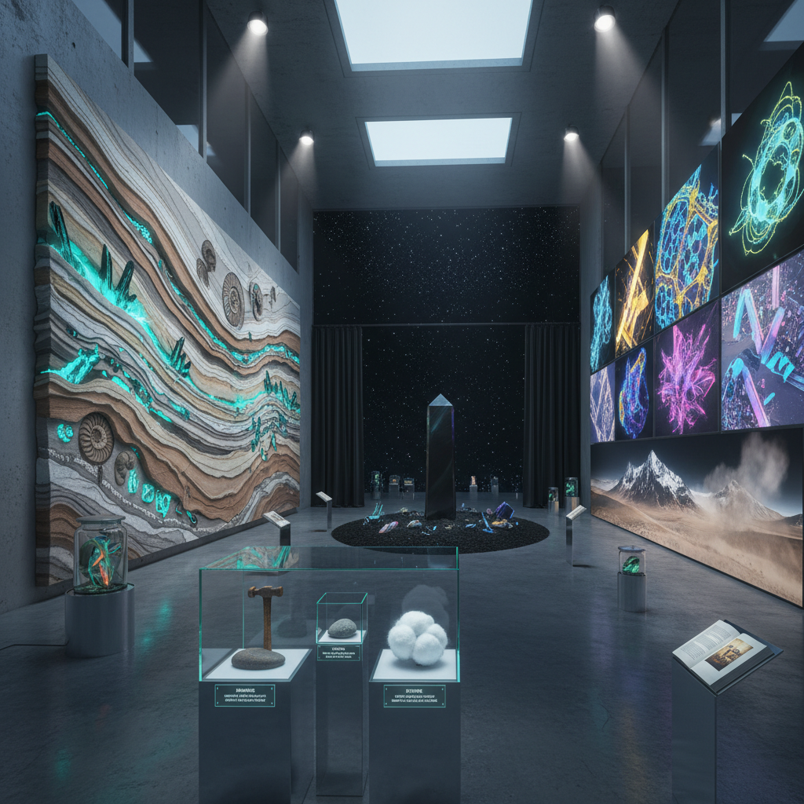

# Speculative Realism Art 思辨实在论艺术

> "Speculative Realism insists that reality exists independently of human thought — that the universe is not a stage built for our perception but a vast alien landscape of objects, forces, and processes that exceed and precede our capacity to think them, that philosophy must escape the prison of human access and confront the great outdoors of being itself, and that art can gesture toward this inhuman reality through objects that resist interpretation, materials that assert their own agency, and forms that refuse to be reduced to human meaning." — Unknown

## 概述

思辨实在论艺术（Speculative Realism Art）是与2007年以来的思辨实在论哲学运动相关的艺术实践。思辨实在论（Speculative Realism）是一组反对"相关主义"（correlationism）——即认为我们只能认识事物与人类思维的关系而非事物本身——的哲学立场。其主要代表包括：格拉汉姆·哈曼（Graham Harman）的面向对象本体论（OOO）、昆汀·梅亚苏（Quentin Meillassoux）的思辨唯物主义、雷·布拉西耶（Ray Brassier）的虚无主义、以及伊恩·汉密尔顿·格兰特（Iain Hamilton Grant）的自然哲学。

在艺术领域，思辨实在论的影响表现为：对"非人类"视角的探索、对物质自身能动性的关注、对"退隐"（withdrawal）和不可接近性的美学化、以及对超越人类尺度的时间和空间的想象。这种艺术试图呈现一个不以人类为中心的世界——地质时间、深海生态、微观粒子世界、以及物体之间不经人类中介的关系。

## 核心特征

| 特征 | 描述 |
|------|------|
| 非人类 | 非人类的视角 |
| 物质 | 物质的能动性 |
| 退隐 | 不可接近的实在 |
| 尺度 | 超人类的尺度 |
| 对象 | 对象的自主性 |
| 思辨 | 思辨性的想象 |

## 视觉特征

- **地质**：地质时间的可视化
- **物质**：物质的自主表现
- **深海**：深海和极端环境
- **微观**：微观世界的放大
- **黑暗**：黑暗和不可见
- **晶体**：矿物和晶体结构

## 代表作品

| 作品 | 艺术家 | 年代 | 意义 |
|------|--------|------|------|
| *Hyperobjects* | Timothy Morton | 2013 | 超对象的概念 |
| *Dark Ecology* | Timothy Morton | 2016 | 黑暗生态学 |
| *Inhuman Nature* | Various | 2010年代 | 非人类自然的展览 |
| *Object-Oriented installations* | Various | 2010年代 | 面向对象的装置 |
| *Geological art* | Various | 2010年代 | 地质时间的艺术 |

## 历史时间线

| 时期 | 事件 |
|------|------|
| 2007 | Goldsmiths思辨实在论研讨会 |
| 2010 | 面向对象本体论的流行 |
| 2013 | Timothy Morton的《超对象》 |
| 2010年代 | 思辨实在论影响艺术界 |
| 当代 | 后人类主义和新唯物主义 |

## 中国语境

思辨实在论在中国学术界有一定的传播，特别是在哲学和当代艺术理论领域。中国的一些当代艺术家在创作中探索类似的"非人类"视角——如对自然材料的尊重和让渡、对技术对象的哲学思考、以及对中国传统哲学中"物"的概念的重新激活。中国传统哲学中的"格物致知"、道家的"物化"概念、以及佛教的"万物有灵"思想都与思辨实在论有某种共鸣。中国的新媒体艺术和生态艺术中也有思辨实在论的影响——试图呈现一个不以人类为中心的世界观。

## AI生成概念图

## 与其他风格的关系

- **Object-Oriented Art** → 面向对象艺术
- **New Materialism** → 新唯物主义
- **Land Art** → 大地艺术
- **Bio Art** → 生物艺术
- **Post-Human Art** → 后人类艺术
- **Conceptual Art** → 概念艺术

---

*浮光艺志 | Chronicle of Artistry*
