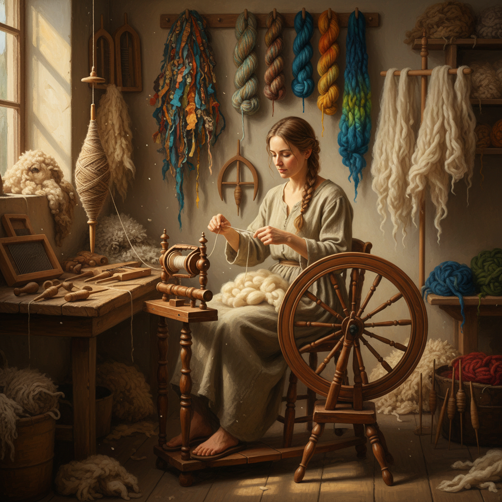

# Spinning 纺纱

> "Spinning is the first transformation — raw fleece, tangled and wild, drawn out and twisted into a continuous thread that can then become anything: cloth, rope, lace, or art." — Unknown

## 概述

纺纱（Spinning）是将松散的纤维（羊毛、棉花、亚麻、丝等）通过加捻（twisting）转变为连续纱线的工艺。纺纱是人类最古老的技术之一——在编织之前必须先有纱线，而纱线来自纺纱。纺纱的基本原理是：将纤维拉伸成细条（drafting），同时加入捻度（twist），使纤维相互锁定形成坚固的纱线。

纺纱工具从最简单的纺锤（spindle，一根加重的棒）到复杂的纺车（spinning wheel），再到现代的电动纺纱机。手工纺纱在当代经历了强劲的复兴——纺纱者享受与纤维的亲密接触、纺纱的冥想性节奏、以及创造独特手纺纱线的满足感。手纺纱线具有工业纱线无法复制的质感和个性。

## 核心特征

| 特征 | 描述 |
|------|------|
| 加捻 | 通过捻度固定纤维 |
| 拉伸 | 将纤维拉伸成条 |
| 连续 | 制作连续的纱线 |
| 古老 | 最古老的技术之一 |
| 冥想 | 冥想性的节奏 |
| 多纤 | 可纺多种纤维 |

## 视觉特征

- **纱线**：手纺纱线的质感
- **不规则**：自然的粗细变化
- **色彩**：染色纤维的色彩
- **质感**：独特的手纺质感
- **蓬松**：蓬松的纤维感
- **自然**：自然的材料美

## 代表作品

| 作品 | 艺术家 | 年代 | 意义 |
|------|--------|------|------|
| *Ancient spindle whorls* | 匿名 | 新石器时代 | 最早的纺纱工具 |
| *Spinning wheel traditions* | 匿名 | 中世纪+ | 纺车传统 |
| *Gandhi's charkha* | 甘地 | 20世纪 | 纺纱的政治象征 |
| *Art yarn* | Various | 当代 | 艺术纱线 |
| *Contemporary handspun* | Various | 当代 | 当代手纺 |

## 历史时间线

| 时期 | 事件 |
|------|------|
| 公元前20000年+ | 最早的纤维加工 |
| 新石器时代 | 纺锤的发明 |
| 中世纪 | 纺车的发明和普及 |
| 工业革命 | 机械纺纱取代手工 |
| 1970s+ | 手工纺纱的复兴 |
| 当代 | 艺术纱线和手纺社区 |

## 中国语境

纺纱在中国有着极其悠久的历史——中国是丝绸的发源地，缫丝（从蚕茧中抽取丝线）是中国最古老的纺纱形式之一。中国古代的纺车（如黄道婆改良的棉纺车）对世界纺织技术有重要贡献。中国传统的"纺线"是农村妇女的日常劳动。当代中国的手工纺纱爱好者群体正在增长——一些人从养羊、剪毛到纺纱、织布，实践完整的纤维艺术链条。中国的一些少数民族地区仍保留着传统的手工纺纱技艺。

## AI生成概念图

## 与其他风格的关系

- **Weaving** → 编织
- **Knitting** → 编织（棒针）
- **Dyeing** → 染色
- **Felting** → 毡化
- **Fiber Art** → 纤维艺术
- **Textile Art** → 纺织艺术

---

*浮光艺志 | Chronicle of Artistry*
