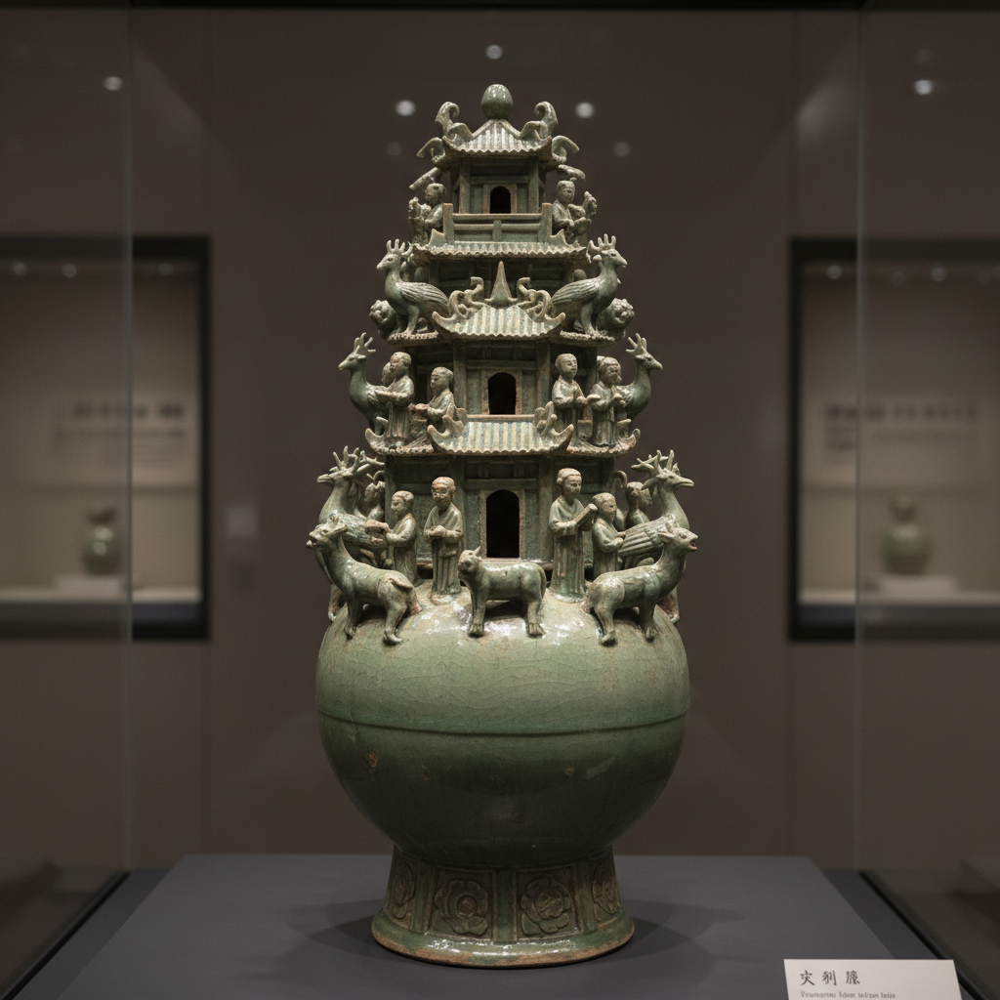

# Spirit Vessel Art 魂瓶艺术

> "The spirit vessel is a ceramic cosmos — a jar crowned with towers, figures, birds, and beasts, a miniature heaven built atop a burial urn so the soul might ascend through its layered architecture, each element a guide for the dead navigating the afterworld, pottery as portal between the living and the departed." — Unknown

## 概述

魂瓶艺术（Spirit Vessel Art）是中国古代一种独特的丧葬陶瓷艺术，以三国两晋时期（3-5世纪）的青瓷魂瓶为代表。魂瓶（又称谷仓罐、堆塑罐）是一种在罐体上堆塑大量建筑、人物、动物和神兽的复杂陶瓷器物——其顶部通常有多层楼阁，象征天界的宫殿，为死者的灵魂提供升天的通道。

魂瓶艺术的核心要素包括：1）堆塑技法——在罐体上堆塑各种形象；2）宇宙模型——象征天地人三界；3）灵魂通道——为灵魂提供升天之路；4）建筑元素——楼阁、城门等建筑模型；5）神兽守护——各种神兽的守护；6）青瓷材质——多为青瓷制作；7）丧葬功能——专为墓葬制作。

## 核心特征

| 特征 | 描述 |
|------|------|
| 堆塑技法 | 罐体堆塑各种形象 |
| 宇宙模型 | 象征天地人三界 |
| 灵魂通道 | 为灵魂升天之路 |
| 建筑元素 | 楼阁城门建筑模型 |
| 神兽守护 | 各种神兽守护 |
| 青瓷材质 | 多为青瓷制作 |

## 视觉特征

- **堆塑繁复**：密集的堆塑装饰
- **多层结构**：从底到顶的多层结构
- **建筑造型**：楼阁、城门等建筑
- **人物动物**：各种人物和动物形象
- **青绿釉色**：青瓷的青绿色釉
- **象征意味**：丰富的象征意义

## 代表作品

| 作品 | 艺术家/文化 | 年代 | 意义 |
|------|-------------|------|------|
| *西晋青瓷魂瓶* | 西晋 | 265-316年 | 经典魂瓶形制 |
| *三国吴青瓷魂瓶* | 三国吴 | 222-280年 | 早期魂瓶 |
| *东晋青瓷魂瓶* | 东晋 | 317-420年 | 晚期魂瓶 |
| *南朝青瓷魂瓶* | 南朝 | 420-589年 | 魂瓶的演变 |
| *越窑青瓷魂瓶* | 越窑 | 3-5世纪 | 越窑精品 |

## 历史时间线

| 时期 | 事件 |
|------|------|
| 东汉末 | 魂瓶的雏形出现 |
| 三国 | 魂瓶形制的确立 |
| 西晋 | 魂瓶艺术的鼎盛 |
| 东晋 | 魂瓶的简化趋势 |
| 南朝 | 魂瓶传统的衰落 |

## 中国语境

魂瓶是中国陶瓷艺术中最具神秘色彩的器物之一。魂瓶主要流行于长江中下游地区——特别是浙江、江苏一带的越窑产区。魂瓶的堆塑内容极为丰富——有楼阁、城门、人物、飞鸟、走兽、龟蛇、佛像等，构成了一个完整的微型宇宙。学者们认为魂瓶反映了当时人们对来世的想象——罐体象征大地，顶部的楼阁象征天界，各种神兽则是灵魂升天的引导者和守护者。魂瓶的制作体现了当时高超的青瓷工艺——越窑工匠们在有限的空间内创造出令人惊叹的微型世界。魂瓶是研究三国两晋时期社会信仰、建筑形制和陶瓷工艺的重要实物资料——它们为我们打开了一扇通往古人精神世界的窗户。

## AI生成概念图

## 与其他风格的关系

- **Mingqi** → 明器
- **Celadon** → 青瓷
- **Yue Ware** → 越窑
- **Funerary Art** → 丧葬艺术
- **Chinese Cosmology** → 中国宇宙观
- **Sculptural Ceramics** → 雕塑陶瓷

---

*浮光艺志 | Chronicle of Artistry*
