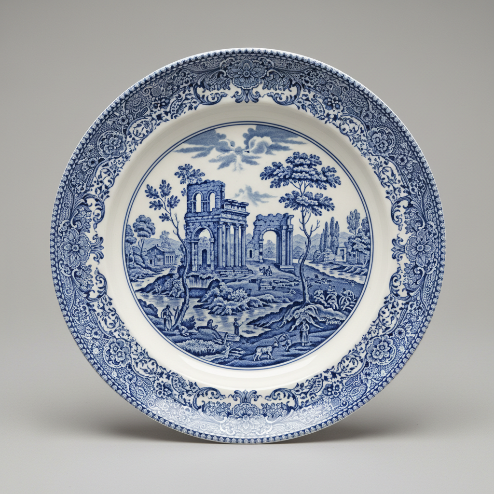

# Spode Art 斯波德艺术

> "Spode is the bridge between earthenware and empire — Josiah Spode perfected bone china and blue transfer printing, two innovations that defined British ceramics for two centuries, making fine porcelain affordable and decorating it with scenes of willow patterns and Italian landscapes printed from engraved copper plates, industrializing beauty without sacrificing charm." — Unknown

## 概述

斯波德艺术（Spode Art）是18世纪末英国陶瓷大师Josiah Spode（1733-1797）及其后代创立的陶瓷艺术传统。斯波德对英国陶瓷的两大贡献是：完善了骨瓷（Bone China）配方和发展了釉下蓝色转印技术（Blue Transfer Printing）。骨瓷以其半透明的白色和坚固的质地成为英国瓷器的标准——而蓝色转印技术则使精美的装饰图案可以大规模复制，让普通家庭也能拥有精美的餐具。

斯波德艺术的核心要素包括：1）骨瓷——完善骨瓷配方；2）蓝色转印——釉下蓝色转印技术；3）柳树图案——经典的中国风柳树图案；4）意大利风景——意大利风景系列；5）工业化——工业化生产的先驱；6）英国传统——英国陶瓷的代表；7）品质标准——确立了英国瓷器标准。

## 核心特征

| 特征 | 描述 |
|------|------|
| 骨瓷 | 完善骨瓷配方 |
| 蓝色转印 | 釉下蓝色转印技术 |
| 柳树图案 | 经典中国风柳树图案 |
| 意大利风景 | 意大利风景系列 |
| 工业化 | 工业化生产先驱 |
| 品质标准 | 确立英国瓷器标准 |

## 视觉特征

- **蓝白配色**：经典的蓝白转印
- **精细图案**：铜版转印的精细图案
- **风景题材**：风景和建筑题材
- **中国风**：柳树图案等中国风
- **骨瓷白**：温暖的骨瓷白色
- **边饰精美**：精美的边饰设计

## 代表作品

| 作品 | 艺术家/文化 | 年代 | 意义 |
|------|-------------|------|------|
| *Blue Italian* | Spode | 1816年 | 经典意大利风景 |
| *Blue Willow* | Spode | 1790年代 | 柳树图案 |
| *Tower Pattern* | Spode | 19世纪 | 塔楼图案 |
| *Spode骨瓷* | Spode | 1797年 | 骨瓷的完善 |
| *当代Spode* | Spode | 当代 | 品牌延续 |

## 历史时间线

| 时期 | 事件 |
|------|------|
| 1770年 | Josiah Spode创立工厂 |
| 1784年 | 完善蓝色转印技术 |
| 1797年 | 完善骨瓷配方 |
| 19世纪 | Spode的繁荣发展 |
| 当代 | Spode品牌的延续 |

## 中国语境

斯波德与中国陶瓷有直接的历史关联。斯波德的蓝色转印技术本身就是为了模仿中国青花瓷的效果——用工业化的方法复制中国手绘青花的装饰效果。最著名的"柳树图案"（Blue Willow）虽然描绘的是想象中的中国场景——亭台楼阁、柳树、小桥——但实际上是英国人对中国的浪漫想象，并非真实的中国图案。斯波德的骨瓷配方（约50%骨灰、25%高岭土、25%长石）是英国人在无法完全复制中国硬质瓷器的情况下发展出的替代方案——骨瓷虽然与中国瓷器的成分不同，但其白度和半透明度甚至超过了中国瓷器。斯波德的成功标志着英国陶瓷工业从模仿中国走向了自主创新——蓝色转印技术使英国瓷器在价格上远低于中国手绘瓷器，最终在全球市场上取代了中国外销瓷的地位。

## AI生成概念图

## 与其他风格的关系

- **Wedgwood** → 韦奇伍德
- **Bone China** → 骨瓷
- **Blue and White** → 青花
- **Transfer Printing** → 转印技术
- **Willow Pattern** → 柳树图案
- **British Ceramics** → 英国陶瓷

---

*浮光艺志 | Chronicle of Artistry*
