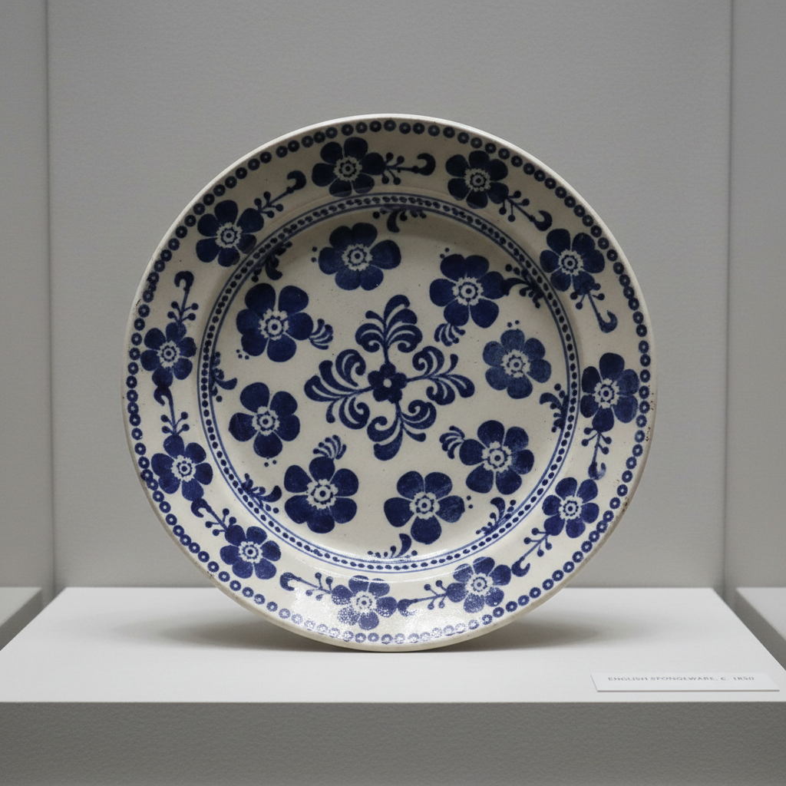

# Spongeware Art 海绵印花艺术

> "Spongeware is pattern made playful — a cut sponge dipped in colored slip or oxide and dabbed repeatedly onto the surface of a pot or plate, each impression slightly different from the last, building up a field of soft-edged repeating motifs that feel handmade and alive in a way that printed transfers never can, the humble kitchen sponge transformed into a tool of folk decoration." — Unknown

## 概述

海绵印花艺术（Spongeware Art）是一种用海绵蘸取彩料在陶瓷表面反复印压形成图案的装饰技法。海绵可以被剪成各种形状——花朵、叶子、几何图形——然后像印章一样在器物表面重复印压，形成有节奏感的重复图案。海绵印花的特点是每个印痕都略有不同，形成手工感强烈的、柔和边缘的装饰效果。这一技法在18-19世纪的英国和美国民间陶瓷中极为流行。

海绵印花艺术的核心要素包括：1）海绵工具——将海绵剪成图案形状；2）蘸取彩料——海绵蘸取色料或氧化物；3）反复印压——在表面重复印压形成图案；4）柔和边缘——海绵产生的柔和模糊边缘；5）重复节奏——规律或自由的重复排列；6）手工变化——每个印痕的微小差异；7）民间风格——质朴亲切的民间装饰感。

## 核心特征

| 特征 | 描述 |
|------|------|
| 海绵印压 | 用海绵作为印花工具 |
| 柔和边缘 | 海绵产生的模糊边缘 |
| 重复图案 | 规律的重复排列 |
| 手工变化 | 每个印痕略有不同 |
| 民间风格 | 质朴亲切的装饰感 |
| 简单高效 | 简单易学的装饰方法 |

## 视觉特征

- **柔和印痕**：边缘模糊的印花图案
- **重复节奏**：规律排列的重复图案
- **蓝白经典**：蓝色印花在白色底上
- **花叶图案**：常见的花朵和叶子图案
- **手工温度**：每个印痕的微小差异
- **民间气息**：质朴温暖的装饰风格

## 代表作品

| 作品 | 艺术家/文化 | 年代 | 意义 |
|------|-------------|------|------|
| *英国海绵印花陶器* | 英国 | 18-19世纪 | 英国民间陶瓷 |
| *美国海绵印花* | 美国 | 19世纪 | 美国民间传统 |
| *苏格兰海绵印花* | 苏格兰 | 19世纪 | 苏格兰陶瓷传统 |
| *当代海绵印花* | 各地陶艺家 | 当代 | 海绵印花的现代应用 |
| *海绵印花餐具* | 当代设计 | 当代 | 当代餐具设计 |

## 历史时间线

| 时期 | 事件 |
|------|------|
| 18世纪 | 英国开始使用海绵印花装饰 |
| 19世纪 | 海绵印花在英美民间陶瓷中流行 |
| 19世纪末 | 工业化生产中海绵印花的应用 |
| 20世纪 | 海绵印花的衰落 |
| 当代 | 海绵印花作为手工装饰的复兴 |

## 中国语境

海绵印花技法在中国民间陶瓷中也有类似的应用——中国传统的"印花"技法使用各种材料（布、纸、木模等）在陶瓷表面印压图案。中国当代陶艺教育中，海绵印花是最容易上手的装饰技法之一——适合初学者和儿童陶艺体验。中国的陶艺体验馆中，海绵印花是最受欢迎的装饰活动之一。海绵印花的重复图案美学与中国传统的"二方连续"和"四方连续"图案设计有相通之处。

## AI生成概念图

## 与其他风格的关系

- **Stamped Pottery** → 印纹陶
- **Block Printing** → 木版印刷
- **Folk Art** → 民间艺术
- **Pattern Design** → 图案设计
- **Transferware** → 转印陶
- **Delftware** → 代尔夫特蓝陶

---

*浮光艺志 | Chronicle of Artistry*
